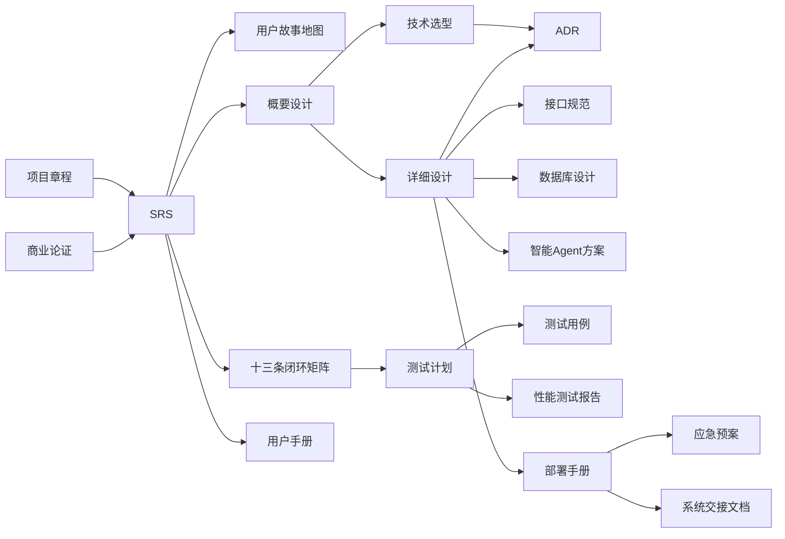

# 项目文档索引

按 **立项 → 需求 → 设计 → 开发 → 测试 → 运维 → 交接** 全生命周期组织。

**交付对照表**（SRS / DSD / 接口 / 库表 / ADR / 测试 / 部署 / 规范 / CHANGELOG）：见 **[文档交付清单.md](./文档交付清单.md)**。

---

## 立项

| 文档 | 路径 | 受众 |
|------|------|------|
| 项目章程 | [initiation/项目章程.md](./initiation/项目章程.md) | 发起人、PM |
| 商业论证 | [initiation/商业论证.md](./initiation/商业论证.md) | 发起人、财务 |
| 成本价值与 ROI 评估 | [initiation/成本价值与ROI评估报告.md](./initiation/成本价值与ROI评估报告.md) | 发起人、财务、PM |
| 开发计划 | [initiation/开发计划.md](./initiation/开发计划.md) | PM、技术负责人、全体开发 |

---

## 需求

| 文档 | 路径 | 受众 |
|------|------|------|
| 需求规格说明书（SRS）V2.4 | [需求规格说明书.md](./需求规格说明书.md) | 全体 |
| 业务闭环评审报告 | [requirements/业务闭环评审报告.md](./requirements/业务闭环评审报告.md) | 产品、架构 |
| 需求缺陷评审报告 | [requirements/需求缺陷评审报告.md](./requirements/需求缺陷评审报告.md) | 产品、架构、发起人 |
| 用户故事地图 | [requirements/用户故事地图.md](./requirements/用户故事地图.md) | 产品、开发、测试 |
| 业务完善方案（分析底稿） | [业务完善方案补充.md](./业务完善方案补充.md) | 产品、架构 |

---

## 设计

| 文档 | 路径 | 受众 |
|------|------|------|
| 概要设计说明书（HLD） | [design/概要设计说明书.md](./design/概要设计说明书.md) V1.3 | 架构、开发 |
| 详细设计说明书（DSD） | [详细设计说明书.md](./详细设计说明书.md) V1.6 | 开发、测试 |
| 技术选型说明书 | [design/技术选型说明书.md](./design/技术选型说明书.md) V2.0 | 架构、开发 |
| 后端技术栈对比（Node/Java/Go） | [design/后端技术栈横向对比.md](./design/后端技术栈横向对比.md) | 架构、技术负责人 |
| 数据安全设计说明书 | [design/数据安全设计说明书.md](./design/数据安全设计说明书.md) V1.0 | 架构、安全、开发 |
| 技术方案评审报告 | [design/技术方案评审报告.md](./design/技术方案评审报告.md) | 架构 |
| CI/CD 方案 | [design/CI-CD方案.md](./design/CI-CD方案.md) | 开发、运维 |
| 智能 Agent 技术方案 | [design/智能Agent技术方案.md](./design/智能Agent技术方案.md) | 架构、安全 |
| 接口规范 | [api/README.md](./api/README.md) · [openapi.yaml](./api/openapi.yaml) · [Postman](./api/postman/) | 前后端、第三方 |

---

## 开发

| 文档 | 路径 | 受众 |
|------|------|------|
| 数据库设计文档 | [database/数据库设计.md](./database/数据库设计.md) · [ams.dbml](./database/ams.dbml) | 开发、DBA |
| 架构决策记录（ADR） | [adr/README.md](./adr/README.md) · [template.md](./adr/template.md) | 架构、技术负责人 |
| 代码规范与 Git 规范 | [代码规范与Git规范.md](./代码规范与Git规范.md) | 全体开发者 |
| 变更日志 | [../CHANGELOG.md](../CHANGELOG.md) | 全体 |

---

## 测试

| 文档 | 路径 | 受众 |
|------|------|------|
| 测试计划 | [testing/测试计划.md](./testing/测试计划.md) | QA、PM |
| 测试用例 | [testing/测试用例.md](./testing/测试用例.md) · [testcases.csv](./testing/testcases.csv) | QA、开发 |
| 性能测试报告 | [testing/性能测试报告.md](./testing/性能测试报告.md) | QA、架构、运维 |

---

## 运维

| 文档 | 路径 | 受众 |
|------|------|------|
| 部署手册 | [deployment/部署手册.md](./deployment/部署手册.md) · [K8s 清单](../deploy/k8s/) | 开发、运维 |
| 应急预案 | [deployment/应急预案.md](./deployment/应急预案.md) | 运维、值班 |
| 部署与运维手册（FAQ 合集） | [deployment/部署与运维手册.md](./deployment/部署与运维手册.md) | 运维 |

---

## 交接

| 文档 | 路径 | 受众 |
|------|------|------|
| 用户手册 | [user/用户手册.md](./user/用户手册.md) | 运营、租户支持 |
| 系统交接文档 | [handover/系统交接文档.md](./handover/系统交接文档.md) | 建设方、业主 |

---

## 其他

| 资料 | 路径 |
|------|------|
| 设计稿原始材料 | [source-material/](./source-material/) |

---

## 维护原则

1. **文档即代码**：Markdown + Git，避免 Word 版本漂移。
2. **单一事实来源**：API → `openapi.yaml`；库表 → Flyway + `database/数据库设计.md`。
3. **变更联动**：需求变 SRS → 故事地图 → 设计 → 接口/库表 → 测试用例。
4. **最小必要**：每份文档明确受众；自动化：OpenAPI、SchemaSpy（可选）、Mermaid 图。

## 文档关系图

