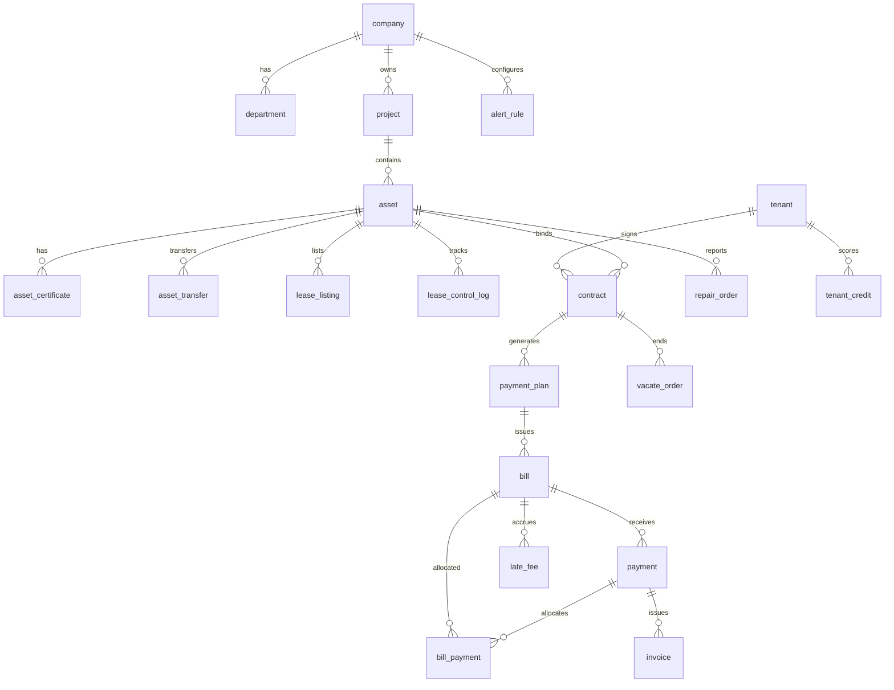

# 数据库设计文档

| 版本     | V1.4                         |
| -------- | ---------------------------- |
| 日期     | 2026-09-18                   |
| 主库     | PostgreSQL 15+               |
| 迁移工具 | Flyway（ADR-0006、ADR-0017） |

## 1. 设计原则

- 主键：`BIGSERIAL` 或 UUID（对外暴露用 `id`）
- 软删除：`deleted_at TIMESTAMPTZ NULL`（监管数据慎用物理删除）
- 审计：`created_at`, `updated_at`, `created_by`, `updated_by`
- 金额：`NUMERIC(18,2)`，单位元
- 多租户数据隔离：`company_id` + RBAC 数据范围
- 状态字段：枚举字符串，与 SRS §4.24 状态机一致

## 2. ER 关系概览



## 3. 核心表结构

### 3.1 组织与权限

#### `company` 公司

| 字段         | 类型              | 说明          |
| ------------ | ----------------- | ------------- |
| id           | BIGSERIAL PK      |               |
| parent_id    | BIGINT FK→company | 集团树        |
| name         | VARCHAR(200)      | 公司名称      |
| company_type | VARCHAR(50)       | 公司类型      |
| status       | SMALLINT          | 1 启用 0 停用 |
| created_at   | TIMESTAMPTZ       |               |

索引：`idx_company_parent`

#### `department` 部门

| 字段       | 类型         | 说明 |
| ---------- | ------------ | ---- |
| id         | BIGSERIAL PK |      |
| company_id | BIGINT FK    |      |
| name       | VARCHAR(100) |      |
| created_at | TIMESTAMPTZ  |      |

#### `user` 系统用户

| 字段          | 类型               | 说明 |
| ------------- | ------------------ | ---- |
| id            | BIGSERIAL PK       |      |
| username      | VARCHAR(64) UNIQUE |      |
| password_hash | VARCHAR(255)       |      |
| name          | VARCHAR(100)       |      |
| phone         | VARCHAR(20)        |      |
| department_id | BIGINT FK          |      |
| status        | SMALLINT           |      |

#### `role` / `user_role` / `role_permission`

标准 RBAC；`role_permission` 存 `menu_code`, `action`, `data_scope`（company/project）。

### 3.2 项目与资产

#### `project` 项目

| 字段          | 类型          | 说明                                               |
| ------------- | ------------- | -------------------------------------------------- |
| id            | BIGSERIAL PK  |                                                    |
| company_id    | BIGINT FK     | 经营公司                                           |
| name          | VARCHAR(200)  |                                                    |
| address       | VARCHAR(500)  | 详细地址                                           |
| province      | VARCHAR(50)   | 省                                                 |
| city          | VARCHAR(50)   | 市                                                 |
| district      | VARCHAR(50)   | 区/县                                              |
| type          | VARCHAR(50)   | park 园区 / building 楼宇 / land 地块 / other 其他 |
| image_url     | VARCHAR(500)  | 项目图片                                           |
| image_file_id | BIGINT        | 图片附件 ID                                        |
| longitude     | NUMERIC(10,7) | GIS                                                |
| latitude      | NUMERIC(10,7) |                                                    |
| status        | SMALLINT      | 1 正常 / 0 停用                                    |

索引：`idx_project_company`

#### `project_zone` 项目分区

新增项目第二步「项目分区配置」：一个项目可配置多个分区。

| 字段       | 类型         | 说明                    |
| ---------- | ------------ | ----------------------- |
| id         | BIGSERIAL PK |                         |
| project_id | BIGINT FK    | 所属项目                |
| name       | VARCHAR(100) | 分区名称，如 A区、1号楼 |
| code       | VARCHAR(64)  | 分区编码                |
| sort       | INTEGER      | 排序                    |
| remark     | VARCHAR(500) | 备注                    |

索引：`idx_project_zone_project (project_id, sort, id)`

> 分区面积不在本表维护，由「该分区下资产面积合计」实时统计得出（`GET /projects/{id}/zones` 返回只读字段 `assetArea` / `assetCount`）。

#### `asset` 资产台账

| 字段                      | 类型               | 说明                                                |
| ------------------------- | ------------------ | --------------------------------------------------- |
| id                        | BIGSERIAL PK       |                                                     |
| project_id                | BIGINT FK          |                                                     |
| zone_id                   | BIGINT             | 所属项目分区（`project_zone.id`），分区面积按此汇总 |
| asset_company_id          | BIGINT             | 资产公司（`company.id`）：项目/责任部门按此级联     |
| asset_no                  | VARCHAR(64) UNIQUE | 资产编号                                            |
| name                      | VARCHAR(200)       |                                                     |
| asset_type                | VARCHAR(20)        | 资产类型，取值见 `asset_type` 字典                  |
| area                      | NUMERIC(18,2)      | 资产面积 m²                                         |
| lease_area                | NUMERIC(18,2)      | 租赁面积 m²                                         |
| floor_no                  | INTEGER            | 分区楼层                                            |
| source_type               | VARCHAR(50)        | 资产来源，取值见 `asset_source` 字典                |
| ownership_type            | VARCHAR(50)        | 资产权属，取值见 `asset_ownership` 字典             |
| partial_lease_status      | VARCHAR(50)        | 部分租赁状态，取值见 `partial_lease_status` 字典    |
| asset_nature              | VARCHAR(50)        | 资产性质，取值见 `asset_nature` 字典                |
| building_plan             | VARCHAR(50)        | 建筑规划，取值见 `building_plan` 字典               |
| structure_type            | VARCHAR(50)        | 建筑结构，取值见 `building_structure` 字典          |
| usage_type                | VARCHAR(50)        | 资产用途，取值见 `asset_usage` 字典                 |
| house_type                | VARCHAR(50)        | 资产房型，取值见 `asset_house_type` 字典            |
| property_company_id       | BIGINT             | 产权公司（`company.id`）                            |
| operating_company_id      | BIGINT             | 经营公司（`company.id`）；与资产公司保持一致        |
| lease_control_status      | VARCHAR(30)        | 租控状态机                                          |
| registered_at             | DATE               | 登记入库时间                                        |
| responsible_department_id | BIGINT             | 责任部门（`department.id`），取自资产公司下属部门   |
| responsible_user_id       | BIGINT             | 责任人（`user.id`），取自责任部门下员工             |
| original_value            | NUMERIC(18,2)      | 原值（万元）                                        |
| image_url                 | VARCHAR(500)       | 资产图片地址                                        |
| image_file_id             | BIGINT             | 资产图片附件（`sys_file.id`）                       |
| base_rent_assessed        | NUMERIC(18,2)      | 评估租金                                            |
| base_rent_floor           | NUMERIC(18,2)      | 备案底价                                            |
| qr_code_url               | VARCHAR(500)       |                                                     |
| parent_asset_id           | BIGINT             | 拆分合并父级                                        |
| deleted_at                | TIMESTAMPTZ        |                                                     |

索引：

- `idx_asset_project` (project_id)
- `idx_asset_zone` (zone_id)
- `idx_asset_company` (operating_company_id)
- `idx_asset_asset_company` (asset_company_id)
- `idx_asset_responsible_dept` (responsible_department_id)
- `idx_asset_responsible_user` (responsible_user_id)
- `idx_asset_status` (lease_control_status)
- `idx_asset_no` UNIQUE

#### `asset_certificate` 权证信息

| 字段            | 类型         | 说明        |
| --------------- | ------------ | ----------- |
| id              | BIGSERIAL PK |             |
| asset_id        | BIGINT FK    |             |
| cert_type       | VARCHAR(50)  | 产权/抵押等 |
| cert_no         | VARCHAR(100) | 证号        |
| mortgage_status | VARCHAR(20)  | 无抵押/在押 |
| file_id         | BIGINT       | 扫描件      |

### 3.3 招租与租户

#### `tenant` 租户/客商

| 字段          | 类型         | 说明                |
| ------------- | ------------ | ------------------- |
| id            | BIGSERIAL PK |                     |
| name          | VARCHAR(200) | 联系人/企业名       |
| phone         | VARCHAR(20)  |                     |
| id_no         | VARCHAR(50)  | 证件号              |
| tenant_type   | VARCHAR(20)  | person / enterprise |
| blacklist     | BOOLEAN      | 黑名单              |
| credit_score  | INTEGER      | 信用分              |
| wechat_openid | VARCHAR(64)  |                     |

索引：`idx_tenant_id_no`, `idx_tenant_phone`

#### `lease_listing` 招租发布

**V59 起「发布」= 提交审批**：`status` 由二值扩为四值，`pending` 待审批 / `active` 招租中 /
`rejected` 已驳回 / `closed` 已关闭。只有 `active` 会被租控派生视图
（`v_asset_lease_status_derived`）识别为 `leasing`，因此「审批通过后小程序可见」与
「资产变为招租中」是同一个条件。发布的招租**必须挂计租单元**（`asset_unit_id`），
否则派生视图看不到它。

| 字段                | 类型          | 说明                                                              |
| ------------------- | ------------- | ----------------------------------------------------------------- |
| id                  | BIGSERIAL PK  |                                                                   |
| asset_id            | BIGINT        | 资产                                                              |
| asset_unit_id       | BIGINT        | 计租单元（V39）；租控视图按 `status='active'` + 本列判定 leasing  |
| annual_rent         | NUMERIC(18,2) | 年租金（元），**表单主字段**（V59）                               |
| rent_amount         | NUMERIC(18,2) | 挂牌租金（元/月）；V59 起由 `annual_rent / 12` 同步写入           |
| rent_negotiable     | BOOLEAN       | 可议价（低于底价年化额时必须为 true，否则 409）                   |
| rent_type           | VARCHAR(30)   | 租金类型（RENT_TYPE 字典）（V59）                                 |
| cover_image_file_id | BIGINT        | 封面图附件（sys_file.id）（V59）                                  |
| cover_image_url     | VARCHAR(500)  | 封面图地址（冗余，公开读 /files/object/**）（V59）                |
| detail_images       | TEXT          | 详情列表图，JSON 数组 `[{fileId,url}]`（V59）                     |
| recommended         | BOOLEAN       | 是否推荐（端上优先展示）（V59）                                   |
| sort_no             | INTEGER       | 排序号，越小越前（V59）                                           |
| intro               | TEXT          | 介绍（V59）                                                       |
| reject_reason       | VARCHAR(500)  | 审批驳回原因，仅详情可见（V59）                                   |
| created_by          | BIGINT        | 发起人 sys_user.id（V59，业务语义而非审计列）                     |
| status              | VARCHAR(20)   | pending/active/rejected/closed                                    |
| published_at        | TIMESTAMPTZ   | 审批通过时间                                                      |
| closed_at           | TIMESTAMPTZ   | 关闭时间                                                          |
| remark              | VARCHAR(500)  | 招租说明                                                          |

索引：`idx_lease_listing_asset`、`idx_lease_listing_status`、`idx_lease_listing_unit`、
`idx_lease_listing_pub_sort (status, recommended DESC, sort_no ASC, id DESC)`（端上列表排序）、
`idx_lease_listing_asset_status (asset_id, status)`（按资产反查招租记录）

#### `tender_announcement` 公开招租公告

| 字段              | 类型         | 说明 |
| ----------------- | ------------ | ---- |
| id                | BIGSERIAL PK |      |
| title             | VARCHAR(200) |      |
| register_deadline | TIMESTAMPTZ  |      |
| status            | VARCHAR(20)  |      |

#### `tender_application` 报名

| 字段            | 类型         | 说明                      |
| --------------- | ------------ | ------------------------- |
| id              | BIGSERIAL PK |                           |
| announcement_id | BIGINT FK    |                           |
| tenant_id       | BIGINT FK    |                           |
| audit_status    | VARCHAR(20)  | pending/approved/rejected |

### 3.4 合同与退租

#### `contract` 租赁合同

| 字段               | 类型               | 说明                                                                                                   |
| ------------------ | ------------------ | ------------------------------------------------------------------------------------------------------ |
| id                 | BIGSERIAL PK       |                                                                                                        |
| contract_no        | VARCHAR(64) UNIQUE |                                                                                                        |
| asset_id           | BIGINT FK          |                                                                                                        |
| tenant_id          | BIGINT FK          |                                                                                                        |
| version            | INTEGER            | 合同版本                                                                                               |
| parent_contract_id | BIGINT             | 续签/变更来源                                                                                          |
| start_date         | DATE               |                                                                                                        |
| end_date           | DATE               |                                                                                                        |
| lease_area         | NUMERIC(18,2)      |                                                                                                        |
| rent_type          | VARCHAR(30)        |                                                                                                        |
| rent_amount        | NUMERIC(18,2)      | 周期租金                                                                                               |
| deposit_amount     | NUMERIC(18,2)      |                                                                                                        |
| payment_cycle      | VARCHAR(20)        |                                                                                                        |
| free_rent_days     | INTEGER            |                                                                                                        |
| status             | VARCHAR(30)        | 合同状态机（§4.24.9）：draft/approving/active/expiring/renewable/expired/terminating/terminated/voided |
| esign_status       | VARCHAR(20)        | P2                                                                                                     |
| created_at         | TIMESTAMPTZ        |                                                                                                        |

索引：`idx_contract_asset`, `idx_contract_tenant`, `idx_contract_status`, `idx_contract_end_date`

#### `vacate_order` 退租单

| 字段              | 类型          | 说明                                   |
| ----------------- | ------------- | -------------------------------------- |
| id                | BIGSERIAL PK  |                                        |
| contract_id       | BIGINT FK     |                                        |
| status            | VARCHAR(30)   | applying/inspecting/settling/completed |
| settlement_amount | NUMERIC(18,2) |                                        |
| deposit_refund    | NUMERIC(18,2) |                                        |

#### `deposit_transaction` 保证金流水

| 字段        | 类型          | 说明                       |
| ----------- | ------------- | -------------------------- |
| id          | BIGSERIAL PK  |                            |
| contract_id | BIGINT FK     |                            |
| type        | VARCHAR(20)   | collect/hold/deduct/refund |
| amount      | NUMERIC(18,2) |                            |
| ref_bill_id | BIGINT        | 抵扣关联                   |

### 3.5 计费与收费

#### `payment_plan` 缴费计划

| 字段           | 类型          | 说明 |
| -------------- | ------------- | ---- |
| id             | BIGSERIAL PK  |      |
| contract_id    | BIGINT FK     |      |
| period_start   | DATE          |      |
| period_end     | DATE          |      |
| planned_amount | NUMERIC(18,2) |      |
| status         | VARCHAR(20)   |      |

#### `bill` 账单

| 字段                 | 类型               | 说明                                      |
| -------------------- | ------------------ | ----------------------------------------- |
| id                   | BIGSERIAL PK       |                                           |
| bill_no              | VARCHAR(64) UNIQUE |                                           |
| contract_id          | BIGINT FK          |                                           |
| plan_id              | BIGINT FK          |                                           |
| bill_type            | VARCHAR(20)        | rent/utility/other                        |
| due_date             | DATE               |                                           |
| amount               | NUMERIC(18,2)      | 应收本金                                  |
| paid_amount          | NUMERIC(18,2)      | 已核销本金                                |
| late_fee_amount      | NUMERIC(18,2)      | 累计应计滞纳金（汇总，明细见 `late_fee`） |
| late_fee_paid_amount | NUMERIC(18,2)      | 已核销滞纳金                              |
| status               | VARCHAR(20)        | 账单状态机                                |
| dunning_level        | SMALLINT           | 催缴等级 L1-L5                            |

索引：`idx_bill_contract`, `idx_bill_status_due` (status, due_date)

#### `payment` 收款记录

| 字段                  | 类型               | 说明                                                         |
| --------------------- | ------------------ | ------------------------------------------------------------ |
| id                    | BIGSERIAL PK       |                                                              |
| payment_no            | VARCHAR(64) UNIQUE |                                                              |
| amount                | NUMERIC(18,2)      |                                                              |
| method                | VARCHAR(20)        |                                                              |
| channel               | VARCHAR(20)        | 收款来源 user_mp / worker_mp / pc（三端统一对账 FR-FIN-006） |
| confirm_status        | VARCHAR(20)        | 现场收款到账状态 pending / confirmed（FR-MPW-010）           |
| confirmed_at          | TIMESTAMPTZ        | 到账确认时间                                                 |
| confirmed_by          | BIGINT             | 到账确认人                                                   |
| paid_at               | TIMESTAMPTZ        |                                                              |
| bank_reconcile_status | VARCHAR(20)        | P1 对账                                                      |

#### `bill_payment` 账单–收款核销流水

> **核销流水（不可变）**：一笔收款拆核多张账单的单一事实来源（FR-PAY-*）；冲正按 `id` 逆序回退，流水本身不删改。

| 字段         | 类型          | 说明                                                     |
| ------------ | ------------- | -------------------------------------------------------- |
| id           | BIGSERIAL PK  | 核销流水号                                               |
| bill_id      | BIGINT FK     |                                                          |
| payment_id   | BIGINT FK     |                                                          |
| amount_type  | VARCHAR(20)   | principal / late_fee（区分本金与滞纳金核销，FR-PAY-003） |
| amount       | NUMERIC(18,2) | 核销金额                                                 |
| allocated_at | TIMESTAMPTZ   | 核销时间                                                 |
| allocated_by | BIGINT        | 操作人                                                   |

索引：`idx_bill_payment_bill`, `idx_bill_payment_payment`

#### `late_fee` 滞纳金明细

> 每日计息任务（`lateFeeJob`）滚动生成的滞纳金明细（FR-DUN-LATE-*），保留利率快照支撑举证与减免。

| 字段          | 类型          | 说明                        |
| ------------- | ------------- | --------------------------- |
| id            | BIGSERIAL PK  |                             |
| bill_id       | BIGINT FK     | 关联账单                    |
| rate_snapshot | NUMERIC(10,6) | 计息利率快照（日利率）      |
| period_start  | DATE          | 计息起算日                  |
| period_end    | DATE          | 计息截止日                  |
| fee_amount    | NUMERIC(18,2) | 滞纳金金额                  |
| status        | VARCHAR(20)   | accruing / waived / settled |

索引：`idx_late_fee_bill`

### 3.6 维修与任务

#### `repair_order` 报修工单

| 字段                  | 类型         | 说明       |
| --------------------- | ------------ | ---------- |
| id                    | BIGSERIAL PK |            |
| asset_id              | BIGINT FK    |            |
| reporter_id           | BIGINT       |            |
| status                | VARCHAR(30)  | SLA 状态机 |
| sla_response_deadline | TIMESTAMPTZ  |            |
| sla_complete_deadline | TIMESTAMPTZ  |            |

#### `task` 任务中心

| 字段        | 类型         | 说明                                     |
| ----------- | ------------ | ---------------------------------------- |
| id          | BIGSERIAL PK |                                          |
| task_type   | VARCHAR(50)  | contract_approval/dunning/revitalization |
| ref_id      | BIGINT       | 业务单 ID                                |
| assignee_id | BIGINT FK    |                                          |
| deadline    | TIMESTAMPTZ  |                                          |
| status      | VARCHAR(20)  |                                          |

### 3.7 预警与盘活

#### `alert_rule` / `alert_record`

规则与触发记录，关联 `company_id`, `alert_type`, `condition_json`。

#### `revitalization_task` 盘活任务

| 字段          | 类型         | 说明 |
| ------------- | ------------ | ---- |
| id            | BIGSERIAL PK |      |
| asset_id      | BIGINT FK    |      |
| vacant_reason | VARCHAR(50)  |      |
| plan_type     | VARCHAR(50)  |      |
| assignee_id   | BIGINT       |      |
| status        | VARCHAR(20)  |      |

### 3.8 固定资产 / 无形资产（P2）

- `fixed_asset`：与 `asset` 分表或 `asset_category` 区分
- `intangible_asset`：权利类型、摊销、到期日

### 3.9 系统

#### `operation_log` 操作日志

| 字段        | 类型         | 说明 |
| ----------- | ------------ | ---- |
| id          | BIGSERIAL PK |      |
| user_id     | BIGINT       |      |
| module      | VARCHAR(50)  |      |
| action      | VARCHAR(50)  |      |
| ref_id      | BIGINT       |      |
| detail_json | JSONB        |      |
| created_at  | TIMESTAMPTZ  |      |

分区：按月 `PARTITION BY RANGE (created_at)`（日志量大时）。

#### `file_metadata` 附件

| 字段        | 类型         | 说明 |
| ----------- | ------------ | ---- |
| id          | BIGSERIAL PK |      |
| bucket      | VARCHAR(100) |      |
| object_key  | VARCHAR(500) |      |
| hash_sha256 | CHAR(64)     | 存证 |
| size        | BIGINT       |      |

### 3.10 期初迁移（FR-MIG-*）

#### `migration_batch` 迁移批次

| 字段           | 类型          | 说明                            |
| -------------- | ------------- | ------------------------------- |
| id             | BIGSERIAL PK  |                                 |
| cutover_date   | DATE          | 基准日                          |
| status         | VARCHAR(20)   | importing / reconciled / locked |
| source_file    | VARCHAR(500)  | 来源文件                        |
| balance_result | NUMERIC(18,2) | 试算平衡差额                    |
| created_at     | TIMESTAMPTZ   |                                 |

#### `migration_import_log` 导入日志

| 字段      | 类型         | 说明                                       |
| --------- | ------------ | ------------------------------------------ |
| id        | BIGSERIAL PK |                                            |
| batch_id  | BIGINT FK    |                                            |
| row_no    | INTEGER      | 源文件行号                                 |
| biz_type  | VARCHAR(30)  | asset / contract / bill / deposit / prepay |
| result    | VARCHAR(20)  | success / failed                           |
| error_msg | VARCHAR(500) | 校验失败原因                               |
| ref_id    | BIGINT       | 导入后的业务单 ID                          |

索引：`idx_migration_log_batch`

### 3.11 V2.5 补强表

#### `asset_transfer` 资产调拨单（FR-CERT-002）

| 字段            | 类型         | 说明                               |
| --------------- | ------------ | ---------------------------------- |
| id              | BIGSERIAL PK |                                    |
| asset_id        | BIGINT FK    |                                    |
| from_company_id | BIGINT       | 调出公司                           |
| to_company_id   | BIGINT       | 调入公司                           |
| transfer_type   | VARCHAR(20)  | with_contract 带租 / vacant 空置   |
| status          | VARCHAR(20)  | draft/approving/approved/completed |
| effective_date  | DATE         | 生效日期                           |
| created_at      | TIMESTAMPTZ  |                                    |

索引：`idx_asset_transfer_asset`

#### `config_version` 配置版本快照（FR-CFG-002）

| 字段           | 类型         | 说明                                                 |
| -------------- | ------------ | ---------------------------------------------------- |
| id             | BIGSERIAL PK |                                                      |
| config_key     | VARCHAR(100) | 参数名（税率/租金单价/滞纳金利率/水电单价/公摊比例） |
| config_value   | VARCHAR(500) | 参数值                                               |
| effective_date | DATE         | 生效日期                                             |
| version        | INTEGER      | 版本号                                               |
| operator_id    | BIGINT       | 操作人                                               |
| created_at     | TIMESTAMPTZ  |                                                      |

索引：`idx_config_key_effective` (config_key, effective_date)

> 历史账单/发票/滞纳金计息引用创建时快照，不被新版本污染（FR-CFG-002）。字段脱敏矩阵（角色×页面×字段，FR-COM-005）亦存于此（`config_key=masking_rule`，JSON 值）。

#### `apportion_config` 水电公摊配置（FR-UTIL-006）

| 字段            | 类型         | 说明                                 |
| --------------- | ------------ | ------------------------------------ |
| id              | BIGSERIAL PK |                                      |
| company_id      | BIGINT       | 公司范围（可空=全局）                |
| project_id      | BIGINT       | 项目范围（可空）                     |
| apportion_basis | VARCHAR(20)  | area / meter / head / usage 分摊口径 |
| enabled         | BOOLEAN      |                                      |

#### `regulation_report` 监管报送（FR-REG-001）

| 字段         | 类型         | 说明                     |
| ------------ | ------------ | ------------------------ |
| id           | BIGSERIAL PK |                          |
| report_type  | VARCHAR(50)  | 报送类型                 |
| period       | VARCHAR(20)  | 报送期间                 |
| content_json | JSONB        | 报送字段与统计口径       |
| status       | VARCHAR(20)  | draft/reviewed/submitted |
| submitted_at | TIMESTAMPTZ  |                          |
| created_by   | BIGINT       |                          |

索引：`idx_regulation_report_type_period`

### 3.12 资产运营人员管理（V60 / FR-OP-001）

登记「谁负责哪些资产的运营」：一条档案 = 人员 + 角色 + 资产运营范围。

**两条边界（刻意如此）**：

- **角色只登记、不授权** —— `asset_operator_role` **不写** `user_role`，本模块不产生任何实际
  权限；真正授权仍在「系统管理 → 角色权限」。否则一个业务模块的页面就等于多出一条提权路径。
- **范围只登记、不拦截** —— `asset_operator_scope` 不参与 `RbacService` 的数据范围收敛；
  表结构按可扩展口径建（类型 + id 分开存），后续接入「按标的收敛」不需要改表。

#### `asset_operator` 运营人员档案

| 字段       | 类型         | 说明                                                |
| ---------- | ------------ | --------------------------------------------------- |
| id         | BIGSERIAL PK |                                                     |
| user_id    | BIGINT       | 人员 sys_user.id                                    |
| status     | SMALLINT     | 1 启用 / 0 停用（停用不删档案）                     |
| remark     | VARCHAR(500) |                                                     |
| deleted_at | TIMESTAMPTZ  | 软删；仅 null 的行可见且参与「一人一份有效档案」    |

索引：`uk_asset_operator_user (user_id) WHERE deleted_at IS NULL`（**部分**唯一索引：
一人只能有一份**有效**档案，软删后可重新登记）、`idx_asset_operator_status (status, id DESC)`

#### `asset_operator_role` 角色选择

| 字段        | 类型         | 说明             |
| ----------- | ------------ | ---------------- |
| id          | BIGSERIAL PK |                  |
| operator_id | BIGINT       | 档案 id          |
| role_id     | BIGINT       | role.id（仅登记）|

索引：`uk_asset_operator_role (operator_id, role_id)`、`idx_asset_operator_role_role (role_id)`

#### `asset_operator_scope` 资产运营范围

| 字段        | 类型         | 说明                                       |
| ----------- | ------------ | ------------------------------------------ |
| id          | BIGSERIAL PK |                                            |
| operator_id | BIGINT       | 档案 id                                    |
| scope_type  | VARCHAR(20)  | project / zone / asset（沿用 V56 抵押口径）|
| scope_id    | BIGINT       | project.id / project_zone.id / asset.id    |

索引：`uk_asset_operator_scope (operator_id, scope_type, scope_id)`、
`idx_asset_operator_scope_target (scope_type, scope_id)`

> **为什么是 `scope_type` + `scope_id` 两列而不是三个可空列**：三个可空列（project_id /
> zone_id / asset_id）无法用一条唯一约束表达「同类型同标的只出现一次」—— 组合唯一索引里
> 另两列恒为 NULL，而 PG 把 NULL 视为互不相等，去重会**静默失效**（V56 引入
> `target_type` / `target_id` 正是同一个理由）。

## 4. 分片与扩展

| 场景                 | 策略                                        |
| -------------------- | ------------------------------------------- |
| 当前规模（200 在线） | 单 PG 主库 + 读副本可选                     |
| 日志表               | 按月分区或迁 MongoDB                        |
| 大报表               | 只读副本 + 物化视图 `mv_monthly_collection` |
| 未来多租户 SaaS      | `company_id` 作分库路由键                   |

## 5. 数据归档

| 数据类型   | 归档策略                                         |
| ---------- | ------------------------------------------------ |
| 操作日志   | 热数据 12 个月在线，之后冷存储                   |
| 已退出资产 | `lease_control_status=exited` 归档库或只读表空间 |
| 收款/合同  | **不归档删除**，监管长期保留                     |
| 附件       | OSS 生命周期：标准→低频→归档                     |

## 6. 与迁移脚本

迁移脚本路径（规划）：

```
backend/src/main/resources/db/migration/
  V1__baseline.sql
  V2__init_org.sql
  V3__init_asset.sql
  V4__init_contract_billing.sql
  ...
```

**规则**：改表只改 Flyway；本文档与 `V*` 脚本同步更新。

## 7. Redis 键设计（摘要）

> 完整权威清单见 [DSD §4.10](../详细设计说明书.md)。

| 键模式                       | 用途             | TTL           |
| ---------------------------- | ---------------- | ------------- |
| `menu:{userId}`              | 用户菜单树       | 30min         |
| `perm:{userId}`              | 权限码集合       | 30min         |
| `auth:token:blacklist:{jti}` | Token 吊销       | 与 token 同寿 |
| `idempotency:{key}`          | 幂等             | 24h           |
| `captcha:{id}`               | 验证码           | 5min          |
| `config:hot`                 | 热点配置         | 1h            |
| `agent:session:{id}`         | Agent 会话上下文 | 24h           |
| `agent:job:{id}`             | 报告异步任务状态 | 7d            |

## 8. 智能 Agent 表结构（P1）

### 8.1 `agent_session` 会话

| 字段       | 类型           | 说明              |
| ---------- | -------------- | ----------------- |
| id         | BIGSERIAL PK   |                   |
| user_id    | BIGINT FK→user |                   |
| company_id | BIGINT         | 数据范围          |
| title      | VARCHAR(200)   | 会话标题          |
| status     | VARCHAR(20)    | active / archived |
| created_at | TIMESTAMPTZ    |                   |

### 8.2 `agent_run` 任务运行

| 字段                     | 类型         | 说明                            |
| ------------------------ | ------------ | ------------------------------- |
| id                       | BIGSERIAL PK |                                 |
| session_id               | BIGINT FK    |                                 |
| user_id                  | BIGINT FK    |                                 |
| intent                   | VARCHAR(50)  | report_generate / data_query 等 |
| template_id              | VARCHAR(64)  | 可选                            |
| status                   | VARCHAR(20)  | running / succeeded / failed    |
| trace_id                 | VARCHAR(64)  | 链路 ID                         |
| started_at / finished_at | TIMESTAMPTZ  |                                 |

### 8.3 `agent_tool_call` Tool 调用快照

| 字段             | 类型                | 说明       |
| ---------------- | ------------------- | ---------- |
| id               | BIGSERIAL PK        |            |
| run_id           | BIGINT FK→agent_run |            |
| tool_name        | VARCHAR(100)        |            |
| request_json     | JSONB               | 脱敏后入参 |
| response_hash    | VARCHAR(64)         | SHA256     |
| response_summary | JSONB               | 摘要/指标  |
| duration_ms      | INTEGER             |            |
| created_at       | TIMESTAMPTZ         |            |

### 8.4 `agent_report` 报告

| 字段         | 类型         | 说明                                   |
| ------------ | ------------ | -------------------------------------- |
| id           | BIGSERIAL PK |                                        |
| run_id       | BIGINT FK    |                                        |
| title        | VARCHAR(200) |                                        |
| format       | VARCHAR(20)  | html / pptx / docx / pdf               |
| status       | VARCHAR(20)  | draft / verified / approved / exported |
| preview_path | VARCHAR(500) | HTML OSS 路径                          |
| file_path    | VARCHAR(500) | 导出文件路径                           |
| verified     | BOOLEAN      | 校验是否通过                           |
| approved_by  | BIGINT       | 对外发布审批人                         |
| created_at   | TIMESTAMPTZ  |                                        |

### 8.5 `agent_report_citation` 溯源

| 字段         | 类型                      | 说明   |
| ------------ | ------------------------- | ------ |
| id           | BIGSERIAL PK              |        |
| report_id    | BIGINT FK→agent_report    |        |
| claim_key    | VARCHAR(100)              | 指标键 |
| claim_value  | TEXT                      | 展示值 |
| tool_call_id | BIGINT FK→agent_tool_call |        |
| api_path     | VARCHAR(200)              |        |
| verified     | BOOLEAN                   |        |

### 8.6 `agent_prompt_template` 模板

| 字段          | 类型               | 说明             |
| ------------- | ------------------ | ---------------- |
| id            | BIGSERIAL PK       |                  |
| template_code | VARCHAR(64) UNIQUE | TPL-OPS-001      |
| name          | VARCHAR(200)       |                  |
| definition    | JSONB              | 章节、Tool、格式 |
| version       | INTEGER            |                  |
| enabled       | BOOLEAN            |                  |

### 8.7 `agent_model_audit` 模型调用审计

| 字段              | 类型         | 说明                         |
| ----------------- | ------------ | ---------------------------- |
| id                | BIGSERIAL PK |                              |
| run_id            | BIGINT FK    |                              |
| model_id          | VARCHAR(100) |                              |
| prompt_tokens     | INTEGER      |                              |
| completion_tokens | INTEGER      |                              |
| sensitivity       | VARCHAR(20)  | public/internal/confidential |
| created_at        | TIMESTAMPTZ  |                              |

### 8.8 业务闭环单据表（V2.2 摘要）

| 表                   | 用途           |
| -------------------- | -------------- |
| `disposal_order`     | 资产处置       |
| `occupation_order`   | 临时占用       |
| `self_use_order`     | 资产自用       |
| `refund_order`       | 退款/冲正      |
| `evaluation_request` | 评估申请       |
| `notification`       | 消息通知       |
| `alert_record`       | 预警记录与处置 |

### 8.9 审批引擎表（ADR-0009）

#### `approval_flow_def` 流程定义

| 字段       | 类型         | 说明                            |
| ---------- | ------------ | ------------------------------- |
| id         | BIGSERIAL PK |                                 |
| biz_type   | VARCHAR(50)  | contract / disposal / refund 等 |
| name       | VARCHAR(100) |                                 |
| definition | JSONB        | 节点 JSON                       |
| version    | INTEGER      |                                 |
| enabled    | BOOLEAN      |                                 |

#### `approval_instance` 审批实例

| 字段         | 类型         | 说明                          |
| ------------ | ------------ | ----------------------------- |
| id           | BIGSERIAL PK |                               |
| flow_def_id  | BIGINT FK    |                               |
| biz_type     | VARCHAR(50)  |                               |
| biz_id       | BIGINT       | 业务单 ID                     |
| status       | VARCHAR(20)  | pending / approved / rejected |
| submitted_by | BIGINT       |                               |
| submitted_at | TIMESTAMPTZ  |                               |

#### `approval_task` 待办任务

| 字段        | 类型         | 说明           |
| ----------- | ------------ | -------------- |
| id          | BIGSERIAL PK |                |
| instance_id | BIGINT FK    |                |
| node_id     | VARCHAR(50)  |                |
| assignee_id | BIGINT       | 审批人         |
| status      | VARCHAR(20)  | pending / done |
| comment     | TEXT         |                |
| acted_at    | TIMESTAMPTZ  |                |

索引：`idx_approval_instance_biz`, `idx_approval_task_assignee_status`

### 8.10 通知表

#### `notification`

| 字段       | 类型         | 说明              |
| ---------- | ------------ | ----------------- |
| id         | BIGSERIAL PK |                   |
| user_id    | BIGINT FK    |                   |
| title      | VARCHAR(200) |                   |
| content    | TEXT         |                   |
| biz_type   | VARCHAR(50)  |                   |
| biz_id     | BIGINT       |                   |
| channel    | VARCHAR(20)  | in_app / sms / mp |
| read_at    | TIMESTAMPTZ  |                   |
| created_at | TIMESTAMPTZ  |                   |

索引：`idx_notification_user_unread`

字段细节在 Flyway `V*` 脚本与 DSD 编码阶段展开；状态机见 SRS §4.24.4–§4.24.9。V1.2 新增 `late_fee`、`migration_batch`、`migration_import_log` 及 `bill_payment` 核销流水语义（对齐 SRS V2.5 §4.23.28/29、§4.23.6）。V1.3 新增 `asset_transfer`、`config_version`、`apportion_config`、`regulation_report`；`contract.status` 对齐 §4.24.9 九态；`payment` 补 `channel`/`confirm_status`；`bill` 金额语义拆分（本金/滞纳金分离）+ `bill_payment` 补 `amount_type`；Redis 键清单对齐 DSD §4.10（对齐 SRS V2.5 FR-CERT-002/FR-CFG-002/FR-UTIL-006/FR-REG-001/FR-MPW-010/FR-FIN-006/FR-PAY-003）。
