# 数据库设计文档

| 版本 | V1.0 |
|------|------|
| 日期 | 2026-08-26 |
| 主库 | PostgreSQL 15+ |
| 迁移工具 | Flyway（见 ADR-0006） |

## 1. 设计原则

- 主键：`BIGSERIAL` 或 UUID（对外暴露用 `id`）
- 软删除：`deleted_at TIMESTAMPTZ NULL`（监管数据慎用物理删除）
- 审计：`created_at`, `updated_at`, `created_by`, `updated_by`
- 金额：`NUMERIC(18,2)`，单位元
- 多租户数据隔离：`company_id` + RBAC 数据范围
- 状态字段：枚举字符串，与 SRS §4.24 状态机一致

## 2. ER 关系概览

```mermaid
erDiagram
  company ||--o{ department : has
  company ||--o{ project : owns
  project ||--o{ asset : contains
  asset ||--o{ asset_certificate : has
  asset ||--o{ lease_listing : lists
  asset ||--o{ lease_control_log : tracks
  tenant ||--o{ contract : signs
  asset ||--o{ contract : binds
  contract ||--o{ payment_plan : generates
  payment_plan ||--o{ bill : issues
  bill ||--o{ payment : receives
  payment ||--o{ invoice : issues
  contract ||--o{ vacate_order : ends
  asset ||--o{ repair_order : reports
  company ||--o{ alert_rule : configures
  tenant ||--o{ tenant_credit : scores
```



## 3. 核心表结构

### 3.1 组织与权限

#### `company` 公司

| 字段 | 类型 | 说明 |
|------|------|------|
| id | BIGSERIAL PK | |
| parent_id | BIGINT FK→company | 集团树 |
| name | VARCHAR(200) | 公司名称 |
| company_type | VARCHAR(50) | 公司类型 |
| status | SMALLINT | 1 启用 0 停用 |
| created_at | TIMESTAMPTZ | |

索引：`idx_company_parent`

#### `department` 部门

| 字段 | 类型 | 说明 |
|------|------|------|
| id | BIGSERIAL PK | |
| company_id | BIGINT FK | |
| name | VARCHAR(100) | |
| created_at | TIMESTAMPTZ | |

#### `user` 系统用户

| 字段 | 类型 | 说明 |
|------|------|------|
| id | BIGSERIAL PK | |
| username | VARCHAR(64) UNIQUE | |
| password_hash | VARCHAR(255) | |
| name | VARCHAR(100) | |
| phone | VARCHAR(20) | |
| department_id | BIGINT FK | |
| status | SMALLINT | |

#### `role` / `user_role` / `role_permission`

标准 RBAC；`role_permission` 存 `menu_code`, `action`, `data_scope`（company/project）。

### 3.2 项目与资产

#### `project` 项目

| 字段 | 类型 | 说明 |
|------|------|------|
| id | BIGSERIAL PK | |
| company_id | BIGINT FK | 经营公司 |
| name | VARCHAR(200) | |
| address | VARCHAR(500) | |
| longitude | NUMERIC(10,7) | GIS |
| latitude | NUMERIC(10,7) | |
| status | SMALLINT | |

索引：`idx_project_company`

#### `asset` 资产台账

| 字段 | 类型 | 说明 |
|------|------|------|
| id | BIGSERIAL PK | |
| project_id | BIGINT FK | |
| asset_no | VARCHAR(64) UNIQUE | 资产编号 |
| name | VARCHAR(200) | |
| asset_type | VARCHAR(20) | property / land |
| area | NUMERIC(18,2) | 面积 m² |
| source_type | VARCHAR(50) | 来源类型 |
| ownership_type | VARCHAR(50) | 权属 |
| property_company_id | BIGINT | 产权公司 |
| operating_company_id | BIGINT | 经营公司 |
| lease_control_status | VARCHAR(30) | 租控状态机 |
| base_rent_assessed | NUMERIC(18,2) | 评估租金 |
| base_rent_floor | NUMERIC(18,2) | 备案底价 |
| qr_code_url | VARCHAR(500) | |
| parent_asset_id | BIGINT | 拆分合并父级 |
| deleted_at | TIMESTAMPTZ | |

索引：

- `idx_asset_project` (project_id)
- `idx_asset_company` (operating_company_id)
- `idx_asset_status` (lease_control_status)
- `idx_asset_no` UNIQUE

#### `asset_certificate` 权证信息

| 字段 | 类型 | 说明 |
|------|------|------|
| id | BIGSERIAL PK | |
| asset_id | BIGINT FK | |
| cert_type | VARCHAR(50) | 产权/抵押等 |
| cert_no | VARCHAR(100) | 证号 |
| mortgage_status | VARCHAR(20) | 无抵押/在押 |
| file_id | BIGINT | 扫描件 |

### 3.3 招租与租户

#### `tenant` 租户/客商

| 字段 | 类型 | 说明 |
|------|------|------|
| id | BIGSERIAL PK | |
| name | VARCHAR(200) | 联系人/企业名 |
| phone | VARCHAR(20) | |
| id_no | VARCHAR(50) | 证件号 |
| tenant_type | VARCHAR(20) | person / enterprise |
| blacklist | BOOLEAN | 黑名单 |
| credit_score | INTEGER | 信用分 |
| wechat_openid | VARCHAR(64) | |

索引：`idx_tenant_id_no`, `idx_tenant_phone`

#### `lease_listing` 招租发布

| 字段 | 类型 | 说明 |
|------|------|------|
| id | BIGSERIAL PK | |
| asset_id | BIGINT FK | |
| rent_amount | NUMERIC(18,2) | 可空=面议 |
| status | VARCHAR(20) | active/closed |
| published_at | TIMESTAMPTZ | |

#### `tender_announcement` 公开招租公告

| 字段 | 类型 | 说明 |
|------|------|------|
| id | BIGSERIAL PK | |
| title | VARCHAR(200) | |
| register_deadline | TIMESTAMPTZ | |
| status | VARCHAR(20) | |

#### `tender_application` 报名

| 字段 | 类型 | 说明 |
|------|------|------|
| id | BIGSERIAL PK | |
| announcement_id | BIGINT FK | |
| tenant_id | BIGINT FK | |
| audit_status | VARCHAR(20) | pending/approved/rejected |

### 3.4 合同与退租

#### `contract` 租赁合同

| 字段 | 类型 | 说明 |
|------|------|------|
| id | BIGSERIAL PK | |
| contract_no | VARCHAR(64) UNIQUE | |
| asset_id | BIGINT FK | |
| tenant_id | BIGINT FK | |
| version | INTEGER | 合同版本 |
| parent_contract_id | BIGINT | 续签/变更来源 |
| start_date | DATE | |
| end_date | DATE | |
| lease_area | NUMERIC(18,2) | |
| rent_type | VARCHAR(30) | |
| rent_amount | NUMERIC(18,2) | 周期租金 |
| deposit_amount | NUMERIC(18,2) | |
| payment_cycle | VARCHAR(20) | |
| free_rent_days | INTEGER | |
| status | VARCHAR(30) | draft/pending_approval/active/terminated/voided |
| esign_status | VARCHAR(20) | P2 |
| created_at | TIMESTAMPTZ | |

索引：`idx_contract_asset`, `idx_contract_tenant`, `idx_contract_status`, `idx_contract_end_date`

#### `vacate_order` 退租单

| 字段 | 类型 | 说明 |
|------|------|------|
| id | BIGSERIAL PK | |
| contract_id | BIGINT FK | |
| status | VARCHAR(30) | applying/inspecting/settling/completed |
| settlement_amount | NUMERIC(18,2) | |
| deposit_refund | NUMERIC(18,2) | |

#### `deposit_transaction` 保证金流水

| 字段 | 类型 | 说明 |
|------|------|------|
| id | BIGSERIAL PK | |
| contract_id | BIGINT FK | |
| type | VARCHAR(20) | collect/hold/deduct/refund |
| amount | NUMERIC(18,2) | |
| ref_bill_id | BIGINT | 抵扣关联 |

### 3.5 计费与收费

#### `payment_plan` 缴费计划

| 字段 | 类型 | 说明 |
|------|------|------|
| id | BIGSERIAL PK | |
| contract_id | BIGINT FK | |
| period_start | DATE | |
| period_end | DATE | |
| planned_amount | NUMERIC(18,2) | |
| status | VARCHAR(20) | |

#### `bill` 账单

| 字段 | 类型 | 说明 |
|------|------|------|
| id | BIGSERIAL PK | |
| bill_no | VARCHAR(64) UNIQUE | |
| contract_id | BIGINT FK | |
| plan_id | BIGINT FK | |
| bill_type | VARCHAR(20) | rent/utility/other |
| due_date | DATE | |
| amount | NUMERIC(18,2) | |
| paid_amount | NUMERIC(18,2) | |
| status | VARCHAR(20) | 账单状态机 |
| dunning_level | SMALLINT | 催缴等级 L1-L5 |

索引：`idx_bill_contract`, `idx_bill_status_due` (status, due_date)

#### `payment` 收款记录

| 字段 | 类型 | 说明 |
|------|------|------|
| id | BIGSERIAL PK | |
| payment_no | VARCHAR(64) UNIQUE | |
| amount | NUMERIC(18,2) | |
| method | VARCHAR(20) | |
| paid_at | TIMESTAMPTZ | |
| bank_reconcile_status | VARCHAR(20) | P1 对账 |

#### `bill_payment` 账单–收款关联

| 字段 | 类型 | 说明 |
|------|------|------|
| bill_id | BIGINT FK | |
| payment_id | BIGINT FK | |
| amount | NUMERIC(18,2) | |

### 3.6 维修与任务

#### `repair_order` 报修工单

| 字段 | 类型 | 说明 |
|------|------|------|
| id | BIGSERIAL PK | |
| asset_id | BIGINT FK | |
| reporter_id | BIGINT | |
| status | VARCHAR(30) | SLA 状态机 |
| sla_response_deadline | TIMESTAMPTZ | |
| sla_complete_deadline | TIMESTAMPTZ | |

#### `task` 任务中心

| 字段 | 类型 | 说明 |
|------|------|------|
| id | BIGSERIAL PK | |
| task_type | VARCHAR(50) | contract_approval/dunning/revitalization |
| ref_id | BIGINT | 业务单 ID |
| assignee_id | BIGINT FK | |
| deadline | TIMESTAMPTZ | |
| status | VARCHAR(20) | |

### 3.7 预警与盘活

#### `alert_rule` / `alert_record`

规则与触发记录，关联 `company_id`, `alert_type`, `condition_json`。

#### `revitalization_task` 盘活任务

| 字段 | 类型 | 说明 |
|------|------|------|
| id | BIGSERIAL PK | |
| asset_id | BIGINT FK | |
| vacant_reason | VARCHAR(50) | |
| plan_type | VARCHAR(50) | |
| assignee_id | BIGINT | |
| status | VARCHAR(20) | |

### 3.8 固定资产 / 无形资产（P2）

- `fixed_asset`：与 `asset` 分表或 `asset_category` 区分
- `intangible_asset`：权利类型、摊销、到期日

### 3.9 系统

#### `operation_log` 操作日志

| 字段 | 类型 | 说明 |
|------|------|------|
| id | BIGSERIAL PK | |
| user_id | BIGINT | |
| module | VARCHAR(50) | |
| action | VARCHAR(50) | |
| ref_id | BIGINT | |
| detail_json | JSONB | |
| created_at | TIMESTAMPTZ | |

分区：按月 `PARTITION BY RANGE (created_at)`（日志量大时）。

#### `file_metadata` 附件

| 字段 | 类型 | 说明 |
|------|------|------|
| id | BIGSERIAL PK | |
| bucket | VARCHAR(100) | |
| object_key | VARCHAR(500) | |
| hash_sha256 | CHAR(64) | 存证 |
| size | BIGINT | |

## 4. 分片与扩展

| 场景 | 策略 |
|------|------|
| 当前规模（200 在线） | 单 PG 主库 + 读副本可选 |
| 日志表 | 按月分区或迁 MongoDB |
| 大报表 | 只读副本 + 物化视图 `mv_monthly_collection` |
| 未来多租户 SaaS | `company_id` 作分库路由键 |

## 5. 数据归档

| 数据类型 | 归档策略 |
|----------|----------|
| 操作日志 | 热数据 12 个月在线，之后冷存储 |
| 已退出资产 | `lease_control_status=exited` 归档库或只读表空间 |
| 收款/合同 | **不归档删除**，监管长期保留 |
| 附件 | OSS 生命周期：标准→低频→归档 |

## 6. 与迁移脚本

迁移脚本路径（规划）：

```
backend/db/migrations/
  V1__init_org.sql
  V2__init_asset.sql
  V3__init_contract_billing.sql
  ...
```

**规则**：改表只改 Flyway；本文档与 `V*` 脚本同步更新。

## 7. Redis 键设计（摘要）

| 键模式 | 用途 | TTL |
|--------|------|-----|
| `auth:token:blacklist:{jti}` | Token 吊销 | 与 token 同寿 |
| `idempotency:{key}` | 幂等 | 24h |
| `captcha:{id}` | 验证码 | 5min |
| `config:hot` | 热点配置 | 1h |
