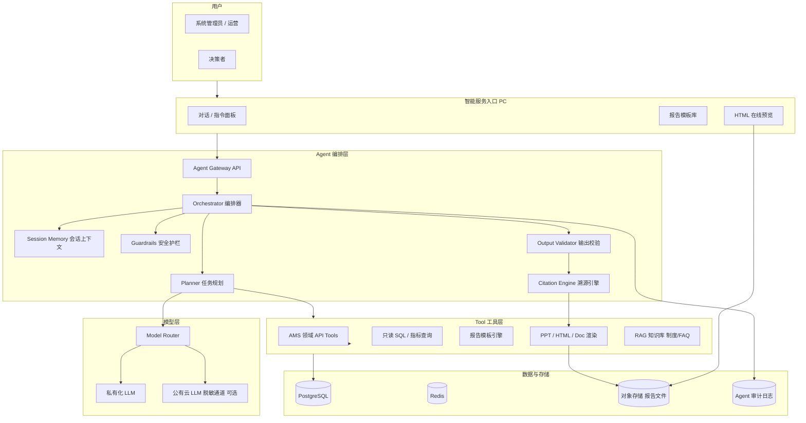
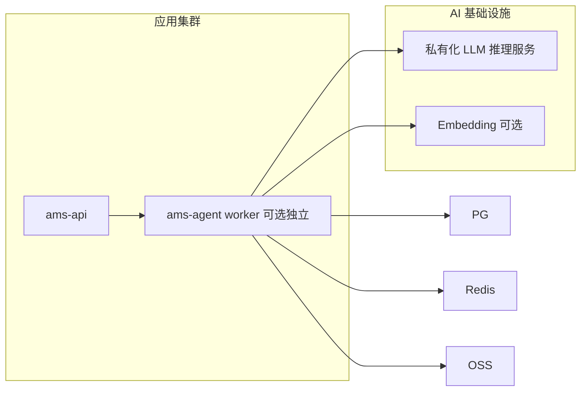

# 资产管理垂直领域 Agent 技术方案

| 版本 | V1.0 |
|------|------|
| 日期 | 2026-08-26 |
| 依据 | SRS V2.2 §4.26、§5.7；DSD V1.3 |
| 受众 | 架构师、后端、前端、安全、运维、产品 |

---

## 1. 建设目标

为 **系统管理员、运营管理员、决策层（集团/公司领导）** 提供基于大模型与系统数据的智能服务：

1. **模板 + 自然语言**：用业务语言描述分析意图，快速整理数据、生成报告。
2. **多格式输出**：PPT、在线预览 HTML、Word/PDF 文档，支持下载与分享（受权限控制）。
3. **垂直领域 Agent**：深度理解租控、合同、收费、催缴、盘点、合规等资管语义，调用系统能力与只读数据接口完成任务。
4. **可溯源可验证**：报告中的每个指标、表格行、结论均可追溯到数据源（API 响应、SQL 快照、单据 ID），禁止「幻觉数据」直接落库或导出。

---

## 2. 设计原则

| 原则 | 说明 |
|------|------|
| 数据不出域 | 默认私有化/专有云 LLM；外调公有云须脱敏、字段白名单、合同审计 |
| 工具优先 | 数值与状态以 **系统 Tool 调用结果** 为准，LLM 负责理解、编排、叙述 |
| 权限继承 | Agent 会话继承当前用户 RBAC + 数据范围，不得越权查询 |
| 全链路审计 | Prompt、Tool 入参/出参、模型版本、报告版本、导出人全程留痕 |
| 人机协同 | 对外分享、监管报送类报告默认需人工确认后发布 |
| 可降级 | LLM 不可用时，模板报告仍可通过固定 SQL + 渲染引擎生成 |

---

## 3. 总体架构



### 3.1 与现有系统关系

- Agent 作为 **独立子模块** `intelligence` 挂载于模块化单体（或独立微服务 `ams-agent`），通过 **内部 Service 调用** 与 asset/contract/billing 等域交互，不绕过 RBAC。
- PC 管理后台新增菜单：**智能中心**（对话助手、报告中心、模板管理、审计查询）。
- 小程序端 **不在一期范围**；决策者主要使用 PC 端。

---

## 4. 核心能力设计

### 4.1 报告模板库

预置与可配置模板（管理员可启用/禁用、绑定数据范围）：

| 模板 ID | 名称 | 典型受众 | 输出 |
|---------|------|----------|------|
| TPL-OPS-001 | 经营月报 | 决策层 | HTML + PPT + PDF |
| TPL-OPS-002 | 出租率与空置分析 | 运营 | HTML + PPT |
| TPL-FIN-001 | 收缴率与欠费专项 | 财务/决策 | HTML + Doc |
| TPL-RISK-001 | 合同到期与催缴升级 | 运营/法务 | HTML |
| TPL-REG-001 | 监管备案材料摘要 | 合规 | Doc + ZIP 附件索引 |
| TPL-AST-001 | 资产台账汇总 | 资产管理员 | HTML + Excel 附录 |
| TPL-CUSTOM | 自定义（NL 描述） | 全部 | 用户选择格式 |

**模板结构**（YAML/JSON 存储）：

```yaml
id: TPL-OPS-001
name: 经营月报
sections:
  - id: summary
    title: 核心指标
    dataSource: tool.getDashboardMetrics
    params: { companyId: "{{scope.companyId}}", month: "{{params.month}}" }
    citations: required
  - id: collection
    title: 收缴分析
    dataSource: tool.getCollectionReport
  - id: narrative
    title: 经营解读
    type: llm_narrative
    inputSections: [summary, collection]
    constraints: [no_new_numbers, cite_only]
outputFormats: [html, pptx, pdf]
approvalRequired: true   # 对外分享须审批
```

### 4.2 自然语言交互

用户输入示例：

> 「生成本月 XX 公司出租率、收缴率报告，重点分析欠费 Top10 项目，输出 PPT 给领导。」

**处理流程**：

```
1. Guardrails：注入检测、敏感词、权限预检
2. Intent 识别：report_generate | data_query | explain_metric | ops_suggest
3. Planner 分解：
   - 解析 scope（companyId、时间范围）
   - 选择模板 TPL-OPS-001 + 附加欠费章节
   - 调度 Tools 拉数
4. LLM 生成叙述段落（仅引用 Tool 返回字段）
5. Validator：正则/规则校验数字 ⊆ Tool 结果
6. Citation：为每个数字绑定 sourceRef
7. Render：HTML 预览 → 异步 PPT/PDF → OSS
8. Audit：写入 agent_run / agent_citation
```

### 4.3 Tool 工具层（系统能力映射）

| Tool 名称 | 映射能力 | 说明 |
|-----------|----------|------|
| `getDashboardMetrics` | dashboard API | 出租率、收缴率、在租面积 |
| `listAssets` | asset API | 台账列表（分页、筛选） |
| `getCollectionReport` | billing 报表 | 应收实收欠费 |
| `listOverdueBills` | dunning API | 欠费账单 TopN |
| `listExpiringContracts` | contract API | 到期合同 |
| `getVacantRevitalization` | revitalization API | 空置盘活进度 |
| `getAlertSummary` | alert API | 预警汇总 |
| `runApprovedMetricQuery` | 预置 SQL 模板 | 仅允许白名单指标 ID，禁止自由 SQL |
| `renderReport` | 模板引擎 | HTML/PPT/DOC 渲染 |
| `searchKnowledge` | RAG | 制度、FAQ、SRS 摘要（无 PII） |

**禁止**：Agent 直接执行写操作（创建合同、改租控、审批）；如需操作建议生成 **待办草稿** 由用户确认后在业务模块执行。

### 4.4 溯源与可验证机制

每条报告片段携带 **Citation**：

```json
{
  "claimId": "c-001",
  "text": "本月收缴率 92.3%",
  "value": 92.3,
  "unit": "percent",
  "sources": [
    {
      "type": "tool",
      "toolName": "getDashboardMetrics",
      "requestId": "run-abc123",
      "responseHash": "sha256:...",
      "snapshotAt": "2026-08-26T10:00:00+08:00",
      "recordIds": [],
      "apiPath": "/api/v1/dashboard/metrics"
    }
  ],
  "verified": true
}
```

**验证规则**：

1. 导出前 `Output Validator` 扫描正文数字，与 `sources` 集合比对。
2. HTML 预览页提供「查看数据来源」侧栏，点击指标跳转原始 API 详情（权限校验）。
3. 报告 PDF 末页附 **溯源附录**（Tool 调用清单、时间戳、操作人）。
4. `verified=false` 的片段在 UI 标红，**禁止导出**直至修复或用户强制标注为「说明性文字（非数据）」。

### 4.5 输出格式

| 格式 | 引擎 | 预览 |
|------|------|------|
| HTML | React 报告页 / SSR 静态页 | 系统内 iframe / 新 Tab |
| PPTX | python-pptx / Node pptxgenjs + 模板母版 | 生成后下载，缩略图预览 |
| DOCX | docx 模板填充 | 下载 |
| PDF | HTML → PDF（Puppeteer）或 DOCX → PDF | 在线 PDF.js 预览 |

报告文件存 OSS，元数据存 `agent_report`；分享链接带 **短期签名 + 权限校验**。

---

## 5. 模型层设计

### 5.1 部署模式（推荐优先级）

| 模式 | 场景 | ADR |
|------|------|-----|
| **私有化部署** | 国资内网、强合规 | 首选：Qwen2.5 / GLM / DeepSeek 私有化 |
| **专有云 API** | 已有云厂商 AI 专区 | VPC 内调用，数据不传公网 |
| **公有云 + 脱敏** | 仅叙述性段落、无原始 PII | 字段掩码、摘要化后再发送 |

### 5.2 Model Router

```typescript
interface ModelRoutePolicy {
  taskType: 'planning' | 'narrative' | 'classification';
  sensitivity: 'public' | 'internal' | 'confidential';
  preferredModel: string;
  fallbackModel?: string;
  requirePrivate: boolean; // confidential 必须为 true
}
```

- **confidential**（含租户姓名、证件、合同金额明细）：仅私有化模型 + 不出域 Tool 结果。
- **internal**（汇总指标）：可私有化或脱敏后外调。
- 记录每次调用的 `modelId`、`promptTokens`、`completionTokens` 至审计表。

### 5.3 Prompt 管理

- Prompt 模板版本化存储 `agent_prompt_template`，禁止前端拼接裸 Prompt。
- System Prompt 固定注入：角色边界、禁止编造数据、必须引用 Tool、权限说明。
- 用户输入与系统 Prompt 分离，防注入。

---

## 6. 安全与隐私

### 6.1 威胁与对策

| 威胁 | 对策 |
|------|------|
| Prompt 注入 | 输入消毒、System/User 分隔、Tool 结果不参与 Prompt 拼接为「指令」 |
| 越权读数 | 每个 Tool 调用注入 `userId` + `dataScope`，复用 RbacService |
| 数据外泄 | 私有化优先；外调脱敏；日志不落完整 PII |
| 幻觉数据 | Validator + 禁止未验证数字导出 |
| 模型投毒/供应链 | 模型镜像内网托管、签名校验 |
| 报告泄露 | OSS 私有桶、签名 URL、分享审批、水印（公司+用户+时间） |

### 6.2 脱敏规则（外调 LLM 时）

| 字段类型 | 处理 |
|----------|------|
| 姓名 | 租户A / 张* |
| 手机/证件 | 掩码 |
| 精确地址 | 区级聚合 |
| 合同编号 | 哈希短码引用 |
| 金额 | 汇总层可保留；明细层改为区间或 TopN 匿名 |

### 6.3 合规留痕

- 满足 SRS **NFR-AI-*** 与 **NFR-DSEC-024~025**、监管审计：谁、何时、用什么模板、查了哪些数据、生成了什么报告、是否对外分享。
- 详见 [数据安全设计说明书.md](./数据安全设计说明书.md) §2、§6。
- 保留周期：与操作日志一致（建议 ≥ 3 年，可配置）。

---

## 7. 数据模型（摘要）

详见 [数据库设计.md](../database/数据库设计.md) §3.12。

| 表 | 用途 |
|----|------|
| `agent_session` | 会话 |
| `agent_run` | 单次任务执行（规划、Tool、模型调用） |
| `agent_tool_call` | Tool 入参/出参快照（哈希 + 脱敏存储） |
| `agent_report` | 报告元数据、格式、OSS 路径、状态 |
| `agent_report_citation` | 片段溯源 |
| `agent_prompt_template` | Prompt/报告模板版本 |
| `agent_model_audit` | 模型调用审计 |

---

## 8. 接口设计（摘要）

详见 [openapi.yaml](../api/openapi.yaml) `Intelligence` tag。

| 方法 | 路径 | 说明 |
|------|------|------|
| POST | `/intelligence/sessions` | 创建会话 |
| POST | `/intelligence/sessions/{id}/messages` | 发送 NL 指令（SSE 流式可选） |
| GET | `/intelligence/templates` | 模板列表 |
| POST | `/intelligence/reports/generate` | 按模板/NL 生成报告 |
| GET | `/intelligence/reports/{id}` | 报告详情 + citations |
| GET | `/intelligence/reports/{id}/preview` | HTML 预览 |
| GET | `/intelligence/reports/{id}/download` | 下载 PPT/PDF/DOC |
| POST | `/intelligence/reports/{id}/approve` | 对外发布审批 |
| GET | `/intelligence/runs/{id}/trace` | 溯源链路（管理员） |

---

## 9. 部署架构



- **小规模**：Agent 逻辑作为 `intelligence` 模块与 API 同进程，LLM 通过 HTTP 调内网推理服务。
- **中大规模**：报告渲染、长任务异步化（BullMQ），独立 Worker 池；GPU 节点仅部署 LLM。

环境变量：`LLM_BASE_URL`、`LLM_API_KEY`、`LLM_DEFAULT_MODEL`、`AGENT_REQUIRE_PRIVATE=true`。

---

## 10. 实施分期

| 阶段 | 范围 | 优先级 |
|------|------|--------|
| Phase 1 | 模板报告 + 固定 Tool + HTML 预览 + 溯源 | P1 |
| Phase 2 | NL 对话 + Planner + PPT/PDF 导出 | P1 |
| Phase 3 | RAG 制度库 + 指标解读建议 | P2 |
| Phase 4 | 与 §4.23.16 智能定价/风险模型联动 | P2 |

依赖：dashboard/billing/contract 报表 API 稳定、RBAC 数据范围成熟、OSS 就绪。

---

## 11. 验收要点

1. 使用预置模板生成经营月报，HTML 预览可打开，指标可点击查看 Tool 溯源。
2. 自然语言「生成 XX 公司本月收缴率报告」成功，且收缴率数值与看板一致。
3. 越权用户无法通过 Agent 查询其他公司数据。
4. 篡改 LLM 输出中的数字后，Validator 拦截导出。
5. PPT/PDF 下载含水印与溯源附录。
6. 管理员可查询完整 `agent_run` 审计链路。
7. LLM 服务不可用时，模板报告降级生成（无 AI 叙述段落）。

---

## 12. 关联文档

- [需求规格说明书 §4.26](../需求规格说明书.md)
- [ADR-0008 私有化 LLM Agent 架构](../adr/0008-llm-agent-architecture.md)
- [详细设计说明书 §4.5](../详细设计说明书.md)

---

**评审通过后进入 Phase 1 开发。**
