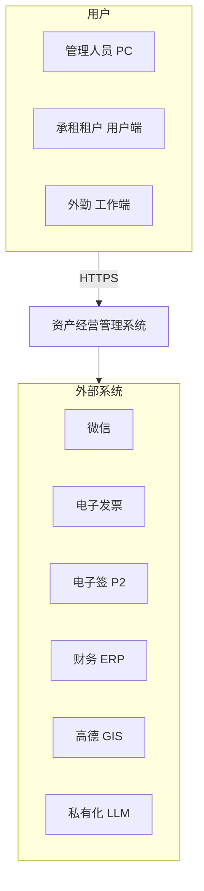
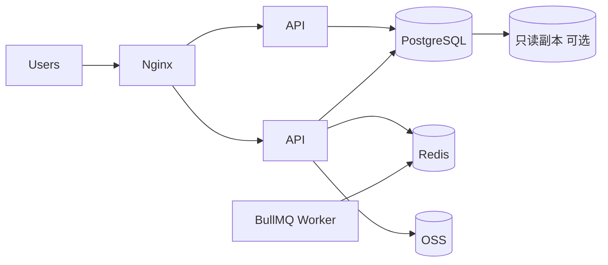

# 概要设计说明书（HLD）

| 版本 | V1.1 |
|------|------|
| 日期 | 2026-08-26 |
| 关联 | [详细设计说明书.md](../详细设计说明书.md) V1.4、[需求规格说明书.md](../需求规格说明书.md) V2.3、[数据安全设计说明书.md](./数据安全设计说明书.md) V1.0、[技术选型说明书.md](./技术选型说明书.md) V1.1 |

---

## 1. 引言

### 1.1 编写目的

在 SRS 基础上描述系统 **总体结构、模块边界、关键流程与技术选型**，为详细设计与开发提供框架。

### 1.2 读者

项目经理、架构师、开发、测试、运维。

---

## 2. 系统上下文



---

## 3. 设计目标与约束

| 目标 | 说明 |
|------|------|
| 业务闭环 | 十三条闭环（SRS §4.27） |
| 可扩展 | 模块化单体 → 可拆微服务 |
| 安全合规 | RBAC、审计、数据隔离、私有化 LLM |
| 性能 | 200 在线用户 |

约束：B/S、前后端分离、PostgreSQL、JWT、Knex+Flyway、OpenAPI 契约。

---

## 4. 总体架构

### 4.1 逻辑架构

| 层次 | 职责 |
|------|------|
| 展现层 | PC React、微信原生小程序 ×2 |
| 接入层 | Nginx、HTTPS |
| 应用层 | Express 模块化单体、审批引擎、EventBus |
| 任务层 | BullMQ Worker |
| 集成层 | 微信、发票、电子签、ERP、GIS、LLM 适配器 |
| 数据层 | PostgreSQL、Redis、OSS |

### 4.2 部署架构



### 4.3 技术选型摘要

> 详见 [技术选型说明书.md](./技术选型说明书.md)。

| 层次 | 技术 |
|------|------|
| PC | React 18 + Vite + Tailwind + Shadcn |
| 小程序 | 微信原生（ADR-0014） |
| 后端 | Node 20 + Express + TypeScript |
| 数据 | PostgreSQL 15 + Knex + Flyway |
| 缓存/队列 | Redis 7 + BullMQ |
| 契约 | OpenAPI 3.0 |
| 工程 | pnpm Monorepo（ADR-0012） |

---

## 5. 功能模块划分

| 模块 | 职责 |
|------|------|
| system / org | 认证、RBAC、组织 |
| asset / certificate | 台账、权证、评估、抵押 |
| lease / contract / pricing | 招租、合同、计划 |
| billing / invoice / refund / finance | 收费、发票、退款、业财 |
| dunning / utility / maintenance | 催缴、水电、维保 |
| alert / notification / plan | 预警、消息、经营计划 |
| disposal / occupation / selfuse / revitalization | 处置、占用、自用、盘活 |
| dashboard / intelligence | 看板、智能 Agent |
| intangible / esign | P2 扩展 |

模块依赖：`contract → pricing → billing` 单向；详见 DSD §3.5。

---

## 6. 关键业务流程

### 6.1 租赁签约

```
添加租赁 → 审批引擎 → 通过 → 缴费计划 → 租控在租 → 按期出账
```

### 6.2 退租

```
退租申请 → 清场(工作端) → 结算 → 保证金 → 合同终止 → 空置 → 盘活
```

### 6.3 公开招租

```
公告 → 报名 → 审查 → 中标 → 签约(6.1)
```

### 6.4 横切：审批 + 事件 + 通知

```
业务提交 → ApprovalEngine → 完成 → DomainEventBus
  → NotificationService / TaskService / 下游域 Handler
```

---

## 7. 数据架构概要

- PostgreSQL 主库；Flyway 迁移
- 闭环单据：disposal、occupation、refund、approval、notification
- 详见 [数据库设计.md](../database/数据库设计.md)

---

## 8. 接口架构概要

- REST `/api/v1`；OpenAPI 契约
- JWT + `X-Client-Type`
- 回调 `/api/v1/callbacks/*`

---

## 9. 安全架构概要

> 详见 [数据安全设计说明书.md](./数据安全设计说明书.md)、SRS §5.8、ADR-0015。

- **传输**：HTTPS（TLS 1.2+）、JWT、RBAC 数据范围
- **数据**：四级分类；L4 字段加密；API 脱敏；导出审计 + 水印
- **存储**：PG/OSS/备份加密；Redis 不存高敏明文；密钥 KMS 托管
- **合规**：境内存储；监管数据禁止物理删除；日志 ≥3 年
- **Agent**：脱敏网关、Tool 白名单、权限继承（NFR-DSEC-024~025）
- **事件**：越权/泄露 15min 止损；P0 72h 复盘

---

## 10. 非功能设计概要

| 类别 | 方案 |
|------|------|
| 性能 | 连接池、缓存、分页、只读副本 |
| 可用 | 多实例、健康检查、主从 |
| 备份 | PG 日备 + WAL |
| 监控 | pino + Prometheus |
| CI/CD | GitHub Actions（见 CI-CD方案.md） |

---

## 11. 智能服务架构概要

详见 [智能Agent技术方案.md](./智能Agent技术方案.md)。

Tool-First Agent；HTML/PPT/PDF 输出；私有化 LLM；溯源审计。

---

## 12. 开发与部署视图

- Monorepo：backend、admin-web、miniprogram-*、packages/*
- 容器：Docker Compose / K8s（`deploy/k8s/`）
- 详见 [部署手册](../deployment/部署手册.md)

---

## 13. 与详细设计关系

| HLD | DSD |
|-----|-----|
| 模块边界 | Service/Repository/算法 |
| 流程概览 | 状态机、伪代码 |
| 选型摘要 | 完整配置、CI、测试 |

---

## 14. 修订记录

| 版本 | 说明 |
|------|------|
| V1.0 | 初版 |
| V1.1 | 技术评审：选型收敛、EventBus/BullMQ/审批、章节重排、V2.2 模块 |

---

**评审通过后进入编码。**
