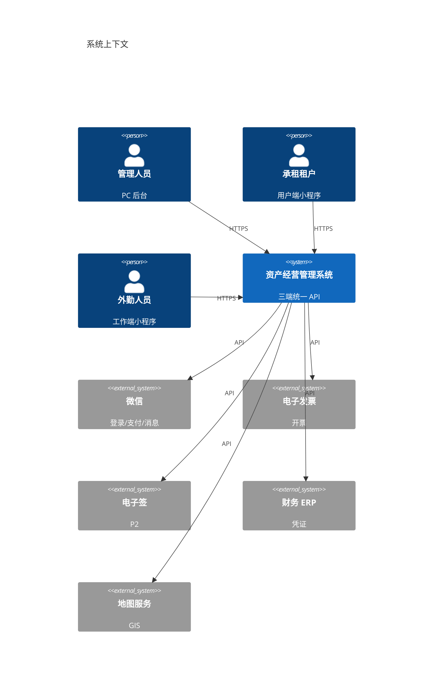
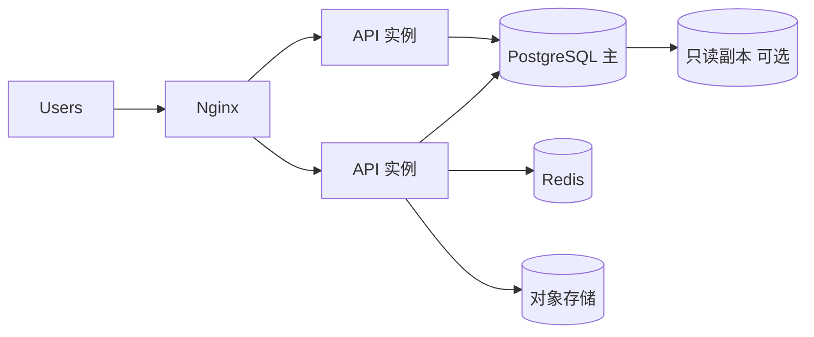

# 概要设计说明书（HLD）

| 版本 | V1.0 |
|------|------|
| 日期 | 2026-08-26 |
| 关联 | [详细设计说明书.md](../详细设计说明书.md)（LLD）、[需求规格说明书.md](../需求规格说明书.md) |

---

## 1. 引言

### 1.1 编写目的

在 SRS 基础上描述系统 **总体结构、模块边界、关键流程与技术选型**，为详细设计与开发提供框架，不涉及具体类/表字段实现细节。

### 1.2 读者

项目经理、架构师、开发、测试、运维。

---

## 2. 系统上下文



---

## 3. 设计目标与约束

| 目标 | 说明 |
|------|------|
| 业务闭环 | 五条闭环（经营/空置/退租/风险/监管） |
| 可扩展 | 模块化单体 → 可拆微服务 |
| 安全合规 | RBAC、审计、数据隔离 |
| 性能 | 200 在线用户 |

约束：B/S、前后端分离、PostgreSQL 主库、JWT 鉴权（见 ADR）。

---

## 4. 总体架构

### 4.1 逻辑架构

| 层次 | 职责 |
|------|------|
| 展现层 | PC React、微信小程序 ×2 |
| 接入层 | Nginx、HTTPS、静态资源 |
| 应用层 | Express 模块化单体（领域服务） |
| 集成层 | 微信、发票、电子签、ERP、GIS 适配器 |
| 数据层 | PostgreSQL、Redis、对象存储 |

### 4.2 部署架构（逻辑）



### 4.3 技术选型摘要

| 层次 | 技术 |
|------|------|
| PC 前端 | React 18 + TypeScript + Vite + Tailwind |
| 小程序 | 微信原生 / Taro |
| 后端 | Node.js 20 + Express + TypeScript |
| 数据库 | PostgreSQL 15+ |
| 缓存 | Redis 7+ |
| 文件 | S3 兼容 OSS / MinIO |
| API 契约 | OpenAPI 3.0 |

---

## 5. 功能模块划分

| 模块 | 职责 | 对外能力 |
|------|------|----------|
| system | 认证、RBAC、菜单、日志 | 登录、权限 |
| org | 公司、部门、用户 | 组织树 |
| asset | 项目、台账、租控、盘点 | 资产 CRUD、二维码 |
| certificate | 权证 | 产权、抵押 |
| lease | 招租、公开遴选 | 公告、报名 |
| contract | 合同、退租 | 签约、变更、清场 |
| pricing | 规则引擎 | 缴费计划 |
| billing | 账单、收款 | 收费大厅 |
| invoice | 发票 | 开票 |
| dunning | 催缴 | 等级升级 |
| utility | 水电 | 抄表、杂费 |
| maintenance | 报修、巡查、SLA | 工单 |
| alert | 预警 | 规则、记录 |
| revitalization | 盘活 | 任务、看板 |
| plan | 经营计划 | 偏差、督办 |
| finance | 对账、凭证 | 业财 |
| dashboard | 看板、报表 | 指标 API |
| intangible | 无形资产 P2 | 台账、摊销 |
| esign | 电子签 P2 | 签署回调 |

模块依赖原则：**contract → pricing → billing** 单向依赖；禁止循环。

---

## 6. 关键业务流程（概要）

### 6.1 租赁签约主流程

```
添加租赁 → 合同草稿 → 审批流 → 审批通过
  → PricingEngine 生成 payment_plan
  → LeaseControl → 在租
  → BillScheduler 按期出账
```

### 6.2 退租主流程

```
退租申请 → 账单冻结 → 清场验收(工作端)
  → 退租结算 → 保证金处理 → 合同终止
  → LeaseControl → 空置 → 盘活任务(可选)
```

### 6.3 公开招租流程

```
公告发布 → 租户报名 → 资格审查 → 中标
  → 添加租赁（进入 6.1）
```

详细状态机见 [详细设计说明书](../详细设计说明书.md) 与 SRS §4.24。

---

## 7. 数据架构概要

- 核心实体：公司、项目、资产、租户、合同、账单、收款、工单
- 主库 PostgreSQL；日志可分区
- 详见 [数据库设计文档](../database/数据库设计.md)

---

## 8. 接口架构概要

- 统一 REST `/api/v1`
- JWT + `X-Client-Type`
- OpenAPI 契约：`docs/api/openapi.yaml`
- 第三方回调独立路径 + 签名校验

---

## 9. 安全架构概要

- 传输：HTTPS
- 认证：JWT / Refresh
- 授权：RBAC + 数据范围（company_id / project_id）
- 审计：operation_log
- 文件：私有桶 + 临时 URL

---

## 10. 非功能设计概要

| 类别 | 方案 |
|------|------|
| 性能 | 连接池、Redis 缓存、分页、索引、只读副本 |
| 可用 | 多实例 + 健康检查；DB 主从 |
| 备份 | PG 日备 + WAL；见部署手册 |
| 监控 | 日志 + 指标 + 告警 |

---

## 11. 开发与部署视图

- 代码：monorepo 或 multi-repo（backend + admin-web + mp）
- 迁移：Flyway
- 容器：Docker Compose / K8s
- 详见 [部署手册](../deployment/部署手册.md)

---

## 12. 与详细设计关系

| 本文（HLD） | 详细设计（LLD） |
|-------------|-----------------|
| 模块边界 | 类/服务/算法 |
| 流程概览 | 状态机、伪代码 |
| 技术选型 | 框架配置、错误处理 |
| ER 概要 | 全表字段、索引 |

---

**评审**：概要设计评审通过后，方可进入详细设计与编码。
