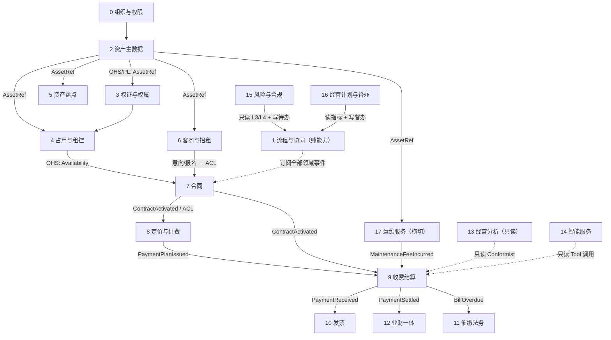

# 领域划分与限界上下文设计（DDD）

| 版本 | V1.1 |
|------|------|
| 日期 | 2026-09-11 |
| 依据 | [需求规格说明书.md](../需求规格说明书.md) V2.5 |
| 关联 | [概要设计说明书.md](./概要设计说明书.md)、[详细设计说明书.md](../详细设计说明书.md) V1.8、[数据库设计.md](../database/数据库设计.md)、[ADR-0002](../adr/0002-monolith-modular-backend.md)、[ADR-0013](../adr/0013-in-process-domain-events.md)、[ADR-0019](../adr/0019-asset-unit-and-occupancy-model.md)、[ADR-0020](../adr/0020-bounded-contexts-and-aggregate-boundaries.md) |
| 评审 | [领域划分与限界上下文评审报告.md](./领域划分与限界上下文评审报告.md)（V1.0 缺陷清单与处置） |

---

## 1. 目的与范围

### 1.1 编写目的

回答三个问题：

1. **业务怎么拆**——哪些流程是一个事务内的强一致，哪些必须跨上下文最终一致；
2. **领域怎么分**——限界上下文（Bounded Context）在哪里，聚合（Aggregate）在哪里，统一语言是什么；
3. **代码怎么落**——`com.ams.modules` 下的 35 个模块如何收敛为可演进的上下文边界，且不推翻既有实现。

### 1.2 读者

架构师、后端开发、前端（接口契约）、测试（验收口径）、产品（术语）。

### 1.3 与既有文档的关系

| 文档 | 回答的问题 |
|------|-----------|
| **本文件** | **为什么这样分**：子域、上下文、聚合边界、映射与依赖规则 |
| [业务闭环编排设计](./业务闭环编排设计.md) | **闭环怎么落地**：13 条闭环的编排、状态机、补偿与已验证缺口清单 |
| [评审报告](./领域划分与限界上下文评审报告.md) | **V1.0 错在哪**：缺陷清单、证据、处置状态 |
| [概要设计说明书](./概要设计说明书.md) | 系统总体结构、部署、技术选型摘要 |
| [详细设计说明书](../详细设计说明书.md) | 每个模块怎么实现（Service/状态机/算法/伪代码） |
| [资产单元与占用模型改造清单](./资产单元与占用模型改造清单.md) | ADR-0019 的**施工单**（逐文件改造点） |
| [数据库设计.md](../database/数据库设计.md) | 表结构、索引、约束 |

本文件不重复施工细节，只定义边界与规则；边界一旦确定，DSD 的模块章节按本文件重组。

### 1.4 版本与修订原则

- V1.0 为初版设想；**V1.1 依据[评审报告](./领域划分与限界上下文评审报告.md) P0/P1 缺陷修正**，主要变更：
  1. L0 不再包含任何读业务表的模块（§4、§6.3）；
  2. 上下文由 14 个修正为 **18 个**（新增资产盘点、风险与合规、智能服务、经营计划与督办；拆分纯能力层）；
  3. 占用引入**预留态**（决策 A），修复并发超租无约束问题（§10.3）；
  4. 跨上下文只读投影补**事件投递保证**（outbox，§12.4）；
  5. 补**十三条闭环映射矩阵**（§11.1）。
- 修订记录见 §15；边界变更须新增 ADR 并同步本文件。

---

## 2. 现状诊断

### 2.1 三个结构性问题

| # | 问题 | 证据 | 后果 |
|---|------|------|------|
| 1 | **模块按菜单分包，不按领域** | `com.ams.modules` 下 35 个模块与 PC 后台菜单基本一一对应（`asset`/`lease`/`contract`/`billing`/`invoice`/`dunning`/`maintenance`/`task`…） | 业务规则散落；"资产状态"被 6 个模块直写；改一个字段要全库搜 |
| 2 | **资产只有一层实体，下游全部挂 `asset_id`** | 合同、招租、占用、自用、处置均直挂 `asset_id`；租控由 `asset.lease_control_status` 单字段承载 | 部分占用无法表达；组合/拆分租赁靠"N 份合同重复 `asset_id`"（`LeaseBundleService.createSplit`） |
| 3 | **依赖方向可以向上** | 现状 `billing → contract` 为模块直调；`AlertService` 直读 `ContractMapper`/`BillMapper` | 合同域改字段震到账单域与预警；无法独立演进或拆分 |

问题 2 已由 [ADR-0019](../adr/0019-asset-unit-and-occupancy-model.md) 修复（V39–V41 已交付扩展层）；问题 1、3 由本文件与 [ADR-0020](../adr/0020-bounded-contexts-and-aggregate-boundaries.md) 定义目标态。

### 2.2 判定一个模块是否该独立：四个症状

沿用"删除测试"——**假设删掉这个模块，复杂度是消失还是扩散到 N 个调用方**：

| 症状 | 含义 | 处置 |
|------|------|------|
| 接口方法数与实现复杂度相当 | 浅模块（透传） | 合并或删除 |
| 与另一个模块的实体互相 `JOIN` 写 | 边界画错 | 合并为一个上下文 |
| 变更频率差异 > 一个数量级 | 边界可能画对，但依赖方式错 | 保留模块，改事件/Port |
| 只有一个调用方，且与调用方共用事务 | 假边界 | 并入调用方 |

按此判定：`occupation`/`selfuse`/`disposal` 三者共用同一不变量（单元区间互斥），合并为一个上下文；`task`/`notification` 同为"待办产出"能力，合并为纯能力层；但**预警、合规、经营计划不可并入纯能力层**——它们要读合同/账单/指标（见 §4.4）。

---

## 3. 战略设计：子域划分

子域决定**投入策略**，上下文决定**代码边界**。两者不是一一对应。

| 类型 | 子域 | 投入策略 | 判断依据 |
|------|------|----------|----------|
| **核心域** | 招租签约、计费收费、催缴 | 自研、重点打磨、优先自动化 | 直接决定收入与收缴率 |
| **核心支撑域** | 资产主数据、**占用与租控**、资产盘点 | 自研、模型先行、不变量固化到 DB | 错了全盘错；无法外购 |
| **支撑域** | 权证、定价规则、发票、运维服务、业财对账、风险合规、经营计划 | 自建，标准化实现 | 有行业共性 |
| **通用域** | 组织权限、流程协同（审批/待办/通知）、字典/文件/审计、经营分析、智能服务 | 复用、薄封装、不进核心模型 | 标准化能力 |

**结论**：系统的"地基"是"资产主数据 + 占用与租控"两个上下文。下游 9 个域里有 6 个（合同、招租、运维、处置、盘活、分析）其实都在问同一个问题——**"某计租单元在某时间段，是否可租 / 可用 / 被谁占用"**。这个问题只在占用上下文回答一次（见 §10.2）。

---

## 4. 限界上下文划分

### 4.1 上下文清单（18 个 + 平台工具）

| # | 层 | 限界上下文 | 类型 | 聚合根（族） | 一句话职责 | 唯一写入口 |
|---|----|-----------|------|--------------|-----------|-----------|
| 0 | L0 | **组织与权限** IAM | 通用 | Company / User / Role | 谁、能看哪些公司/项目 | `RbacService` |
| 1 | L0 | **流程与协同** Process | 通用 | ApprovalInstance / Task | 审批编排 + 待办产出（**纯能力，不读业务表**） | `ApprovalEngine` / `TaskService` |
| 2 | L1 | **资产主数据** Asset Master | 核心支撑 | Project / Asset / AssetUnit | 项目-分区-资产-单元"一物一档" | `AssetService` / `AssetUnitService` |
| 3 | L1 | **权证与权属** Title | 支撑 | AssetCertificate / Mortgage / Transfer | 权证、抵押、评估、调拨 | `CertificateService` |
| 4 | L2 | **占用与租控** Occupancy | 核心支撑 | AssetOccupancy | 空间互斥与可用性唯一真源 | `AssetOccupancyService` |
| 5 | L2 | **资产盘点** Audit | 支撑 | AuditPlan / AuditItem | 盘点计划、盘盈盘亏、账实核对 | `AssetAuditService` |
| 6 | L3 | **客商与招租** Tenancy | 核心 | Tenant / LeaseListing / Tender | 招租意向、报名、客商准入与信用 | `ListingService` |
| 7 | L3 | **合同** Contract | 核心 | Contract（含 ContractLine） | 租约法律载体 + 状态机 | `ContractStateMachine` |
| 8 | L3 | **定价与计费** Pricing | 支撑 | PricingRule / PaymentPlan | 合同 → 应收计划；减免/调价**规则** | `PricingEngine` / `PlanGenerator` |
| 9 | L4 | **收费结算** Billing | 核心 | Bill / Payment / Deposit | 应收 → 实收 → 核销；**退款冲正子包** | `BillService` / `AllocationService` |
| 10 | L4 | **发票** Invoicing | 支撑 | Invoice | 开票、红冲、勾稽 | `InvoiceLifecycleService` |
| 11 | L4 | **催缴法务** Dunning | 核心 | DunningCase / LateFee | 欠费 → 催缴 → 法务 | `DunningEscalationService` |
| 12 | L4 | **业财一体** Finance | 支撑 | ReconcileBatch / Voucher | 银行流水匹配、收入确认、凭证推送 | `ReconcileService` |
| 13 | L5 | **经营分析** Analytics | 通用 | （只读投影，无聚合） | 看板、报表、**监管报送** | 无（只读） |
| 14 | L5 | **智能服务** Intelligence | 通用 | AgentSession / AgentRun / AgentReport | LLM Agent、报告生成、溯源（**有状态**） | `IntelligenceService` |
| 15 | L5 | **风险与合规** Risk | 支撑 | AlertRecord / ComplianceFiling | 预警规则评估、处置闭环、重大事项备案 | `AlertService` / `ComplianceService` |
| 16 | L5 | **经营计划与督办** Plan | 支撑 | BusinessPlan | 经营目标、偏差分析、督办 | `BusinessPlanService` |
| 17 | 横切 | **运维服务** Maintenance | 支撑 | RepairOrder / InspectionPlan / Meter | 报修、巡查、SLA、能耗 | `RepairService` |
| — | — | **平台工具**（非上下文） | — | — | 导入导出、期初迁移、字典、文件、操作日志、电子签适配器 | — |

**L0 的两条硬约束**（V1.1 修正的核心）：

1. L0 只提供**能力**（谁能审批、待办怎么写、通知怎么发），**不得 import 任何业务域的实体或 Mapper**；
2. 一切"读业务数据才能判定的规则"（预警阈值、备案条件、计划偏差、运营日历）**必须移出 L0**，落在 L5 风险与合规 / L5 经营计划 / 各自业务域内。

### 4.2 现有模块归属映射

| 限界上下文 | 现有模块 | 处置 |
|-----------|---------|------|
| 组织与权限 | `system`、`org` | 保留；字典/文件/审计日志移入平台通用子包 |
| 流程与协同 | `task`、`notification` | 保留；**`alert`/`compliance`/`plan`/`opscalendar` 迁出** |
| 资产主数据 | `asset`(台账/结构)、`map` | 剥离单元与占用；`map` 降为只读投影 |
| 权证与权属 | `asset`(certificate/mortgage)、`evaluation` | 抽出为独立上下文 |
| 占用与租控 | `occupation`、`selfuse`、`disposal`、`revitalization` + 新 `asset_occupancy` | 合并为"单据层 + 生效层"两个子包 |
| 资产盘点 | `audit` | **V1.0 误归入平台工具**；实为 `AssetAuditPlan`/`AssetAuditItem`（FR §4.23.8 P0），迁入 L2 |
| 客商与招租 | `lease`、`tenant` | `tenant` 并入 |
| 合同 | `contract` | 保留；引入 `ContractLine`；退租单 `vacate_order` 归此 |
| 定价与计费 | `pricing`、`adjustment`(规则部分) | 调价/减免**规则**归此；调价/减免**单据**归合同 |
| 收费结算 | `billing`、`refund`（DSD 已列，模块待建） | 退款冲正作为子包，不单设上下文（与核销强耦合） |
| 发票 | `invoice` | 保留 |
| 催缴法务 | `dunning` | 保留 |
| 业财一体 | `finance` | 独立上下文 |
| 经营分析 | `dashboard`、`report`、`regulation` | 合并；只读 |
| 智能服务 | `intelligence` | **V1.0 错误并入"只读分析"**；它有 7 张状态表，独立成上下文 |
| 风险与合规 | `alert`、`compliance`、`opscalendar`(运营日历) | 迁出 L0，放 L5（读 L3/L4） |
| 经营计划与督办 | `plan` | 迁出 L0，放 L5（读 L5 指标、写 L0 待办） |
| 运维服务 | `maintenance`、`meter` | 合并 |
| 平台工具 | `migration`、`io`、`misc`、`config` | 不进业务上下文；迁移的跨域写入规则见 §12.5 |
| 待建（P2） | 无模块：`esign`、固定资产/无形资产正式建模 | 电子签作适配器（平台）；固定资产折旧语言与经营性台账不同，正式建模时独立成上下文 |

### 4.3 划分依据（三个判据 + 一条反例）

1. **语言不同** → 不同上下文。"占用"在合同域叫"租期"，在收费域叫"计费区间"，在运维域叫"服务期"。
2. **不变量不同** → 不同聚合。"Σ 单元面积 ≤ 资产面积"与"同单元区间不重叠"可独立违反、独立修复。
3. **变更频率不同** → 不同上下文（用事件/Port 而非直调连接）。
4. **反例（V1.0 的错误）**：判据 1 要求把语言不同的东西拆开，但 V1.0 把 `task`/`notification`/`alert`/`plan`/`opscalendar`/`compliance` 合成一个"流程协同"，同时又把有状态的 `intelligence` 塞进"只读分析"。V1.1 按判据纠正，并在 §4.1 用"L0 两条硬约束"把该判据变成可机器校验的规则。

---

## 5. 统一语言（术语表）

以下为**规范术语**，代码、接口、UI、文档必须一致；右侧为禁止用法。

| 规范术语 | 英文/代码名 | 精确定义 | 禁止混用 |
|---------|------------|---------|---------|
| **资产** | `Asset` | 一物一档的实物/权利标的（房产、土地），承载权属、价值、位置 | "房间"、"铺位"（那是单元） |
| **计租单元** | `AssetUnit` | **不可再分**的最小计租单位，合同/占用的基本粒度 | "子资产"、"分间" |
| **项目** | `Project` | 园区/楼宇/地块级的管理容器，下辖分区与资产 | "楼盘"（可，但代码统一 `Project`） |
| **分区** | `ProjectZone` | 项目内的管理分区（A 区、1 号楼） | "区域"（与省市区混淆） |
| **占用** | `AssetOccupancy` | **已生效或已预留**的"某主体在某区间占用某单元"事实，互斥 | "占用状态"（那是派生态） |
| **单据** | `contract` / `self_use_order` / `occupation_order` / `disposal_order` / `vacate_order` | 可多个、可驳回的**申请载体**，含审批状态 | "占用"（单据 ≠ 生效占用） |
| **预留** | `biz_status='reserving'` | 单据**已提交审批**即写入的排他占用，防并发超租；驳回/撤回转区间收口 | "预占"、"临时占用"（是独立类型） |
| **退租中** | `biz_status='vacating'` | 租户尚未腾空，占用区间**仍然有效** | 独立租控状态（已废弃） |
| **招租意向** | `LeaseListing` | 某单元对外招租的**意向**，可并存多个，**不占用面积** | "招租"（当动词可用；当名词指 `LeaseListing`） |
| **合同行** | `ContractLine` | 合同与计租单元的一对多桥接，每行一个单元及其面积/租金/分摊 | "合同明细"、"bundle 明细" |
| **账单** | `Bill` | 应收凭据，由缴费计划按期生成 | "订单"（`PaymentOrder` 是支付侧概念） |
| **核销** | `Allocation` | 收款对账单的逐笔冲减，不可变流水 | "对账"（那是 `Reconcile`） |
| **退款冲正** | `RefundReversal` | 退款单驱动的核销逆序回退 + 发票红冲 + 凭证冲销 | "退款"（仅支付动作时可用） |
| **可用性** | `Availability` | 某单元某区间是否可租/可用，由占用（含预留）集合派生 | "空置"（派生展示口径，不是事实） |
| **权属负担** | `Mortgage` | 抵押等权利限制，**不是占用**，不与租赁互斥 | "抵押占用" |
| **盘点** | `AuditPlan` / `AuditItem` | 账实核对（计划→盘点→盘盈盘亏→调账），**不是操作日志** | "审计"（`operation_log` 才是） |
| **备案** | `ComplianceFiling` | 重大事项（低价、大额减免、处置）的合规留痕与材料包 | "审批"（备案是留痕，审批是决策） |

> 关键区分三则：
> **① 占用 ≠ 单据**——单据可驳回、可并存；生效/预留占用互斥。
> **② 意向 ≠ 占用**——`leasing` 不写 `asset_occupancy`，允许多个意向并存。
> **③ 权属负担 ≠ 占用**——抵押只与处置/拆分互斥，不与租赁互斥。

`asset_occupancy.biz_status` 取值集合：`reserving` | `active` | `vacating`（见 §10.3）。

---

## 6. 上下文映射

### 6.1 映射图



图例：`-->` 同步 Port 调用或领域事件（含说明）；`-. 只读 .->` 投影；`OHS/PL` = 开放主机服务 + 发布语言；`ACL` = 防腐层。

### 6.2 跨上下文只允许五种交互

| 方式 | 用途 | 规则 |
|------|------|------|
| **① 同步 Port 查询** | 下游读上游（拿主数据、判可用性） | 只读、无副作用、可批量、禁止反向调用 |
| **② 领域事件** | 上游通知下游（状态已变更） | 投递保证见 §12.4；载荷含 `traceId/bizType/bizId`；幂等消费 |
| **③ 只读投影** | 下游存上游快照（名称、面积、公司） | 禁止跨域 `JOIN` 写；投影随事件更新，按版本比对兜底 |
| **④ 编排器** | 3 个以上上下文的流程 | `ProcessManager` 负责推进与补偿，不承载领域规则 |
| **⑤ 依赖倒置（前置校验）** | 下游需要"上层"规则做提交前校验（如合同提交前查合规） | **上层提供实现、下层定义接口**：`contract` 定义 `SubmissionPolicy` 接口，`risk` 实现并注入。依赖方向仍向下 |

**明令禁止**：跨上下文直呼 Service 写库、跨上下文外键 `ON DELETE CASCADE`、跨上下文共享可变实体、一个事务里改两个上下文的聚合、L0 依赖任何业务域。

### 6.3 分层与依赖方向

依赖只能向下，**禁止向上或反向**。

| 层 | 上下文 | 允许依赖 |
|---|--------|---------|
| **L0 通用** | 0 组织与权限、1 流程与协同 | **无**（不依赖任何业务域；只被依赖） |
| **L1 主数据** | 2 资产主数据、3 权证与权属 | L0 |
| **L2 空间** | 4 占用与租控、5 资产盘点 | L0、L1 |
| **L3 经营** | 6 客商与招租、7 合同、8 定价与计费 | L0–L2 |
| **L4 资金** | 9 收费结算、10 发票、11 催缴法务、12 业财一体 | L0–L3（**对 L3 仅事件 + 快照**，禁止调合同 Service 写库） |
| **L5 分析** | 13 经营分析、14 智能服务、15 风险与合规、16 经营计划与督办 | L0–L4（**只读**；写只限自身聚合并经 L0 写待办） |
| **横切** | 17 运维服务 | L0–L2；向 L4 传费用走事件 |

> ⚠️ **现状修正点 1**：`billing → contract` 是 L4 → L3 的向上直调，必须改为"合同发布 `ContractActivated`（含条款与合同行快照）→ 收费落地本地投影"。
> ⚠️ **现状修正点 2**：`AlertService` 直读 `ContractMapper`/`BillMapper`（L0 → L3/L4）、`ComplianceService` 直读 `contract`/`lease`、`BusinessPlanService` 直读 `dashboard`（L0 → L5）、`OpsCalendarService` 直读 `occupation`/`selfuse`（L0 → L2）——四处共同违反 L0 约束，必须按下表迁移。这四个模块是"L0 不是 L0"的直接证据，详见[评审报告](./领域划分与限界上下文评审报告.md) P0-1。

**L0 违规迁移落点**：

| 模块 | 现层 | 迁往 | 理由 |
|------|------|------|------|
| `alert` | L0 | **L5 风险与合规** | 需扫合同到期、账单逾期、抵押到期（读 L3/L4） |
| `compliance` | L0 | **L5 风险与合规** | 需读合同与招租公告生成备案材料包 |
| `plan` | L0 | **L5 经营计划与督办** | 需读 L5 指标算偏差 |
| `opscalendar` | L0 | **L5 风险与合规**（运营日历子包） | 需读占用/自用排期 |
| `task`、`notification` | L0 | 保持 L0 | 只写待办与通知，不读业务表 |

---

## 7. 战术设计：项目与资产录入

录入不是一张表单，而是**四个聚合的四次独立写入**，由应用服务编排（应用服务不含领域规则，只负责时序与幂等）。

### 7.1 聚合边界

| 聚合 | 聚合根 | 内部实体/值对象 | 不变量（★=跨聚合，需兜底） | 事务边界 |
|------|--------|----------------|--------------------------|---------|
| `Project` | Project | ProjectZone[]、地址(值对象) | 分区编码项目内唯一；分区面积由资产汇总（只读） | 单事务（聚合内强一致） |
| `Asset` | Asset | 权属/标签/位置/价值(值对象) | `asset_no` 全局唯一；分区必须属于同项目 | 单事务（聚合内强一致） |
| `AssetUnit` | AssetUnit | 面积、底价、楼层、排序 | ★Σ 单元面积 ≤ 资产面积；同资产内 `unit_no` 唯一 | 单事务；面积预算跨聚合校验 |
| `AssetCertificate` | AssetCertificate | 抵押记录 | ★抵押存续期内禁止处置/拆分 | 单事务；禁止处置跨聚合校验 |
| `AssetOccupancy` | AssetOccupancy | 占用区间(DateRange)、`biz_status` | **同单元区间不重叠**（含预留） | 单事务 + DB `EXCLUDE` |

> V1.0 把 ★ 类不变量也写成"强不变量"，与决策 B（单元独立聚合）自相矛盾；V1.1 明确标注跨聚合，落地位置见 §7.3。

**为什么 `AssetUnit` 不放进 `Asset` 聚合？**

| 方案 | 优点 | 缺点 |
|------|------|------|
| 作为 `Asset` 聚合内实体 | 面积预算不变量天然强一致 | 一栋楼 200 单元会串行化；合同生效/退租都要锁整个资产聚合 |
| **独立聚合 + DB 约束（采纳）** | 并发隔离好；互斥由 `EXCLUDE` 对**任何写入口**生效（含导入、迁移脚本） | 不变量跨聚合，需检测作业兜底 |

### 7.2 录入编排

```text
AssetOnboardingProcess（应用编排，非领域服务）
  1) ProjectAggregate.register(...)                         // 不含资产
       → 事件 ProjectRegistered(projectId)
  2) AssetAggregate.create(projectRef, zoneRef, ...)        // INV: asset_no 全局唯一
       → 事件 AssetRegistered(assetId, ...)                 // 触发 3、4
  3) UnitAggregate.generate(assetRef, specs[])
       → INV-1: Σ unit.area ≤ asset.area，越界即拒绝
       → 不传 specs 时按 ensureUnitForAsset 生成 1 个单元（保证 ≥1 单元）
  4) CertificateAggregate.register(assetRef, ...)           // 权证可后补，异步
```

**幂等与重试**：每一步以 `(processId, step)` 为幂等键；步骤 3 失败时步骤 1、2 不回滚（资产无单元是**可诊断的中间态**，由 `v_asset_without_unit` 暴露，可重跑步骤 3 修复），避免长事务。

### 7.3 不变量清单与落地位置

| 编号 | 不变量 | 跨聚合 | 落地 | 违反可发现 |
|------|--------|--------|------|-----------|
| INV-1 | Σ 单元面积 ≤ 资产面积 | ★ | `AssetUnitService` 校验 + `v_asset_unit_budget` | 视图 |
| INV-2 | 每个资产 ≥ 1 个有效单元 | — | `AssetUnitService.ensureUnitForAsset` | `v_asset_without_unit` |
| INV-3 | 同资产内 `unit_no` 唯一 | — | `uq_asset_unit_no`（partial） | 唯一索引 |
| INV-4 | **同单元区间不重叠（含预留）** | — | `ex_occupancy_unit_no_overlap`（`WHERE exclusive`） | `EXCLUDE` 约束 |
| INV-5 | 占用面积 == 单元面积（A1） | — | `ck_occupancy_area` + 服务层恒等赋值 | 验收 SQL |
| INV-6 | 非终态合同必须挂单元 | — | `v_contract_without_unit`（收敛阶段加 CHECK） | 视图 |
| INV-7 | `asset_no` 全局唯一（软删下） | — | 需改 partial unique（见改造清单 §2.5#25） | 唯一索引 |
| **INV-8** | **审批中的合同必须已预留单元（防并发超租）** | — | 提交审批时 `occupy(biz_status=reserving)`（§10.3）；业务链路接入属 P1 | 诊断视图 `v_occupancy_reserving_orphan`（**已由 `V42` 交付**，正常应始终为空） |
| **INV-9** | 账单核销总额 ≤ 收款额；保证金/预收余额 ≥ 0 | ★ | `AllocationService` 流水 + 余额校验 | 对账作业 |
| **INV-10** | Σ 缴费计划金额 == 合同总额（含尾差并入末期） | ★ | `PlanGenerator` 尾差调整（DSD §4.2） | 一致性作业 |
| **INV-11** | 合同行面积守恒：Σ line.leaseArea == contract.leaseArea | — | `Contract` 聚合内校验 | 验收 SQL（§14） |
| **INV-12** | 下游投影版本不落后于主数据版本 | ★ | `AssetRef.version` 比对作业（§8） | 比对作业 |

---

## 8. 发布语言：`AssetRef`

下游**一律不允许**自己 `JOIN asset` / `asset_unit` 拿名称、面积、公司。上游发布稳定的值对象，下游存快照：

```java
/**
 * 资产主数据上下文对外发布的唯一语言（OHS + Published Language）。
 * unitId 是计租口径；assetId 仅用于汇总与数据权限。
 */
public record AssetRef(
    long assetId,
    long unitId,                 // 下游一律以 unitId 为计租粒度
    String assetNo,
    String unitNo,               // 业务人员可读编码
    String assetName,
    String projectName,
    long companyId,              // 经营公司（数据权限）
    long projectId,
    long zoneId,
    BigDecimal area,             // 资产面积
    BigDecimal leaseArea,        // 可租面积
    String assetType,            // 字典码
    String usageType,
    long version                 // 乐观锁版本；下游据此发现主数据变更
) {}
```

**规则**：

1. `AssetRef` 是**不可变值对象**，一旦发布字段只增不改语义（新增字段必须可空）；
2. 下游表存 `asset_id` / `asset_unit_id` / `asset_no` 快照，**不建外键**（避免跨上下文级联）；
3. 主数据变更由 `AssetUpdated` / `AssetUnitSplit` / `AssetTransferred` 事件通知下游刷新投影；
4. `asset_id` 冗余列**保留**（60+ 处引用、RBAC 数据范围、看板报表依赖），但其语义是"投影"，不是"真源"；
5. **版本比对协议（V1.1 补充）**：下游投影表必须存 `source_version`；每日作业比对 `AssetRef.version` 与 `source_version`，落后者由事件重放补齐（重放接口 `POST /internal/projections/rebuild?context=X`）。比对作业是**检测**手段，投递保证见 §12.4。

---

## 9. 合同行模型：`ContractLine`

### 9.1 现状问题

| 现状 | 问题 |
|------|------|
| `contract.asset_unit_id`（一合同一单元） | 组合租赁（多单元一份合同）无法表达 |
| `lease_bundle` + `lease_bundle_item` | 用"N 份合同重复 `asset_id`"模拟多单元；单元身份依附于合同，合同终止即消失 |
| `contract.asset_id` | 组合租赁下无法判断"合同覆盖了哪些单元"，只能数 `attachedContracts` |

### 9.2 目标模型

```text
ContractAggregate
  ├─ Contract                       // 租期、租户、状态机、总金额、押金
  └─ ContractLine[]                 // 合同行：合同 → 计租单元
        assetUnitId    UnitRef       // 计租单元
        assetId                      // 冗余投影（报表/数据权限）
        leaseArea                    // 该行出租面积
        rentAmount                   // 该行租金
        rentType / paymentCycle      // 可覆盖合同默认（按行独立计租）
        apportionRatio               // 组合租赁分摊比例（面积/独立计量）
        lineNo                       // 行号，稳定排序
```

```java
/** 聚合内实体：不变量由 Contract 聚合保证。 */
public record ContractLine(
    long lineNo,
    long assetUnitId,
    long assetId,
    BigDecimal leaseArea,
    BigDecimal rentAmount,
    String rentType,
    String paymentCycle,
    BigDecimal apportionRatio
) {}
```

聚合不变量：

1. `Σ line.leaseArea == contract.leaseArea`（INV-11，组合/拆分面积守恒，对应 FR-OPS-006）；
2. 同一合同内 `assetUnitId` 不重复；
3. 每一行的占用写入 `asset_occupancy` 时 `subject_id = contract.id` 且 **`asset_unit_id = line.assetUnitId`**——一份合同占 N 个单元即写 N 条占用（占用**不是**合同级单条）；
4. **部分变更（FR-CON-LC-004 面积变更，V1.1 补充）**：减租 = 移除合同行 + `releaseUnit(unitId)`；增租 = 新增合同行 + `occupy(unitId)`。两者必须在同一个合同变更单内原子提交，任一失败全量回滚（见 §10.2 `replaceLines`）。

### 9.3 与 `lease_bundle_item` 的关系

| 概念 | 真源 | 说明 |
|------|------|------|
| `contract_line` | 合同上下文 | 合同 ↔ 单元的**法律与计费**桥接 |
| `asset_unit` | 资产主数据上下文 | 单元的**可租标的身**（面积、底价、状态） |
| `lease_bundle_item` | 客商与招租上下文 | bundle 的**分配参数视图**（`area_ratio`、`rent_amount`） |

收敛路径：`V43+` 新增 `contract_line`，从 `contract.asset_unit_id`（单行合同）与 `lease_bundle_item`（多行合同）回填；`lease_bundle_item` 降级为只读兼容视图，不再作为真源。三者靠 `asset_unit_id` 关联，**不互为真源**。

**收益**：账单可按行生成并**回溯到单资产/单元**（满足 FR-OPS-006"账单须能追溯到单资产"），不再需要 `LeaseBundleService` 的 N 合同技巧。

---

## 10. 深模块接口

### 10.1 `AssetCatalogPort`（资产主数据上下文对外）

```java
/** 回答"这个单元是什么"。只读、无副作用、支持批量防 N+1。 */
public interface AssetCatalogPort {
    AssetRef describe(UnitRef unit);
    Map<UnitRef, AssetRef> describeAll(List<UnitRef> units);
    List<AssetRef> unitsOf(AssetId assetId);
    Optional<AssetRef> findByUnitNo(String unitNo);
}
```

### 10.2 `OccupancyPort`（占用与租控上下文对外）

```java
/** 回答"这个单元某区间能不能用"；是占用生效层的唯一写入口。 */
public interface OccupancyPort {

    /** 可用性判定：预留态与生效态都算"被占"，只有已收口区间算空闲。 */
    boolean isAvailable(UnitRef unit, DateRange range);

    List<AvailabilitySlot> availability(AssetId assetId, DateRange range);

    /**
     * 登记占用。幂等键 = (bizType, bizId, unitId) —— 组合租赁一单多单元会写多行，
     * 仅用 (bizType, bizId) 无法幂等（V1.0 的签名错误，评审 P1-4）。
     * 时机：submitting 时写 reserving，approved 时置 active，rejected 时区间收口。
     */
    void occupy(OccupyCommand cmd);

    /** 区间收口（不删行）。按单元释放，支撑组合租赁与部分退租。 */
    void releaseUnit(SubjectRef subject, UnitRef unit, LocalDate effectiveDate);

    /** 释放来源单据的全部未收口占用（退租、解除、处置完成）。 */
    void releaseAll(SubjectRef subject, LocalDate effectiveDate);

    /** 退租中：占用仍存在（租户未搬走），仅改 biz_status。 */
    void markVacating(SubjectRef subject);

    /** 审批驳回/撤回：预留转区间收口。 */
    void cancelReservation(SubjectRef subject);

    /** 合同变更（FR-CON-LC-004）：行集合原子替换，释放移除行、占用新增行。 */
    void replaceLines(SubjectRef subject, List<LineOccupancy> lines, LocalDate effectiveDate);
}
```

`OccupyCommand.bizType ∈ {contract, self_use, occupation, disposal}`，与 `asset_occupancy.occupancy_type` 一致（ADR-0019 决策 C）。

**删除测试验证**：删掉 `OccupancyPort`，合同、招租、运维、处置、盘活、看板六处会各自长出"查有没有被占"的 SQL——说明它确实在挣自己的位置。

**硬规则**：`asset_occupancy` 只有占用上下文能写。其他域**只能**发命令或订阅事件。这样"合同签了却忘了置占用"这类缺陷在结构上不可能发生。

### 10.3 预留语义（V1.1 新增，决策 A）

**问题**：审批中的合同不写占用，因此**不进入 `EXCLUDE` 判定**。两个 `approving` 合同可同时通过校验，签同一单元 → 并发超租。结论：**"约束优先于纪律"在旧口径下对审批期不成立**。

**决策 A（采纳）**：占用在**提交审批时**即写入，`biz_status='reserving'`，`exclusive=true`。

| 时点 | 动作 | `biz_status` |
|------|------|-------------|
| 提交审批 | `occupy(...)` | `reserving` |
| 审批通过 | 原地转生效 | `active` |
| 审批驳回 / 撤回 | 区间收口（`date_to = 审批日`） | 收口 |
| 退租申请 | 标记 | `vacating` |
| 退租完成 / 处置完成 | 区间收口 | 收口 |

**关键实现后果（必须同步，否则会污染派生态）**：

1. `OccupancyBizStatus` 新增 `RESERVING = "reserving"`；
2. **`v_unit_lease_status` / `v_asset_lease_status_derived` 派生租控状态时必须排除 `biz_status='reserving'`**——否则一份尚未批准的合同（起始日已到）会让单元显示为"在租"。这是 V1.1 引入的**新 DD 变更**，**已随 `V42__occupancy_reservation.sql` 交付**；
3. `EXCLUDE` 约束的 `WHERE (exclusive)` **无需修改**——预留行 `exclusive=true` 天然参与互斥（这是方案 A 成本低的关键）；
4. `ck_occupancy_type` **无需修改**（预留是 `biz_status` 不是新类型）；
5. `assertUnitAvailable` 保留，仅用于把冲突转成可读提示，**不作为正确性依赖**；
6. `LeaseAreaGroups.AREA_HOLDING` 降级为"查询视图"（预留行本身就是占用，不再需要独立计数字段），避免双份真相。

---

## 11. 跨上下文业务流程拆分

### 11.1 十三条闭环映射矩阵（V1.1 新增）

依据 SRS §4.27 验收矩阵逐条映射。**状态列如实标注文档覆盖度**，未建模项不得视为已闭环。

| # | 闭环 | 主导上下文 | 参与上下文 | 编排 | 一致性 | 文档状态 |
|---|------|-----------|-----------|------|--------|---------|
| 1 | 经营（定价→合同→账单→实收→发票） | 7 合同 → 8 定价 → 9 收费 | 合同/定价/收费/发票 | 事件编排 | 最终一致 | ✅ 已建模（§11.3 流程 2–4） |
| 2 | 空置（空置原因→盘活→招租→签约/处置） | 4 占用与租控 | 占用/招租/合同/定价/计划 | 编排器 | 最终一致 | ⚠️ 部分：**盘活→招租链路未建模**（`revitalization` 现仅为督办生成器） |
| 3 | 退租（清场→结算→保证金→空置） | 7 合同 | 合同/占用/收费/发票/业财 | **Saga** | 补偿事务 | ✅ 已建模（§11.3 流程 7） |
| 4 | 风险（预警规则→触发→处理→关闭/升级） | 15 风险与合规 | 风险/收费/催缴/占用 | 调度 + 事件 | 最终一致 | ⚠️ 部分：**预警处置状态机（SRS §4.24.4）未建模** |
| 5 | 监管（重大事项可导出备案材料包） | 13 经营分析 | 分析/风险/权证/合同 | 只读聚合 | 只读 | ❌ 未建模（上下文已定） |
| 6 | 处置（申请→审批→执行→已退出→备案） | 4 占用与租控 | 占用/权证/主数据/收费/业财 | 编排器 | 最终一致 | ✅ 已建模（§11.3 流程 8） |
| 7 | 占用（申请→审批→占用→解除→空置） | 4 占用与租控 | 占用/流程协同/主数据 | 编排器 | 最终一致 | ⚠️ 部分：Port 与预留语义已定，**解除链与状态机未建模** |
| 8 | 业财（收款→对账→收入确认→凭证） | 12 业财一体 | 收费/发票/业财 | 事件编排 | 最终一致 | ⚠️ 部分：**对账/收入确认/凭证未建模** |
| 9 | 发票（收款→开票→核销→红冲） | 10 发票 | 收费/发票/业财 | 编排器 | 最终一致 | ⚠️ 部分：**红冲/勾稽未建模** |
| 10 | 退款（申请→审批→冲正→账单/凭证联动） | 9 收费结算（退款冲正子包） | 收费/发票/业财/流程协同 | **Saga** | 补偿事务 | ❌ 未建模 |
| 11 | 评估（申请→报告→定价基准→合规校验） | 3 权证与权属 | 权证/定价/风险 | 编排器 | 最终一致 | ❌ 未建模 |
| 12 | 通知（业务事件→推送→待办→处理） | 1 流程与协同 | 全部（订阅事件） | 事件订阅 | 最终一致 | ❌ 未建模（上下文已定） |
| 13 | 自用（申请→审批→自用→结束→空置） | 4 占用与租控 | 占用/流程协同/主数据 | 编排器 | 最终一致 | ❌ 未建模（上下文已定） |

**覆盖度统计**：✅ 完整 **3** / ⚠️ 部分 **5** / ❌ 未建模 **5**。

> ⚠️ **本列的 ⚠️/❌ 标注的是「本设计文档的覆盖度」，不等于「代码缺失」。** 经逐条核对（见 [业务闭环编排设计](./业务闭环编排设计.md) §1.1），10 条中有 **7 条的完整状态机与跨域联动已在代码中实现**（含 `RefundService` 已串联 `reverseAllocation → redFlushByPayment → pushVoucher`、`ReconcileService` 已含未达账项与月结、`ComplianceService`/`RegulationReportService` 已完整）。两者不可混为一谈：
>
> | 说法 | 含义 | 处置 |
> |------|------|------|
> | 文档 ❌ | 未建模 | 补文档（低成本） |
> | 代码缺失 | 功能未实现 | 写代码（高成本） |
>
> 本系统 10 条中属**代码真实缺失**的仅：通知闭环的事件目录只实现 2/8（`NotificationEventListener` 只订阅 `ApprovalCompletedEvent`、`PaymentRegisteredEvent`）。其余 ⚠️/❌ 均为设计文档滞后。
>
> 逐闭环编排规格、共性机制与 20 项已验证缺口清单见 **[业务闭环编排设计](./业务闭环编排设计.md)**。

**两条跨闭环前置**（不计入十三条，但影响验收）：

| 项 | 主导 | 说明 | 文档状态 |
|---|------|------|---------|
| 合同变更（FR-CON-LC-004 面积变更） | 7 合同 | 经 `replaceLines`（§10.2）增减单元并重算账单 | ⚠️ 接口已定，编排未建模 |
| 期初迁移（FR-MIG-*） | 平台工具 | SRS 交叉规则 6：经营/业财/催缴闭环的**上线前置**；跨 L1/L3/L4 批量写入，写入规则见 §12.5 | ❌ 未建模 |

### 11.2 九条主流程

拆分标准：**哪些步骤必须在一个聚合内强一致，哪些可以最终一致，哪些需要补偿**。

| 流程 | 编排方式 | 参与上下文 | 一致性 |
|------|---------|-----------|--------|
| 资产建档（项目→资产→单元→权证） | 同步编排 | 主数据 + 权证 | 同上下文强一致；权证异步 |
| 招租 → 签约 | 编排器 | 招租 → 流程协同(审批) → 合同 → 定价 | 事件最终一致 |
| 合同生效 → 出账 | 事件编排 | 合同 → 定价 → 收费 | 最终一致 |
| 收款 → 核销 → 开票 | 编排器 | 收费 → 发票 → 业财 | 最终一致 |
| 欠费 → 催缴 → 法务 | 调度 + 事件 | 收费 → 催缴 → 流程协同 | 最终一致 |
| 报修 → 派工 → 验收 → 计费 | 编排器 | 运维 → 流程协同 → 收费 | 最终一致 |
| **退租 → 结算 → 退款** | **Saga（需补偿）** | 合同 → 占用 → 收费 → 保证金 → 发票 | 补偿事务 |
| 处置 → 退出 | 编排器 | 主数据 → 占用 → 权证 | 最终一致 |
| **调拨 → 迁移** | **Saga** | 主数据 → 权证 → 合同 → 收费归属 | 补偿事务 |

**只有两条是 Saga**（退租、调拨），因为只有它们需要回滚**已产生外部副作用**的步骤（钱已收、票已开、合同已迁）。其余用事件编排即可——不要一上来全上 Saga。（退款闭环按 SRS §4.24.7 亦为双向冲正，实现时按 Saga 处理。）

### 11.3 退租 Saga（示例）

```text
Start: VacateRequested(contractId, actualVacateDate)
  1) 合同上下文: contract → terminated            Compensate: → active
  2) 占用上下文: releaseAll(contract, actualDate)  Compensate: occupy(原区间)
     （组合租赁下必须逐单元释放，见评审报告 P0-5）
  3) 收费上下文: 结算（应收/欠费/滞纳金）           Compensate: 作废结算单
  4) 收费上下文: 保证金退还/抵扣                   Compensate: 冲正 deposit_transaction
  5) 发票上下文: 红冲未核销发票                    Compensate: 重开（需人工）
  6) 单元状态由派生视图自动归位（无需独立步骤）
失败策略: 步骤 1–4 可自动补偿；步骤 5 失败挂"待人工"待办，不阻塞退租完成
```

---

## 12. 落地设计

### 12.1 目标包结构

```text
com.ams
├── shared/                      # 共享内核：Money、DateRange、CompanyRef、AssetRef、DomainEvent
├── platform/                    # 平台工具：migration、io、file、dict、audit-log、esign-adapter
│                                # L0 纯能力
├── platform/process/            # 1 流程与协同（审批、待办、通知）—— 不读业务表
├── contexts/
│   ├── iam/                     # 0  组织与权限
│   ├── masterdata/              # 2  项目/资产/单元（L1）
│   │   ├── domain/ application/ infrastructure/ api/
│   │   └── port/                #    ★ AssetCatalogPort
│   ├── title/                   # 3  权证与权属（L1）
│   ├── occupancy/               # 4  占用与租控（L2：单据层 + 生效层）
│   │   └── port/                #    ★ OccupancyPort
│   ├── audit/                   # 5  资产盘点（L2）
│   ├── tenancy/                 # 6  客商与招租（L3）
│   ├── contract/                # 7  合同（L3，含 ContractLine）
│   ├── pricing/                 # 8  定价与计费（L3）
│   ├── billing/                 # 9  收费结算（L4，含 refund 子包）
│   ├── invoicing/               # 10 发票（L4）
│   ├── dunning/                 # 11 催缴法务（L4）
│   ├── finance/                 # 12 业财一体（L4）
│   ├── analytics/               # 13 经营分析（L5，只读）
│   ├── intelligence/            # 14 智能服务（L5）
│   ├── risk/                    # 15 风险与合规（L5：alert + compliance + opscalendar）
│   ├── plan/                    # 16 经营计划与督办（L5）
│   └── maintenance/             # 17 运维服务（横切）
```

### 12.2 依赖规则（ArchUnit 门禁）

```java
@ArchTest
static final ArchRule contextsAreIsolated =
    noClasses().that().resideInAPackage("..contexts.(*)..")
        .should().dependOnClassesThat()
        .resideInAnyPackage("..contexts.(*).domain..", "..contexts.(*).infrastructure..")
        .because("跨上下文只允许依赖 port 包");

@ArchTest
static final ArchRule l0MustNotTouchBusinessDomain =
    noClasses().that().resideInAnyPackage("..platform.process..", "..contexts.iam..")
        .should().dependOnClassesThat()
        .resideInAnyPackage("..contexts.(*).domain..", "..contexts.(*).infrastructure..",
                            "..contexts.(*).entity..", "..contexts.(*).mapper..")
        .because("L0 是纯能力层，只提供审批/待办/通知，不得读取任何业务数据；"
               + "预警、合规、计划、运营日历等需读业务表的规则一律移出 L0");

@ArchTest
static final ArchRule layering =
    layeredArchitecture().consideringOnlyDependenciesInLayers()
        .layer("L0").definedBy("..platform.process..", "..contexts.iam..")
        .layer("L1").definedBy("..contexts.masterdata..", "..contexts.title..")
        .layer("L2").definedBy("..contexts.occupancy..", "..contexts.audit..")
        .layer("L3").definedBy("..contexts.tenancy..", "..contexts.contract..", "..contexts.pricing..")
        .layer("L4").definedBy("..contexts.billing..", "..contexts.invoicing..",
                               "..contexts.dunning..", "..contexts.finance..")
        .layer("L5").definedBy("..contexts.analytics..", "..contexts.intelligence..",
                               "..contexts.risk..", "..contexts.plan..")
        .layer("MT").definedBy("..contexts.maintenance..")   // 横切：可依赖 L0–L2，只被 L4 事件消费
        .whereLayer("L5").mayNotBeAccessedByAnyLayer()
        .whereLayer("L4").mayOnlyBeAccessedByLayers("L5")
        .whereLayer("L3").mayOnlyBeAccessedByLayers("L4", "L5")
        .whereLayer("L2").mayOnlyBeAccessedByLayers("L3", "L4", "L5", "MT")
        .whereLayer("L1").mayOnlyBeAccessedByLayers("L2", "L3", "L4", "L5", "MT")
        .whereLayer("MT").mayNotBeAccessedByAnyLayer();      // 运维域只通过事件向 L4 传递费用
```

四条硬约束：

1. `contexts.A` 不得依赖 `contexts.B.domain` / `contexts.B.infrastructure`；
2. 跨上下文只允许依赖对 `port` 包与 `shared`；
3. 跨上下文外键禁止 `ON DELETE CASCADE`，只存 ID + 快照字段；
4. 状态字段只能由所属上下文写，其他域发命令或事件。

**门禁分档**（避免一次性阻断交付）：`l0MustNotTouchBusinessDomain` 与 `contextsAreIsolated` 为 **error**；`layering` 初期为 **warn**，按 §13 分期收紧。

### 12.3 数据模型增量（相对当前 V41）

| 变更 | 表 | 阶段 |
|------|----|------|
| 新增 | `contract_line`（合同行） | P2（ADR-0020 决策 C），待 `V45+` |
| 新增 | `domain_event_outbox` + `event_consumption`（事件投递保证与消费幂等，§12.4） | **已交付**（`V44` + `platform/event/outbox/`） |
| 修改 | `asset_occupancy.biz_status` 增加 `reserving` 取值（无 DDL，仅注释与枚举） | **已交付**（`V42` + `OccupancyBizStatus.RESERVING`） |
| 修改 | `v_unit_lease_status` / `v_asset_lease_status_derived` 排除 `reserving`，并追加 `reserved_area` | **已交付**（`V42`） |
| 新增 | `v_occupancy_reserving_orphan`（预留孤儿诊断，INV-8） | **已交付**（`V42`） |
| 降级 | `lease_bundle_item` → 只读兼容视图 | P2 |
| 收敛 | `contract.asset_unit_id` → 冗余投影（由 `contract_line` 派生） | P3 |
| 收敛 | `asset.partial_lease_status` 删除（第三口径漂移） | P3 |
| 收敛 | `asset.lease_area` → 派生列 | P3 |
| 新增约束 | `contract` 非终态必须挂单元 | P3 |
| 修正 | `asset_no` 改 partial unique | P1 |

### 12.4 事件投递保证：outbox（V1.1 新增，ADR-0020 决策 F）

**问题**：ADR-0013 为进程内 `afterCommit` 事件。若提交后进程崩溃、重启或监听器抛异常，事件**永不投递**，而下游只读投影会**永久陈旧且无人知晓**。V1.0 仅用"一致性作业"兜底，那是检测而非保证。

**决策**：新增 `domain_event_outbox`（与业务写同事务插入），投递器轮询投递，下游按 `eventId` 幂等消费。**已交付**（`V44` + `platform/event/outbox/`），实现细节与两处与初稿的差异见 [ADR-0020 决策 F](../adr/0020-bounded-contexts-and-aggregate-boundaries.md)。

```text
业务事务:  [ 写聚合 ] + [ INSERT domain_event_outbox ]   （同一事务，原子）
提交后:    投递器轮询 status='pending' → 分发到监听器 → 置 'done'
失败:      重试 N 次后置 'dead' → 告警 + 人工重放
下游:      按 (eventId, consumer) 幂等；重复投递不产生第二次副作用
```

| 字段 | 说明 |
|------|------|
| `id` | 事件 ID（幂等键） |
| `event_type` / `aggregate_type` / `aggregate_id` | 事件与聚合标识 |
| `payload` | JSONB；含 `traceId/bizType/bizId` |
| `status` / `retry_count` / `next_retry_at` | pending / done / dead |
| `created_at` / `dispatched_at` | 时序与延迟监控 |

**降级选项**（若不引入 outbox）：必须明确"投影允许最终陈旧"，并以 §8 规则 5 的版本比对作业作为**可发现**手段——但不得再声称"投影随事件一致"。
### 12.5 期初迁移的跨域写入规则（V1.1 新增）

`MigrationService` 需跨 L1/L3/L4 批量写入（资产、合同、账单、收款、占用），与"状态只能由所属上下文写"存在张力。规则：

1. **禁止直写派生列与状态列**（`lease_control_status`、`unit_status`、`bill.status`…），历史状态必须表达为**带 `date_from/date_to` 的历史占用/历史账单**；
2. 迁移作为**编排者**调用各上下文的批量导入端点（各上下文自校验、自写状态）；
3. 迁移后必须跑 §14 全部验收 SQL，并核对 `v_asset_lease_status_reconcile`；
4. 试算平衡（SRS 交叉规则 6）作为进入试运行的**门禁**，不平即阻塞。

---

## 13. 分期落地路径

每期可独立上线，不要求一次性重构。

| 阶段 | 动作 | 验收信号 |
|------|------|---------|
| **P0** | ADR-0019 收敛 + **预留态（决策 A）** + **outbox（决策 F）** + 清理 6 处绕过写入 + 修 `releaseBySubject` 单行释放缺陷（评审 P0-5） | `v_asset_unit_budget.check_result <> ok` 为空；`v_asset_lease_status_reconcile` 为空；并发提交两合同命中 `EXCLUDE` |
| **P1** | 抽 `AssetCatalogPort` / `OccupancyPort`，下游对 `asset` 表的直接 `JOIN` 全部改掉；**L0 违规模块迁移**（alert/compliance/plan/opscalendar）；加 ArchUnit 门禁 | 除 `masterdata` 外无模块 import `AssetMapper`；`l0MustNotTouchBusinessDomain` 通过 |
| **P2** | 引入 `contract_line`；补 5 条未建模闭环编排 | 账单可回溯到单单元；INV-11 校验通过 |
| **P3** | 按 L0–L5 重组包结构；收敛冗余列与约束；`layering` 转 error | CI 通过依赖规则；验收 SQL 全绿 |
| **P4** | 按需拆分服务（优先 `billing`、`contract`） | — |

---

## 14. 验收标准

```sql
-- ① 单元面积预算（INV-1）
SELECT * FROM v_asset_unit_budget WHERE check_result <> 'ok';

-- ② 每个资产至少一个单元（INV-2）
SELECT * FROM v_asset_without_unit;

-- ③ 非终态合同必须挂单元（INV-6）
SELECT * FROM v_contract_without_unit;

-- ④ 派生列与视图一致（切换读路径前必须为空）
SELECT * FROM v_asset_lease_status_reconcile;

-- ⑤ A1 不变量：占用面积 == 单元面积
SELECT count(*) FROM asset_occupancy o
  JOIN asset_unit u ON u.id = o.asset_unit_id
 WHERE u.area <> o.area;

-- ⑥ 合同行面积守恒（INV-11，P2 起）
SELECT c.id, c.lease_area, SUM(l.lease_area) AS line_area
  FROM contract c JOIN contract_line l ON l.contract_id = c.id
 GROUP BY c.id, c.lease_area
HAVING ABS(c.lease_area - SUM(l.lease_area)) > 0.005;

-- ⑦ 预留占用分布（INV-8）：reserving 应只在审批中单据上存在
SELECT o.subject_type, o.subject_id, count(*) AS reserved_units
  FROM asset_occupancy o
 WHERE o.biz_status = 'reserving' AND o.date_to IS NULL
 GROUP BY o.subject_type, o.subject_id;

-- ⑧ outbox 投递健康度（决策 F）
SELECT status, count(*) FROM domain_event_outbox
 GROUP BY status;   -- dead 必须为 0

-- ⑨ 派生租控状态不得被 reserving 污染（决策 A 后果 2）
SELECT * FROM v_asset_lease_status_derived d
 WHERE EXISTS (SELECT 1 FROM asset_occupancy o
                WHERE o.asset_id = d.asset_id
                  AND o.biz_status = 'reserving'
                  AND CURRENT_DATE <@ daterange(o.date_from, o.date_to, '[)'))
   AND d.derived_status <> 'vacant';
```

| # | 标准 | 判定方式 |
|---|------|---------|
| 1 | 上下文边界可被机器校验 | ArchUnit `contextsAreIsolated` + `layering` 在 CI 通过 |
| 2 | **L0 不读业务数据** | ArchUnit `l0MustNotTouchBusinessDomain` 通过 |
| 3 | 状态只有一个写入口 | `rg "setLeaseControlStatus\(|lease_control_status\s*=" backend/src/main` **仅命中** `LeaseStatusDeriver`（V1.0 的 grep 只匹配 SQL，漏掉 Java setter，已修正） |
| 4 | 下游不直连主数据表 | 除 `masterdata` 外无 `AssetMapper` / `AssetUnitMapper` import |
| 5 | 术语一致 | 类名与 §5 术语表一致（`AssetUnit` 不叫 `SubAsset`；盘点不叫"审计"） |
| 6 | 跨上下文交互可枚举 | 仅存在 Port / 事件 / 投影 / 编排器 / 依赖倒置五种 |
| 7 | **并发超租不可复现** | 并发提交两份同单元合同，第二条命中 `EXCLUDE`（INV-4 + INV-8） |
| 8 | 十三条闭环可追溯 | §11.1 矩阵中 ✅ 项可端到端跑通；⚠️/❌ 项有排期 |

---

## 15. 修订记录

| 版本 | 日期 | 说明 |
|------|------|------|
| V1.0 | 2026-09-11 | 初版：子域划分、14 个限界上下文、上下文映射与分层、项目与资产录入聚合边界、`AssetRef` 发布语言、`ContractLine` 合同行模型、`AssetCatalogPort`/`OccupancyPort` 深模块接口、九条流程拆分、ArchUnit 门禁、分期路径 |
| V1.1 | 2026-09-11 | **依评审报告修正**：① L0 改为纯能力层并给出 4 个违规模块迁移落点（P0-1）；② 上下文 14→18，新增资产盘点/风险与合规/智能服务/经营计划与督办，拆分纯能力层（P1-1/P1-2/P1-3/P1-6）；③ 占用引入预留态 `reserving` 修复并发超租（P0-2，§10.3）；④ 新增 outbox 投递保证（P0-4，§12.4）；⑤ 补十三条闭环映射矩阵与覆盖度统计（P0-3，§11.1）；⑥ `OccupancyPort` 修幂等键为 `(bizType,bizId,unitId)` 并补 `releaseUnit`/`releaseAll`/`cancelReservation`/`replaceLines`（P1-4）；⑦ §7.1 标注跨聚合不变量（P1-5）；⑧ 补 `AssetRef.version` 比对协议（P2-4）、期初迁移写入规则（§12.5）、术语表补单据/预留/盘点/备案（P2-2）；⑨ 修正 §14 无效 grep 校验（P2-1） |

---

**评审通过后，按 §13 分期路径推进；边界变更须新增 ADR 并同步更新本文件。**
