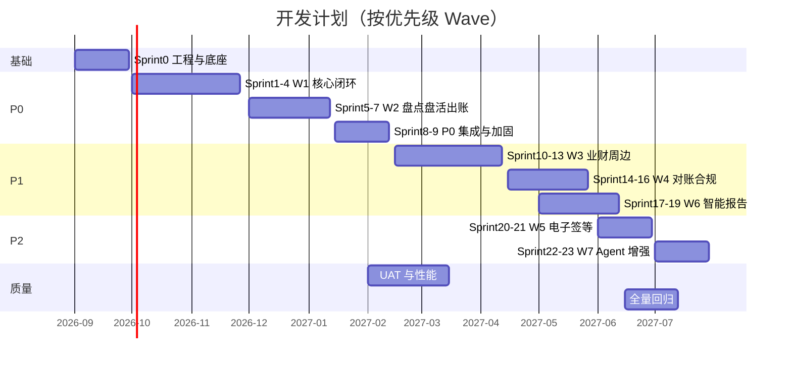
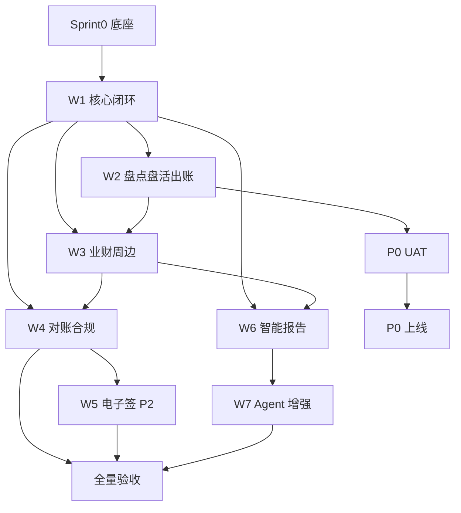

# 资产经营管理系统 — 开发计划

| 文档版本 | V1.1 |
|----------|------|
| 编制日期 | 2026-09-04 |
| 依据 | SRS V2.4 §4.25、§4.27；[项目章程](./项目章程.md)；[用户故事地图](../requirements/用户故事地图.md) |
| 排期原则 | **需求优先级 P0 → P1 → P2**；**业务闭环可验收**；**依赖前置、分期上线** |

---

## 1. 计划总览

### 1.1 目标与范围

| 项 | 说明 |
|----|------|
| 交付形态 | PC 管理后台 + 租户小程序 + 工作端小程序 + 统一 API |
| 验收基线 | SRS 全量功能 + 十三条业务闭环（§4.27）+ 数据安全 §5.8 |
| 实施策略 | 按 Wave 分期交付；**P0 首版可独立上线产生经营收益** |
| 总工期（参考） | **约 10 个月**（2026-09 启动编码 → 2027-06 全量验收） |
| P0 首版 | **约 5–6 个月**（2026-09 → 2027-02 可 UAT） |

### 1.2 优先级定义

| 级别 | 含义 | 排期 |
|------|------|------|
| **P0** | 运营闭环必备；不上线则无法完成招租—签约—收费—退租主路径 | Wave 0–2，Sprint 1–12 |
| **P1** | 业财、合规、分析、智能化主能力 | Wave 3–4、6–7，Sprint 13–22 |
| **P2** | 电子签、无形资产、智能定价/RAG 等扩展 | Wave 5、7 尾部，Sprint 23–26 |

### 1.3 团队配置（参考）

| 角色 | 人数 | 主要职责 |
|------|------|----------|
| 产品 / PM | 1 | 需求澄清、验收、迭代计划 |
| 前端（PC + 小程序） | 2 | admin-web、双端小程序 |
| 后端 | 2 | API、领域服务、集成、Agent |
| 测试 | 1 | 用例、自动化、性能 |
| 运维 / DevOps | 0.5 | CI/CD、环境、监控 |
| UI/UX | 0.5（前期） | 设计稿还原、组件库 |

---

## 2. 里程碑与 Wave 对照

| 里程碑 | 时间 | Wave / Sprint | 交付目标 | 可验收闭环 |
|--------|------|---------------|----------|------------|
| **M0 立项** | 2026-08 | — | SRS、设计文档、ADR | 文档基线 |
| **M1 设计收口** | 2026-09 | Sprint 0 | OpenAPI 冻结、Flyway V1 DDL、脚手架 | 可编译、可部署 DEV |
| **M2 P0 α** | 2026-11 | W1 完成 | 招租—签约—收费主路径 | 闭环 1–6 部分 |
| **M3 P0 β** | 2027-01 | W2 完成 | 盘点、盘活、自动出账、评估联动 | 闭环 7–10 |
| **M4 P0 上线** | 2027-02 | P0 冻结 | UAT、性能基线、生产部署 | **13 条闭环中 P0 项** |
| **M5 P1 扩展** | 2027-04 | W3–W4 | 业财、发票、催缴升级、合规 | P1 闭环补齐 |
| **M6 智能化** | 2027-05 | W6–W7 | 智能报告、Agent、导出 | FR-AI 主路径 |
| **M7 全量验收** | 2027-06 | W5 P2 | 电子签、无形资产、智能定价 | SRS 全量 §10 |

---

## 3. Wave 与 Sprint 排期（2 周 / Sprint）

> 上图日期为 **基准计划**；可根据人力与业主确认节奏 ±2 周调整。

---

## 4. Sprint 0 — 工程底座与横切能力 **[P0]**

**周期**：2026-09-01 ~ 2026-09-28（4 周）

**目标**：Monorepo 可运行；认证、权限、审计、数据安全基线就绪；核心库表 V1。

| 序号 | 工作包 | 需求 / 文档 | 产出 |
|------|--------|-------------|------|
| 0.1 | 工程脚手架 | ADR-0016 | `backend/` Maven Spring Boot 3 |
| 0.2 | CI/CD | CI-CD方案 | `mvn verify` + pnpm api:lint |
| 0.3 | 数据库 V1 | Flyway V1 | `resources/db/migration` |
| 0.4 | 认证与 RBAC | FR-ORG-*, FR-SYS-* | Spring Security + JWT |
| 0.5 | 数据安全基线 | NFR-DSEC-*, ADR-0015 | 字段加密 TypeHandler、审计 AOP |
| 0.6 | 审批引擎骨架 | ADR-0009 | 流程定义、实例、任务 API |
| 0.7 | 通知与任务骨架 | FR-NOTIF-*, FR-TASK-* | ApplicationEvent + 待办 |
| 0.8 | 对象存储 | ADR-0007 | MinIO / OSS SDK |
| 0.9 | PC 壳子 + 登录 | FR-COM-*, FR-HOME-* | admin-web 布局（pnpm） |
| 0.10 | OpenAPI 对齐 | ADR-0005 | springdoc + Redocly lint |
| 0.11 | 期初迁移工具 | FR-MIG-* | 导入模板、校验、试算平衡、对账报告 |

**出口标准**：DEV 环境一键部署；冒烟用例 TC-AUTH-001~005、TC-DSEC-001~003、TC-MIG-001~002 可执行。

---

## 5. Wave W1 — P0 核心运营闭环

**周期**：Sprint 1–4（约 8 周，2026-10 ~ 2026-11）

**SRS 依据**：§4.25 W1；§4.23.2~4.23.5、4.23.17~4.23.18、4.23.20、4.23.22、4.23.25、4.23.27；§4.24.1~4.24.7

### 5.1 后端 / API

| 优先级 | 模块 | 需求编号 | 说明 |
|--------|------|----------|------|
| P0 | 资产台账 | FR-AST-001~003 | 项目、房产/土地、导入导出 |
| P0 | 权证 | FR-CERT-001 | 产权、抵押基础字段 |
| P0 | 定价引擎 | FR-PRICE-* | 底价、备案价、校验规则 |
| P0 | 公开招租 | FR-TENDER-*, FR-TENDER-006 | 公告、报名、审查、保证金退还 |
| P0 | 客商信用 | FR-TENANT-CREDIT-* | 评分、黑名单拦截 |
| P0 | 合同管理 | FR-CON-001~005 | 租赁、审批、续签变更 |
| P0 | 合同生命周期 | FR-CON-LC-* | 转租、主体/面积变更 |
| P0 | 租控状态机 | §4.24.1 | 空置/在租/占用/自用/处置 |
| P0 | 收费大厅 | FR-BILL-001~003 | 收款、收缴率、保证金大厅 |
| P0 | 账单状态机 | §4.24.2 | 出账、部分缴、核销 |
| P0 | 退款冲正 | FR-REF-*, §4.24.7 | 申请、审批、账单回写 |
| P0 | 退租清场 | FR-VACATE-* | 验收、结算、保证金顺序 §4.24.3 |
| P0 | 临时占用 | FR-OCC-*, §4.24.6 | 占用单、到期解除 |
| P0 | 资产自用 | FR-SELF-* | 自用申请、结束回空置 |
| P0 | 资产处置 | FR-DISP-*, §4.24.5 | 申请—审批—执行—归档 |
| P0 | 预警处置 | FR-ALERT-*, §4.24.4 | 规则、记录、任务联动 |
| P0 | 催缴基础 | FR-DUN-001 | 催缴记录、等级展示 |
| P0 | 维修巡检 | FR-MNT-*, FR-MNT-001~003 | 报修、派工、巡查 |
| P0 | 经营看板 | FR-DASH-001 | 核心 KPI（只读） |

### 5.2 前端 PC

| 模块 | 设计稿对应 |
|------|------------|
| 资产管理、资债权证、资产招租 | source-material |
| 合同管理、收费大厅、履约催缴 | 同上 |
| 预警、任务中心、经营看板 | 同上 |
| 资产运营（处置、占用、自用） | 同上 |

### 5.3 小程序

| 端 | P0 功能 | FR |
|----|---------|-----|
| 用户端 | 登录、缴费、报修、招租报名、消息 | FR-MPU-001~009 |
| 工作端 | 登录、任务、巡检、催缴张贴、审批 | FR-MPW-001~008 |

### 5.4 W1 验收闭环（TC-LOOP）

| 闭环 | 编号 |
|------|------|
| 招租—签约 | TC-LOOP-001~002 |
| 收费—退款 | TC-LOOP-003~004 |
| 退租—空置 | TC-LOOP-005 |
| 处置 / 占用 / 自用 | TC-LOOP-006~008、013 |
| 预警—任务 | TC-LOOP-012 |

**出口标准**：M2 里程碑；核心 API P95 预研；Postman 冒烟全绿。

---

## 6. Wave W2 — P0 盘点、盘活与自动出账

**周期**：Sprint 5–7（约 6 周，2026-12 ~ 2027-01）

**SRS 依据**：§4.25 W2；§4.23.8~4.23.9、4.23.23；定价 FR-PRICE-005

| 优先级 | 模块 | 需求 | 说明 |
|--------|------|------|------|
| P0 | 缴费计划自动出账 | FR-PRICE-005 | 合同通过后 JobRunr 生成 plan/bill |
| P0 | 经营性盘点 | FR-AST-AUDIT-* | 盘点任务、差异审批、工作端扫码 |
| P0 | 空置盘活 | FR-VACANT-* | 盘活任务、阶段、与租控联动 |
| P0 | 评估与定价联动 | FR-EVAL-* | 评估申请、底价回写 |
| P0 | 招租发布增强 | FR-LEASE-001~002 | 与盘活任务衔接 |
| P0 | 数据报表基础 | FR-REP-001 | 台账、收缴类固定报表 |
| P0 | 资产地图 | FR-MAP-001 | 点位、GIS（可 MVP 列表+地图） |
| P0 | 固定资产 MVP | FR-FA-001~003 | 清单、基础盘点（完整折旧放 P1） |

**出口标准**：TC-LOOP-009（盘活）；TC-AST-005；自动出账 TC-CON-002。

---

## 7. Sprint 8–9 — P0 集成加固与 UAT 准备

**周期**：约 4 周（2027-01）

| 工作项 | 说明 |
|--------|------|
| 端到端联调 | 三端 + 微信登录/支付沙箱 |
| 数据迁移工具 | 台账、合同、在租账单导入 |
| 性能压测 | PERF-001~005（200 在线） |
| 安全测试 | TC-DSEC-001~007 |
| 缺陷清零 | P0/P1 blocker 清零 |
| 部署演练 | Docker/K8s、备份恢复 |

**出口标准**：**P0 UAT 候选版**；业主业务代表签字试运行。

---

## 8. Wave W3 — P1 经营计划与业财周边

**周期**：Sprint 10–13（约 8 周，2027-02 ~ 2027-03）

**SRS 依据**：§4.25 W3

| 模块 | 需求 | 说明 |
|------|------|------|
| P1 | 经营计划 | FR-PLAN-* | 目标、分解、偏差督办 |
| P1 | 催缴升级 | FR-DUN-ESC-* | L1–L5 自动升级、法务协同 |
| P1 | 水电杂费 | FR-UTIL-* | 抄表、周期出账、退租结清 |
| P1 | 巡检 SLA | FR-MNT-SLA-* | 超时预警、质检 |
| P1 | 发票闭环 | FR-INV-*, §4.24.8 | 开具、红冲、状态机 |
| P1 | 预收预交 | FR-PREPAY-* | 预交台账、抵扣 |
| P1 | 用户端退租 | FR-VACATE-004, FR-MPU-010 退租部分 | 进度查询 |
| P1 | 工作端抄表 | FR-MPW-009 | 现场抄表录入 |

---

## 9. Wave W4 — P1 业财、合规与主数据

**周期**：Sprint 14–16（约 6 周，2027-04 ~ 2027-05）

**SRS 依据**：§4.25 W4

| 模块 | 需求 | 说明 |
|------|------|------|
| P1 | 业财对账 | FR-FIN-* | 银行流水、凭证推送 ERP |
| P1 | 合规备案 | FR-COMP-* | 三重一大、低价/大额留痕 |
| P1 | 主数据拆分合并 | FR-MDM-* | 资产结构变更、历史映射 |
| P1 | 抵押解押 | FR-MORT-* | 登记、到期预警、解押 |
| P1 | 减免调价 | FR-ADJ-* | 费用减免、租金调价审批 |
| P1 | 固定资产完整 | FR-FA-004~006 | 折旧、报表 |
| P1 | 运营管理 | FR-OP-001~003 | 隐私政策、租户端配置 |

---

## 10. Wave W6 — P1 智能报告与 Agent（只读）

**周期**：Sprint 17–19（约 6 周，可与 W4 尾部并行）

**SRS 依据**：§4.26、§4.25 W6；ADR-0008

| 模块 | 需求 | 说明 |
|------|------|------|
| P1 | 智能中心 | FR-AI-004~006 | 菜单、会话、权限 |
| P1 | 报告模板 | FR-AI-007~011 | 模板库、一键生成、异步任务 |
| P1 | Tool 与溯源 | FR-AI-012~018 | 看板/报表 API 封装、Citation |
| P1 | 私有化 LLM 对接 | NFR-AI-*, NFR-DSEC-024 | 脱敏网关、审计 |
| P1 | HTML 预览 | FR-AI-010 | 默认可预览格式 |
| P1 | 管理员配置 | FR-AI-019~021 | 模板启用、模型路由 |

**依赖**：W1–W3 看板与报表 API 稳定。

---

## 11. Wave W5 — P2 电子签与扩展资产

**周期**：Sprint 20–21（约 4 周）

**SRS 依据**：§4.25 W5；§4.23.14~4.23.16

| 模块 | 需求 | 说明 |
|------|------|------|
| P2 | 电子签约 | FR-ESIGN-*, FR-MPU-010 | 第三方回调、存证 |
| P2 | 无形资产 | FR-IA-* | 台账、摊销、到期 |
| P2 | 智能定价/风险 | FR-AI-001~003 | 建议价、风险评分演示 |
| P2 | 国资监管报送 | 接口预留 | 标准化导出 |

---

## 12. Wave W7 — P1/P2 Agent 增强

**周期**：Sprint 22–23（约 4 周）

**SRS 依据**：§4.25 W7

| 模块 | 需求 | 说明 |
|------|------|------|
| P1 | 自然语言生成 | FR-AI-009 | NL → 模板 + Tool |
| P1 | PPT/PDF 导出 | FR-AI-010~011 | 异步渲染、水印 |
| P2 | RAG 制度库 | FR-AI-015 | pgvector、FAQ |
| P2 | 定价风险报告联动 | FR-AI-016 | 嵌入智能章节 |

**验收**：TC-AI-001~012；TC-DSEC-008。

---

## 13. 十三条闭环与 Wave 映射

| # | 闭环名称 | 优先级 | 主要 Wave | 验收用例 |
|---|----------|--------|-----------|----------|
| 1 | 招租—签约 | P0 | W1 | TC-LOOP-001 |
| 2 | 签约—出账 | P0 | W1–W2 | TC-LOOP-002 |
| 3 | 收费—核销 | P0 | W1 | TC-LOOP-003 |
| 4 | 退款冲正 | P0 | W1 | TC-LOOP-004 |
| 5 | 退租—空置 | P0 | W1 | TC-LOOP-005 |
| 6 | 空置—盘活 | P0 | W2 | TC-LOOP-009 |
| 7 | 处置退出 | P0 | W1 | TC-LOOP-006 |
| 8 | 临时占用 | P0 | W1 | TC-LOOP-007 |
| 9 | 自用 | P0 | W1 | TC-LOOP-013 |
| 10 | 评估—定价 | P0/P1 | W2 | TC-LOOP-010 |
| 11 | 预警—任务 | P0 | W1 | TC-LOOP-012 |
| 12 | 通知—待办 | P0 | Sprint 0 + W1 | TC-LOOP-011 |
| 13 | 发票 | P1 | W3 | TC-LOOP-008 |

---

## 14. 依赖关系（关键路径）

**关键路径**：S0 → W1 → W2 → UAT → P0 上线（约 **6 个月**）。

---

## 15. 质量与发布门禁

| 阶段 | 门禁 |
|------|------|
| Sprint 结束 | 单元测试通过；OpenAPI 无 breaking；PR 经 Code Review |
| Wave 结束 | 模块回归；对应 TC-LOOP 通过；演示给产品 |
| P0 发布 | UAT 签字；PERF-005 达标；TC-DSEC P0 通过；应急预案演练 |
| P1/P2 发布 | 全量回归；CHANGELOG 更新；交接文档刷新 |

---

## 16. 风险与缓冲

| 风险 | 影响 | 缓冲策略 |
|------|------|----------|
| 微信/支付联调延迟 | W1 延期 2–4 周 | 提前沙箱；Mock 回调 |
| 历史数据质量差 | UAT 推迟 | W2 启动迁移专项 |
| 人力不足 | Wave 顺延 | 优先砍 P2，保 P0/P1 |
| 等保整改 | +2–4 周 | Sprint 0 已含安全基线 |
| LLM 环境未就绪 | W6/W7 延期 | 模板+Tool 无 AI 叙述降级 |

**建议缓冲**：每 Wave 预留 **0.5 Sprint**；总计划 **+10% 日历缓冲**。

---

## 17. 分期上线建议（业务视角）

| 版本 | 时间 | 范围 | 业务价值 |
|------|------|------|----------|
| **v0.1 内部试运行** | 2026-12 | W1 80% | 核心招租签约收费 |
| **v1.0 P0 正式** | 2027-02 | W1+W2 | 完整运营闭环、可考核收缴率 |
| **v1.5 P1** | 2027-05 | W3+W4+W6 | 业财、发票、智能报告 |
| **v2.0 全量** | 2027-06+ | W5+W7 | 电子签、无形资产、Agent 全能力 |

---

## 18. 修订记录

| 版本 | 日期 | 说明 |
|------|------|------|
| V1.0 | 2026-08-27 | 初版：按 SRS 优先级与 W1–W7 排 Sprint |
| V1.1 | 2026-09-04 | 对齐 SRS V2.4：Sprint 0 追加期初迁移工具（FR-MIG-*）；出口标准补 TC-MIG 冒烟 |

---

**关联文档**：[成本价值与ROI评估报告](./成本价值与ROI评估报告.md) · [测试计划](../testing/测试计划.md) · [详细设计说明书](../详细设计说明书.md)
