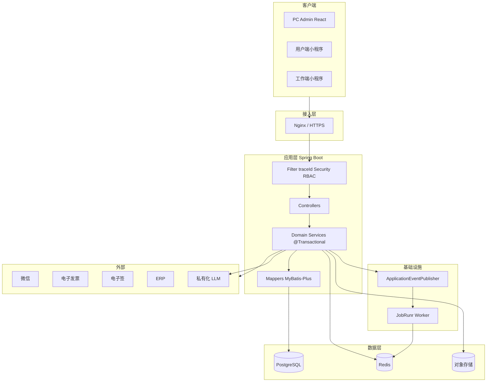
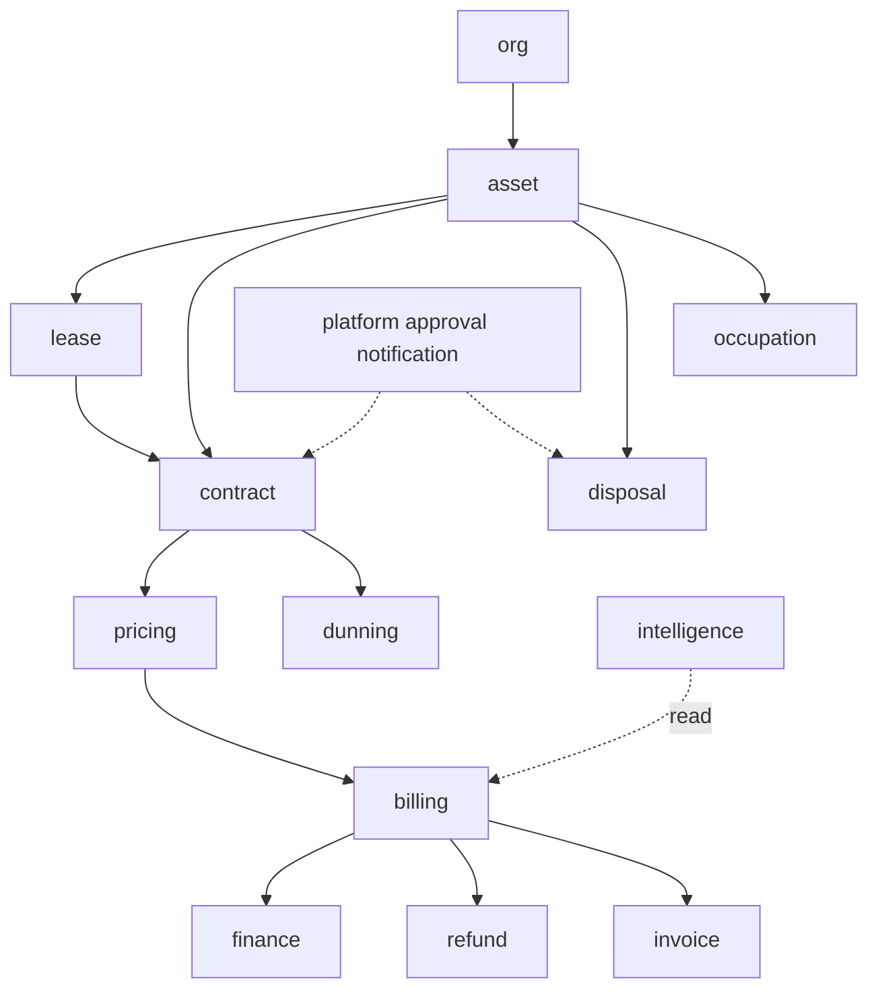

# 资产经营管理系统 — 详细设计说明书（DSD）

| 版本 | V1.8 |
|------|------|
| 日期 | 2026-09-07 |
| 依据 | SRS V2.5 |
| 关联 | [技术选型说明书.md](./design/技术选型说明书.md)、[概要设计说明书.md](./design/概要设计说明书.md) |

---

## 1. 项目概述与背景

### 1.1 目标

实现国资国企经营性资产 **盘清、提效、合规、监管** 的全链路数字化，三端统一 API。

### 1.2 范围

SRS V2.5 全量功能（P0/P1/P2 + 十三条业务闭环 + 收费算法与期初迁移 + P1/P2 缺陷闭环补强）；详见 [需求规格说明书.md](./需求规格说明书.md)。

### 1.3 术语

与 SRS §1.3 一致。

---

## 2. 非功能性需求与约束

| 类别 | 指标 | 设计对策 |
|------|------|----------|
| 并发 | 200 在线用户 | 2+ API 实例、PG pool max 20/实例、Redis 缓存 |
| 可用性 | ≥ 99.5% | 健康检查、无状态 API、DB 主从、应急预案 |
| 响应 | API P95 < 2s | 索引、分页 max 100、禁止循环查库 |
| 安全 | JWT、RBAC、审计 | §7；NFR-SEC-* |
| 合规 | 长期留存 | 软删+归档；禁止物理删监管数据 |
| 智能 | NFR-AI-* | [智能Agent技术方案.md](./design/智能Agent技术方案.md) |

---

## 3. 总体技术架构

### 3.1 架构风格

**模块化单体** + 前后端分离 + 统一 REST API（ADR-0002）。



### 3.2 技术选型

> 完整版本与 ADR 索引见 [技术选型说明书.md](./design/技术选型说明书.md)。

| 层次 | 技术 | ADR |
|------|------|-----|
| PC 前端 | React 18 + TS + Vite + Tailwind + Shadcn | — |
| 小程序 | 微信原生 ×2 | ADR-0014 |
| API | JDK 21 + Spring Boot 3.3 | ADR-0016 |
| 数据访问 | MyBatis-Plus（Flyway 管 DDL） | ADR-0017 |
| 校验 | Jakarta Validation | ADR-0005 |
| 异步 | JobRunr + @Scheduled | ADR-0018 |
| 事件 | Spring ApplicationEvent | ADR-0013 |
| 审批 | 轻量 JSON 流程引擎 | ADR-0009 |

**数据访问**：**MyBatis-Plus + Flyway**（ADR-0017）。

### 3.3 请求链路

```
Client → Nginx → Spring Boot
  Filter: TraceId → Security → RBAC
  → Controller → Service(@Transactional) → Mapper(MyBatis-Plus)
  → commit → ApplicationEventPublisher → @EventListener
  → 可选: JobRunr.enqueue、OSS、第三方 HTTP
```

### 3.4 Monorepo 目录结构

见 ADR-0012。backend 内分层：

```
backend/src/main/java/com/ams/
├── AmsApplication.java
├── config/              # Security、MyBatis、Redis、JobRunr
├── common/              # ApiResponse、异常、AOP
├── modules/
│   ├── asset/
│   │   ├── AssetController.java
│   │   ├── AssetService.java
│   │   ├── AssetMapper.java
│   │   ├── entity/Asset.java
│   │   └── dto/
│   ├── contract/
│   ├── billing/
│   └── ...
├── platform/
│   ├── auth/
│   ├── approval/        # 审批引擎
│   ├── notification/
│   ├── event/
│   └── job/             # JobRunr Job 定义
└── resources/db/migration/   # Flyway V*.sql
```

**模块依赖规则**（禁止违反）：

```
system, org → 无业务依赖
asset → org
lease → asset
contract → asset, lease, pricing
billing → contract, pricing
finance → billing
notification → 仅订阅事件，不被业务域依赖
intelligence → 只读调用各域 Service（ToolRegistry）
pricing → 仅订阅 contract 领域事件（ApprovalCompleted），事件驱动生成缴费计划，不反向依赖 contract 模块
```

### 3.5 模块依赖图



---

## 4. 模块详细设计

### 4.1 模块划分

| 域模块 | 职责 | 关键服务 |
|--------|------|----------|
| system | 用户、角色、菜单、日志、脱敏矩阵 | AuthService, RbacService, MaskingService |
| org | 公司、部门 | OrgService |
| asset | 项目、台账、租控、盘点、调拨 | AssetService, LeaseControlService, TransferService |
| certificate | 权证、抵押、调拨 | CertificateService, MortgageService |
| lease | 招租、公开遴选、流标弃标 | ListingService, TenderService |
| contract | 合同、变更、退租、合同状态机 | ContractService, VacateService, ContractStateMachine |
| pricing | 规则引擎、缴费计划 | PricingEngine, PlanGenerator |
| billing | 账单、收款、预收、核销、资金池互抵 | BillService, PaymentService, PrepayService, AllocationService |
| invoice | 发票生命周期 | InvoiceService, InvoiceLifecycleService |
| dunning | 催缴升级、滞纳金 | DunningEscalationService, LateFeeService |
| utility | 水电抄表、公摊分摊 | MeterService, ApportionService |
| maintenance | 报修、巡查、SLA | RepairService, SlaMonitor |
| alert | 预警规则与处置 | AlertRuleEngine, AlertHandleService |
| task | 任务中心、超时升级 | TaskService, TaskTimeoutService |
| revitalization | 盘活 | RevitalizationService |
| plan | 经营计划 | BusinessPlanService |
| dashboard | 经营/集团合并看板 | DashboardService, GroupConsolidationService |
| finance | 业财、凭证、三端统一对账 | ReconcileService, VoucherPushService |
| disposal | 资产处置、处置损益 | DisposalService |
| occupation | 临时占用 | OccupationService |
| selfuse | 资产自用 | SelfUseService |
| refund | 退款冲正 | RefundService |
| evaluation | 评估申请 | EvaluationService |
| notification | 消息待办 | NotificationService |
| regulation | 监管报送口径 | RegulationReportService |
| config | 参数生效版本 | ConfigVersionService |
| intangible | 无形资产 P2 | IntangibleAssetService |
| esign | 电子签 P2 | ESignAdapter |
| intelligence | 智能 Agent P1 | AgentOrchestrator, ReportService |
| migration | 期初迁移与建账 P0 | MigrationService, MigrationReconcileService |

### 4.2 定价引擎

**输入**：`ContractTerms`（租期、租金类型、金额、周期、免租、递增/阶梯）

**输出**：`PaymentPlanItem[]`

```java
// 伪代码
public List<PaymentPlanItem> generatePlans(ContractTerms terms) {
    List<Period> periods = splitByCycle(terms.getStart(), terms.getEnd(), terms.getCycle());
    return periods.stream().map(p -> PaymentPlanItem.builder()
        .periodStart(p.start())
        .periodEnd(p.end())
        .amount(calcAmount(p, terms))                    // 免租/阶梯/递增
        .dueDate(subtractDays(p.start(), terms.getGraceDays()))
        .status(Pending)
        .build()
    ).toList();
}
```

**首末月不足月折算（FR-PRICE-007/008）**：`splitByCycle` 产出的首/末周期若非整月，须按日折算——`calcAmount` 增加 `prorate` 分支：

```java
public BigDecimal prorate(Period p, ContractTerms terms) {
    long days = diffDays(p.start(), p.end()) + 1;
    int denom = terms.getProrationBase() == CALENDAR
        ? daysInMonth(p.start())       // 当月自然日
        : 30;                          // 固定 30 天
    return round2(terms.getMonthlyRent()
        .multiply(BigDecimal.valueOf(days))
        .divide(BigDecimal.valueOf(denom), RoundingMode.HALF_UP));
}
```

**尾差调整**：所有周期金额四舍五入到 2 位小数后，`Σ planned_amount` 与 `合同总额` 的舍入尾差并入**末期** `planned_amount`（多退少补），保证全周期应收合计精确等于合同总额；提前解约/退租时按实算天数重算末期并作废原末期计划。

触发：`ApprovalCompleted` + `bizType=contract` → `PlanGenerator.generate(contractId)`。

### 4.3 租控状态机

统一入口 `LeaseControlService.transition(assetId, event, operator)`。

| 事件 | 目标状态 |
|------|----------|
| ContractActivated | 在租 |
| VacateCompleted | 空置 |
| SelfUseApproved | 自用 |
| OccupationApproved | 占用 |
| DisposalCompleted | 已退出 |
| ListingPublished | 招租中 |

禁止 Repository 直改；乐观锁 `version` 字段。

### 4.4 催缴升级调度

```
@Scheduled(cron = "0 0 2 * * *") → JobRunr.enqueue(dunningScanJob)
  → scan overdue bills
  → map days to L1-L5
  → update dunning_level
  → publish BillOverdue event
  → NotificationListener + TaskListener
```

**滞纳金计息（FR-DUN-LATE-*）**：独立调度 `lateFeeJob`（每日），对本金未结清账单按利率快照滚动计息，写入 `late_fee` 明细：

```
@Scheduled(cron = "0 0 3 * * *") → JobRunr.enqueue(lateFeeJob)
  → scan unpaid bills (principal > 0)
  → days = overdueDays(bill.due_date, today)
  → fee = principal * dailyRate * days  // 单利，默认不复利
  → upsert late_fee(bill_id, rate_snapshot, fee_amount)
  → publish LateFeeAccrued event
  → 催缴单/律师函展示：本金 + 滞纳金 + 起算日 + 已计天数
```

计息停止条件：全额结清、减免核销、合同终止/退租结算、账单作废；利率调整仅对调整后天数生效（`rate_snapshot` 留痕）。

### 4.5 智能 Agent 模块

详见 [智能Agent技术方案.md](./design/智能Agent技术方案.md)、ADR-0008。报告渲染走 JobRunr `agent-report` 任务。

### 4.6 闭环域模块（V2.2）

| 服务 | 核心方法 | 状态机 |
|------|----------|--------|
| DisposalService | `create`, `submitApproval`, `execute`, `complete` | SRS §4.24.5 |
| OccupationService | `create`, `approve`, `release` | §4.24.6 |
| SelfUseService | `create`, `approve`, `end` | 同占用模式 |
| RefundService | `apply`, `approve`, `executeReversal` | §4.24.7 |
| EvaluationService | `apply`, `recordResult`, `bindPricing` | — |
| InvoiceLifecycleService | `issue`, `reconcile`, `redFlush` | §4.24.8 |
| AlertHandleService | `assign`, `process`, `close`, `escalate` | §4.24.4 |
| AllocationService | `allocate`, `reallocate`, `reverseAllocation` | §4.24.2 核销 / FR-PAY-* |
| MigrationService | `importBatch`, `validate`, `reconcile`, `lockCutover` | §4.23.28 / FR-MIG-* |
| ContractStateMachine | `submit`, `activate`, `expire`, `renew`, `terminate`, `void` | §4.24.9 / FR-CON-LC-* |
| ApportionService | `computeApportion`, `settleMultiMeter` | FR-UTIL-006 公摊 |
| GroupConsolidationService | `consolidate`, `drillDown`, `excludeInternal` | FR-DASH-002 集团看板 |
| TransferService | `apply`, `migrateContract`, `reconcileTransfer` | FR-CERT-002 调拨 |
| ConfigVersionService | `change`, `snapshot`, `rollback` | FR-CFG-002 配置版本 |
| TaskTimeoutService | `monitor`, `remind`, `escalate` | FR-TASK-002 超时升级 |
| MaskingService | `mask`, `matrix` | FR-COM-005 脱敏矩阵 |
| RegulationReportService | `buildReport`, `traceback`, `submit` | FR-REG-001 监管报送 |

**DisposalService 伪代码**：

```
create(dto) → disposal_order(status=draft)
submitApproval(id) → ApprovalEngine.start('disposal', id)
on Approved → status=pending_execute, leaseControl→处置中
execute(id, result) → record outcome
complete(id) → leaseControl→已退出, publish DisposalCompleted
```

**AllocationService 伪代码（收款核销，FR-PAY-*）**：

```
allocate(paymentId, strategy):
  bills = unpaidBills(contract, order=strategy)   // FIFO / 指定 / 按比例
  for bill in bills while remain > 0:
    applied = min(remain, bill.principal + bill.late_fee - bill.paid)
    insert bill_payment(bill_id, payment_id, applied)   // 不可变流水
    bill.paid += applied; remain -= applied
  if remain > 0: 超收转预收或退回（可配置）
reverseAllocation(refundId):
  for alloc in refund.allocations order by id desc:      // 逆序回退
    bill.paid -= alloc.amount
    bill.status = bill.paid == 0 ? 待缴 : 部分缴
```

**MigrationService 伪代码（期初迁移，FR-MIG-*）**：

```
importBatch(batchId, file):
  parse template → rows → validate(必填/编码唯一/金额非负)
  if invalid: 逐条报错，整批可回退
  else: 写入 staging，标记 source=迁移
reconcile(batchId):
  balance = Σ期初合同应收 − (Σ期初欠费 + Σ期初实收)
  return 对账报告（不平则阻塞）
lockCutover(batchId): 试算平衡通过 → 锁定基准日 → 进入试运行
```

### 4.7 轻量审批引擎

见 ADR-0009。

**表**：`approval_flow_def`、`approval_instance`、`approval_task`

**流程定义 JSON 示例**：

```json
{
  "bizType": "contract",
  "nodes": [
    { "id": "dept", "type": "serial", "role": "dept_manager" },
    { "id": "finance", "type": "serial", "role": "finance", "when": "amount>100000" },
    { "id": "major", "type": "serial", "role": "leader", "flags": ["triple_major"] }
  ]
}
```

**API**：`POST /approvals/{instanceId}/approve|reject`

完成后 `EventBus.publish('ApprovalCompleted', { bizType, bizId })`。

### 4.8 领域事件与通知

见 ADR-0013。

| 事件 | 订阅者 | 动作 |
|------|--------|------|
| ApprovalCompleted | ContractHandler, NotificationHandler | 出计划/通知 |
| BillIssued | NotificationHandler | 租户缴费提醒 |
| BillOverdue | DunningHandler, NotificationHandler | 催缴升级 |
| AlertTriggered | AlertHandleService, TaskHandler | 待办 |
| DisposalCompleted | NotificationHandler | 备案提醒 |
| ContractExpired | ContractStateMachine, AlertHandleService | 需续签/已到期预警 |
| PaymentRegistered | FinanceHandler | 待确认款入账（工作端） |
| AssetTransferred | NotificationHandler, FinanceHandler | 调拨留痕、交接对账 |

事务边界：事件在 `afterCommit` 钩子发布，避免回滚后误通知。

### 4.9 异步任务（JobRunr）

| Job 名称 | 说明 | 并发 |
|----------|------|------|
| billing-generate | 批量出账、计划生成 | 2 |
| dunning-scan | 催缴扫描 | 1 |
| late-fee | 滞纳金计息 | 1 |
| migration-import | 期初迁移导入 | 2 |
| notification-batch | 批量短信 | 5 |
| agent-report | PPT/PDF 渲染 | 2 |
| finance-import | 银行流水导入 | 1 |
| apportion-bill | 水电公摊出账 | 1 |
| contract-expiry | 合同到期状态扫描 | 1 |
| task-timeout | 待办超时监控 | 1 |
| regulation-report | 监管报送生成 | 1 |

Job 上下文含 `traceId`（MDC）；失败重试 3 次；持久化于 PostgreSQL（ADR-0018）。

### 4.10 缓存策略

> **Redis 键权威清单**（与 [数据库设计 §7](./database/数据库设计.md) 一致，新增/变更仅在此处与数据库设计同步）。

| 键 | 内容 | TTL |
|----|------|-----|
| `menu:{userId}` | 用户菜单树 | 30min |
| `perm:{userId}` | 权限码集合 | 30min |
| `config:hot` | 热点配置 | 1h |
| `idempotency:{key}` | 幂等结果 | 24h |
| `auth:token:blacklist:{jti}` | Token 吊销 | 与 token 同寿 |
| `captcha:{id}` | 验证码 | 5min |
| `agent:session:{id}` | Agent 会话上下文 | 24h |
| `agent:job:{id}` | 报告异步任务状态 | 7d |

租控/账单 **不缓存** 读路径（强一致）；看板指标可缓存 5min。

### 4.11 事务与幂等

- 写操作默认 `@Transactional`
- 跨模块：单事务内调用 Service，禁止跨 HTTP
- 幂等：`Idempotency-Key` → Redis SETNX → 相同 key 返回首次结果
- 状态变更：乐观锁 `version`；冲突 `40900`

### 4.12 组合/拆分租赁与主数据

见 SRS FR-MDM-*。

```
splitAsset(parentId, specs[]):
  assert parent.lease_control in (vacant, ...)
  freeze parent
  create children with parent_asset_id
  remap certificates
  if parent has active contract → reject or require migrate service

combineAsset(ids[]):
  assert all vacant
  create merged asset, map old_ids → new_id in asset_merge_log
```

### 4.13 合同状态机（FR-CON-LC-* / §4.24.9）

统一入口 `ContractStateMachine.transition(contractId, event, operator)`，状态与 SRS §4.24.9 一致：

```
submit(draft)        → 审批中
on Approved          → 生效（租控=在租，触发 PlanGenerator）
expireCheck(scheduled)：
  if 到期前 N 天 && 未续签 && 未退租 → 需续签（提醒）
  if 已逾期 && 未续签 && 未退租   → 已到期（生成预警，挂账处理）
renew(需续签/已到期)  → 生效（新合同或延期，更新缴费计划）
terminate(退租/解约)  → 已终止（仅由 VacateService / 提前解约驱动）
void(未生效)          → 已作废
```

禁止 Repository 直改合同状态；乐观锁 `version`；每次状态迁移写合同版本快照（FR-CON-LC-006）。

### 4.14 水电公摊分摊（FR-UTIL-006）

```
computeApportion(billCycle, scope):
  rules = apportion_config(公司/项目, 口径=面积/表数/人头/用量)
  for tenant in scope:
    share = metric(tenant) / Σ metric * total   // 按口径权重
    assert Σ share ≤ total + epsilon           // 超出阻断
    insert utility_bill(tenant, share, 明细追溯)
settleMultiMeter(退租): 按末次读数 + 公摊口径生成末次公摊账单 → 并入退租结清（FR-UTIL-005）
```

### 4.15 三端收款统一对账（FR-FIN-006 / FR-MPW-010）

```
工作端现场收款：registerPayment → status=待确认（不计实收、不核销）
财务到账确认：confirmArrival(待确认单) → status=已到账 → 并入收款记录
统一对账：ReconcileService.importBankFlow → match(金额/日期/备注)
  → 用户端 + 工作端(已到账) + PC 三端收款统一匹配 → 未达账项清单（FR-FIN-002）
```

### 4.16 资产调拨迁移（FR-CERT-002）

```
apply(调拨单)：填写调出/调入公司、在租处理方式
on Approved：
  if 资产在租:
    if 带租调拨: migrateContract(合同/欠费/保证金/预收随迁) → 生成交接对账单
    else: 阻断（须先退租/解除占用）
  迁移权证/经营公司/数据范围/租控/账单归属
  生成 transfer_log（双方公司留痕，历史映射保留）
```

### 4.17 参数配置版本（FR-CFG-002）

```
change(configKey, newValue, effectiveDate):
  旧版本标记失效；插入新版本（生效日、旧值、新值、操作人）
snapshot(configKey, asOfDate) → 返回该时点生效版本
历史账单/发票/滞纳金计息 引用创建时快照，禁止被新值污染
```

### 4.18 任务超时升级（FR-TASK-002）

```
@Scheduled → taskTimeoutMonitor
  → 扫描待办任务，按类型时限判断
  → 临近：提醒经办人；超时：提醒上级 + 转预警(FR-ALERT-LC-004)或督办(FR-PLAN-004)
  → 记录超时时长；与预警共用超时策略配置
```

### 4.19 脱敏矩阵（FR-COM-005 / NFR-DSEC-008）

`MaskingService.mask(field, role, page)` 依据「角色×页面×字段」矩阵决定返回明文/掩码/不返回；响应 DTO AOP 统一拦截（与 §7.2 脱敏控制一致）。

### 4.20 集团合并看板（FR-DASH-002）

```
consolidate(groupId, asOfDate):
  metric = aggregate(子公司) by 口径（内部调拨往来单列/可抵销）
  cache 5min（§4.10）
drillDown: 集团 → 公司 → 项目 → 单资产（复用各域只读 Service）
```

### 4.21 监管报送（FR-REG-001）

```
buildReport(期间, 口径):
  按字段清单 + 统计口径（时点/期间、含税、含内部往来）聚合
  sourceRef 绑定业务单据（FR-AI-017）
submit: 人工复核 → 接口/模板导出 → 报送记录留痕
```

---

## 5. 数据架构

详见 [database/数据库设计.md](./database/数据库设计.md)。

- Flyway `V*` 为 DDL 唯一来源（ADR-0017）
- 核心 ER：company–project–asset–contract–bill–payment
- 闭环扩展表：§8.8 + `approval_*`、`notification`

---

## 6. 接口与集成

详见 [api/openapi.yaml](./api/openapi.yaml)。

| 集成 | 适配器 | 模式 |
|------|--------|------|
| 微信支付 | WechatPayAdapter | APIv3 + 回调验签 |
| 电子发票 | InvoiceAdapter | 异步回调 |
| 电子签 | ESignAdapter | 跳转 + 回调 P2 |
| ERP | ErpVoucherAdapter | REST P1 |
| GIS | AmapAdapter | Web API |
| LLM | LlmGateway | HTTP SSE |

回调统一：`/api/v1/callbacks/*`，签名校验，幂等 `callback_log`。

---

## 7. 安全设计

> 数据安全专项见 [数据安全设计说明书.md](./design/数据安全设计说明书.md)、[ADR-0015](./adr/0015-data-classification-and-encryption.md)；SRS §5.8 NFR-DSEC-*。

### 7.1 身份与访问

- 认证：JWT Access 2h + Refresh 7d；小程序 code2session
- 授权：`RbacService.assert(user, permission, dataScope)`；SQL 注入 `company_id IN (...)`
- 防护：HTTPS、CORS 白名单、rate-limit 100/min/IP（登录 10/min）
- 密码：BCrypt（Spring Security）cost 12；失败锁定 5 次/15min
- 审计：`operation_log` + 关键表审计字段

### 7.2 数据安全（重点）

| 控制项 | 实现 |
|--------|------|
| 分类分级 | L1~L4 元数据；Repository 标注 |
| L4 加密 | `FieldEncryptionService` JCE AES-256-GCM；`id_no_hash` 盲索引 |
| 脱敏 | 响应 DTO AOP / `@JsonSerialize` 按角色掩码 |
| 导出 | `ExportService` 水印 + `export_audit`；L4 默认拒绝 |
| 存储 | PG 盘加密；OSS 私有 + SSE；Redis 不存 L3/L4 明文 |
| 日志 | Logback MDC；禁止 password、token、id_no、phone 明文 |
| 密钥 | 环境变量/KMS；禁止入库与日志 |
| 出境 | 生产数据境内；LLM 私有化（ADR-0008） |

### 7.3 Agent 与文件

- Agent：§5.7、ADR-0008；脱敏网关前置
- 文件：OSS 私有 + 签名 URL 15min

---

## 8. 异常与错误处理

- `AppError` 统一 `{ code, message, httpStatus }`
- 对外 JSON 统一 `{ code, message, data, traceId }`（见 api/README）
- 第三方：`50001` + JobRunr 可重试
- 校验失败：`40000` + Jakarta Validation 字段错误明细

---

## 9. 监控与可观测性

| 项 | 方案 |
|----|------|
| 日志 | Logback JSON；字段：traceId, userId, path, durationMs |
| 指标 | Micrometer：`http_server_requests`、业务 `payments_total` |
| 链路 | traceId 全链路透传（含 JobRunr job MDC） |
| 健康 | `/health`、`/health/ready`（PG+Redis）、`/health/live` |
| 告警 | 错误率>1%、P95>2s、队列积压>1000 → 运维 |

---

## 10. CI/CD 与质量门禁

见 [design/CI-CD方案.md](./design/CI-CD方案.md)。

- PR：`cd backend && mvn test` + `cd frontend && pnpm api:lint` + 前端 lint
- main：上述 + integration smoke + Docker build
- 发版：tag `v*` → 构建镜像 → STAGING → UAT → PROD

---

## 11. 部署与运维

详见 [deployment/部署手册.md](./deployment/部署手册.md)。

- API 无状态水平扩展
- Worker 独立 Deployment（K8s）或 pm2 `ams-worker`
- 配置：环境变量 + 密钥管理（不入库）

---

## 12. 测试策略（技术）

| 层级 | 范围 | 工具 |
|------|------|------|
| 单元 | Service、PricingEngine、状态机 | JUnit 5 + Mockito + AssertJ |
| 集成 | Repository + PG testcontainer | JUnit 5 + Testcontainers |
| API | OpenAPI 契约 | MockMvc / RestAssured + springdoc 契约校验 |
| E2E | 十三条闭环冒烟 | Playwright（admin）+ 手工小程序 |
| 性能 | 200 并发 | k6（见性能测试报告） |

---

## 13. 演进与扩展

| 阶段 | 演进 |
|------|------|
| 当前 | 模块化单体 Spring Boot + ApplicationEvent + JobRunr |
| 中期 | PG 只读副本、物化视图、报表库 |
| 长期 | 按域拆微服务（billing、contract）、外置 MQ |

扩展点：PricingEngine 插件、AlertRule DSL、BPMN 可视化（替换 JSON 流程）、ToolRegistry 插件。

---

## 14. 修订记录

| 版本 | 日期 | 说明 |
|------|------|------|
| V1.0 | 2026-08-26 | 初版 |
| V1.2 | 2026-08-26 | V2.2 闭环模块 |
| V1.3 | 2026-08-26 | 技术评审：Knex/Flyway、BullMQ、EventBus、审批引擎、Monorepo、CI/CD |
| V1.4 | 2026-08-26 | 数据安全强化 |
| V1.5 | 2026-08-27 | 切换 Java Spring Boot + MyBatis-Plus + JobRunr（ADR-0016~0018） |
| V1.6 | 2026-09-04 | 收费算法与期初迁移：定价引擎折算/尾差、催缴滞纳金、收款核销服务、迁移服务（FR-MIG/FR-PAY/FR-PRICE-007~008/FR-DUN-LATE-*） |
| V1.7 | 2026-09-07 | P1/P2 缺陷落地：合同状态机、公摊分摊、三端统一对账、资产调拨迁移、配置版本、任务超时、脱敏矩阵、集团合并看板、监管报送（FR-CON-LC/FR-UTIL-006/FR-FIN-006/FR-MPW-010/FR-CERT-002/FR-CFG-002/FR-TASK-002/FR-COM-005/FR-DASH-002/FR-REG-001） |
| V1.8 | 2026-09-07 | **编码前评审修复**：测试策略工具 Java 化（Vitest/supertest/Prism → JUnit 5/MockMvc/RestAssured）；异常处理 Zod → Jakarta Validation；模块依赖修正（pricing 改为事件驱动，消除 pricing↔contract 循环）；§4.2 伪代码 TS → Java；§4.10 Redis 键清单合并为权威清单 |

---

**请开发、测试、运维共同评审本 DSD 后再进入编码阶段。**
