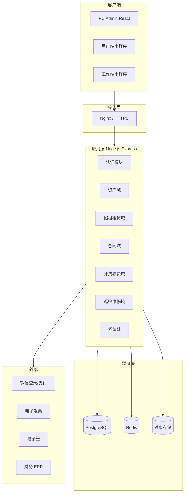

# 资产经营管理系统 — 详细设计说明书（DSD）

| 版本 | V1.0 |
|------|------|
| 日期 | 2026-08-26 |
| 依据 | SRS V2.0 |

---

## 1. 项目概述与背景

### 1.1 目标

实现国资国企经营性资产 **盘清、提效、合规、监管** 的全链路数字化，三端统一 API。

### 1.2 范围

SRS V2.0 全量功能（P0/P1/P2）；详见 [需求规格说明书.md](./需求规格说明书.md)。

### 1.3 术语

与 SRS §1.3 一致。

---

## 2. 非功能性需求与约束

| 类别 | 指标 |
|------|------|
| 并发 | 200 在线用户 |
| 可用性 | 7×24，核心接口可用性 ≥ 99.5%（生产目标） |
| 响应 | 常规 API P95 < 2s（100M 网络） |
| 安全 | JWT、RBAC、传输加密、操作审计 |
| 合规 | 合同/收款/权证长期留存 |

---

## 3. 总体技术架构

### 3.1 架构风格

**模块化单体** + 前后端分离 + 统一 REST API（ADR-0002）。



### 3.2 技术选型

| 层次 | 技术 | 理由 |
|------|------|------|
| PC 前端 | React 18 + TypeScript + Vite + Tailwind + Shadcn | 组件生态、与设计稿后台一致 |
| 小程序 | 微信原生 / Taro | 双端复用可选 |
| API | Node.js 20 + Express + TypeScript | 与团队栈一致、JSON 生态 |
| ORM | Prisma 或 Knex | 迁移与 Flyway 配合 |
| 校验 | Zod | 与 OpenAPI 对齐 |
| 任务调度 | node-cron / BullMQ | 出账、催缴升级、SLA 扫描 |

### 3.3 请求链路

```
Client → Nginx → Express middleware(traceId, auth, rbac)
  → Controller → Service(事务, 状态机) → Repository → PG
  → 可选：Redis 锁/缓存、OSS、第三方 HTTP
```

---

## 4. 模块详细设计

### 4.1 模块划分

| 域模块 | 职责 | 关键服务 |
|--------|------|----------|
| system | 用户、角色、菜单、日志 | AuthService, RbacService |
| org | 公司、部门 | OrgService |
| asset | 项目、台账、租控、盘点 | AssetService, LeaseControlService |
| certificate | 权证 | CertificateService |
| lease | 招租、公开遴选 | ListingService, TenderService |
| contract | 合同、变更、退租 | ContractService, VacateService |
| pricing | 规则引擎、缴费计划 | PricingEngine, PlanGenerator |
| billing | 账单、收款、对账 | BillService, PaymentService |
| invoice | 发票 | InvoiceService |
| dunning | 催缴升级 | DunningEscalationService |
| utility | 水电抄表 | MeterService |
| maintenance | 报修、巡查、SLA | RepairService, SlaMonitor |
| alert | 预警 | AlertRuleEngine |
| revitalization | 盘活 | RevitalizationService |
| plan | 经营计划 | BusinessPlanService |
| finance | 业财、凭证 | ReconcileService, VoucherPushService |
| intangible | 无形资产 P2 | IntangibleAssetService |
| esign | 电子签 P2 | ESignAdapter |

### 4.2 定价引擎（核心算法摘要）

**输入**：`ContractTerms`（租期、租金类型、金额、周期、免租天数、递增规则）

**输出**：`PaymentPlanItem[]`（每期 start/end、amount、dueDate）

**伪代码**：

```
plans = []
for each period in splitByPaymentCycle(start, end, cycle):
  amount = baseRent
  if period in freeRentRange: amount = 0
  else if stepRule applies: amount = stepRule(period)
  else if incrementRule: amount = applyIncrement(period)
  plans.push({ period, amount, dueDate = period.start - graceDays })
return plans
```

合同审批通过事件 → `PlanGenerator.generate(contractId)` → 写入 `payment_plan`。

### 4.3 租控状态机

由领域服务统一入口 `LeaseControlService.transition(assetId, event)` 驱动，禁止 Repository 直改。

事件来源：`ContractActivated`, `VacateCompleted`, `SelfUseApproved`, `DisposalApproved` 等。

### 4.4 催缴升级调度

定时任务（每日 02:00）：

1. 扫描 `bill.status in (unpaid, partial_paid)` 且 `due_date < today`
2. 按逾期天数映射 L1–L5
3. 升级 `dunning_level`，触发通知/任务
4. 回款后重置等级

---

## 5. 数据架构

详见 [database/数据库设计.md](./database/数据库设计.md)。

- 主库 PostgreSQL
- Flyway 版本管理
- 核心 ER：company–project–asset–contract–bill–payment

---

## 6. 接口与集成

详见 [api/openapi.yaml](./api/openapi.yaml) 与 [api/README.md](./api/README.md)。

| 集成 | 方式 | 说明 |
|------|------|------|
| 微信支付 | APIv3 + 回调 | 用户端缴费 |
| 电子发票 | 异步回调 | 开票结果 |
| 电子签 | 跳转签署 + 回调 | P2 |
| ERP | REST/消息 | 凭证推送 P1 |
| GIS | 高德/百度地图 API | 资产地图 |

---

## 7. 安全设计

- 认证：JWT + Refresh；小程序 code2session
- 授权：RBAC + `data_scope` 注入 SQL 条件
- 防护：HTTPS、CORS 白名单、速率限制、参数校验、SQL 预编译
- 审计：`operation_log` 记录关键写操作
- 文件：私有桶 + 临时签名 URL

---

## 8. 异常与错误处理

- 全局 `errorHandler` 映射 `AppError.code` → HTTP 200 + body.code（或 4xx/5xx 按策略）
- 第三方失败：可重试队列 + `code=50001`
- 状态冲突：`40900`，提示刷新

---

## 9. 监控与可观测性

- 结构化日志 + `traceId`
- 指标：QPS、延迟、错误率、业务指标（日收款额）
- 健康检查：§部署手册

---

## 10. 部署与运维

详见 [deployment/部署与运维手册.md](./deployment/部署与运维手册.md)。

---

## 11. 演进与扩展

| 阶段 | 演进 |
|------|------|
| 当前 | 模块化单体 |
| 中期 | 读副本、报表物化视图 |
| 长期 | 按域拆微服务（billing、contract）、事件总线 |

扩展点：PricingEngine 规则插件、AlertRule 脚本化条件、Workflow 流程引擎。

---

**请开发、测试、运维共同评审本 DSD 后再进入编码阶段。**
