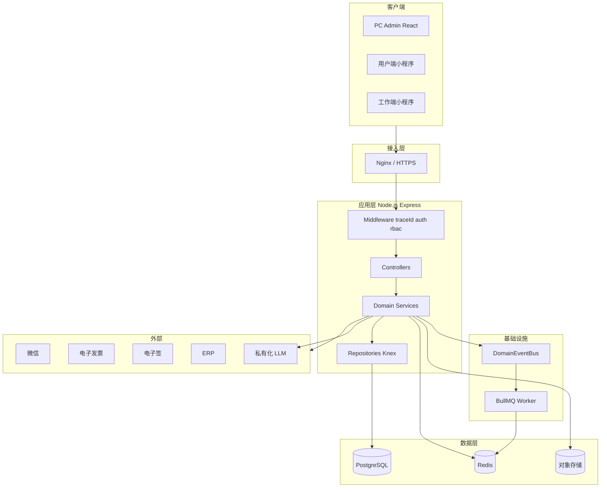
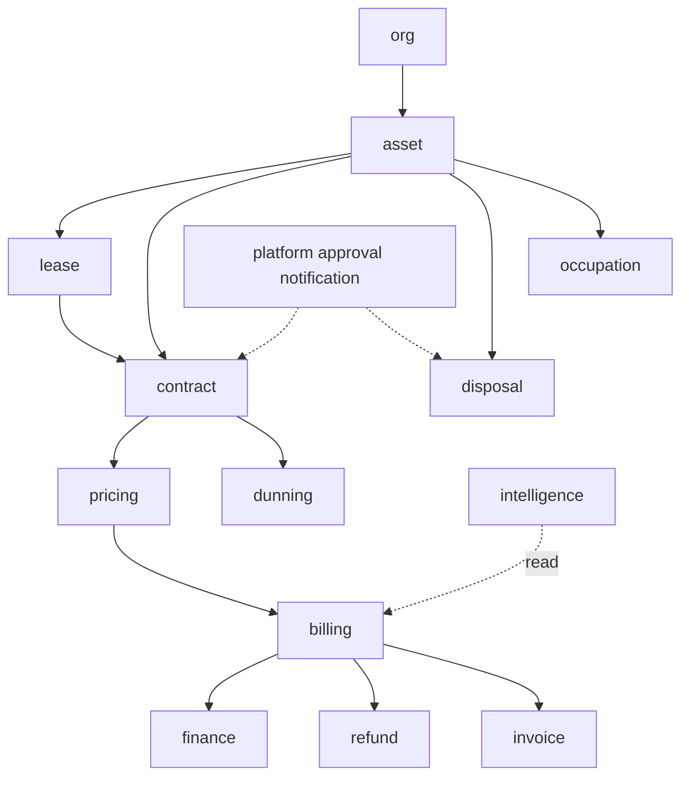

# 资产经营管理系统 — 详细设计说明书（DSD）

| 版本 | V1.3 |
|------|------|
| 日期 | 2026-08-26 |
| 依据 | SRS V2.2 |
| 关联 | [技术选型说明书.md](./design/技术选型说明书.md)、[概要设计说明书.md](./design/概要设计说明书.md) |

---

## 1. 项目概述与背景

### 1.1 目标

实现国资国企经营性资产 **盘清、提效、合规、监管** 的全链路数字化，三端统一 API。

### 1.2 范围

SRS V2.2 全量功能（P0/P1/P2 + 十三条业务闭环）；详见 [需求规格说明书.md](./需求规格说明书.md)。

### 1.3 术语

与 SRS §1.3 一致。

---

## 2. 非功能性需求与约束

| 类别 | 指标 | 设计对策 |
|------|------|----------|
| 并发 | 200 在线用户 | 2+ API 实例、PG pool max 20/实例、Redis 缓存 |
| 可用性 | ≥ 99.5% | 健康检查、无状态 API、DB 主从、应急预案 |
| 响应 | API P95 < 2s | 索引、分页 max 100、禁止循环查库 |
| 安全 | JWT、RBAC、审计 | §7；NFR-SEC-* |
| 合规 | 长期留存 | 软删+归档；禁止物理删监管数据 |
| 智能 | NFR-AI-* | [智能Agent技术方案.md](./design/智能Agent技术方案.md) |

---

## 3. 总体技术架构

### 3.1 架构风格

**模块化单体** + 前后端分离 + 统一 REST API（ADR-0002）。



### 3.2 技术选型

> 完整版本与 ADR 索引见 [技术选型说明书.md](./design/技术选型说明书.md)。

| 层次 | 技术 | ADR |
|------|------|-----|
| PC 前端 | React 18 + TS + Vite + Tailwind + Shadcn | — |
| 小程序 | 微信原生 ×2 | ADR-0014 |
| API | Node.js 20 + Express + TypeScript | ADR-0002 |
| 数据访问 | Knex（Flyway 管 DDL） | ADR-0010 |
| 校验 | Zod | ADR-0005 |
| 异步 | BullMQ + node-cron | ADR-0011 |
| 事件 | in-process DomainEventBus | ADR-0013 |
| 审批 | 轻量 JSON 流程引擎 | ADR-0009 |

**已移除待定项**：~~Prisma 或 Knex~~ → 统一 **Knex + Flyway**。

### 3.3 请求链路

```
Client → Nginx → Express
  middleware: traceId → requestLog → auth → rbac → validate(Zod)
  → Controller → Service(@Transactional) → Repository(Knex)
  → commit → DomainEventBus.publish → Handlers(Notification/Task)
  → 可选: BullMQ.add、OSS、第三方 HTTP
```

### 3.4 Monorepo 目录结构

见 ADR-0012。backend 内分层：

```
backend/src/
├── app.ts
├── config/
├── middleware/
├── routes/           # 按模块挂载 /api/v1/*
├── modules/
│   ├── asset/
│   │   ├── asset.controller.ts
│   │   ├── asset.service.ts
│   │   ├── asset.repository.ts
│   │   ├── asset.schema.ts      # Zod
│   │   └── lease-control.service.ts
│   ├── contract/
│   ├── billing/
│   └── ...
├── platform/
│   ├── auth/
│   ├── approval/     # 审批引擎
│   ├── notification/
│   ├── event-bus/
│   └── scheduler/
├── workers/          # BullMQ processors
└── db/
    ├── knex.ts
    └── migrations/   # Flyway 同步路径或 symlink
```

**模块依赖规则**（禁止违反）：

```
system, org → 无业务依赖
asset → org
lease → asset
contract → asset, lease, pricing
pricing → contract
billing → contract, pricing
finance → billing
notification → 仅订阅事件，不被业务域依赖
intelligence → 只读调用各域 Service（ToolRegistry）
```

### 3.5 模块依赖图



---

## 4. 模块详细设计

### 4.1 模块划分

| 域模块 | 职责 | 关键服务 |
|--------|------|----------|
| system | 用户、角色、菜单、日志 | AuthService, RbacService |
| org | 公司、部门 | OrgService |
| asset | 项目、台账、租控、盘点 | AssetService, LeaseControlService |
| certificate | 权证、抵押 | CertificateService, MortgageService |
| lease | 招租、公开遴选 | ListingService, TenderService |
| contract | 合同、变更、退租 | ContractService, VacateService |
| pricing | 规则引擎、缴费计划 | PricingEngine, PlanGenerator |
| billing | 账单、收款、预收 | BillService, PaymentService, PrepayService |
| invoice | 发票生命周期 | InvoiceService, InvoiceLifecycleService |
| dunning | 催缴升级 | DunningEscalationService |
| utility | 水电抄表 | MeterService |
| maintenance | 报修、巡查、SLA | RepairService, SlaMonitor |
| alert | 预警规则与处置 | AlertRuleEngine, AlertHandleService |
| revitalization | 盘活 | RevitalizationService |
| plan | 经营计划 | BusinessPlanService |
| finance | 业财、凭证 | ReconcileService, VoucherPushService |
| disposal | 资产处置 | DisposalService |
| occupation | 临时占用 | OccupationService |
| selfuse | 资产自用 | SelfUseService |
| refund | 退款冲正 | RefundService |
| evaluation | 评估申请 | EvaluationService |
| notification | 消息待办 | NotificationService |
| intangible | 无形资产 P2 | IntangibleAssetService |
| esign | 电子签 P2 | ESignAdapter |
| intelligence | 智能 Agent P1 | AgentOrchestrator, ReportService |

### 4.2 定价引擎

**输入**：`ContractTerms`（租期、租金类型、金额、周期、免租、递增/阶梯）

**输出**：`PaymentPlanItem[]`

```typescript
// 伪代码
function generatePlans(terms: ContractTerms): PaymentPlanItem[] {
  const periods = splitByCycle(terms.start, terms.end, terms.cycle);
  return periods.map((p) => ({
    periodStart: p.start,
    periodEnd: p.end,
    amount: calcAmount(p, terms), // 免租/阶梯/递增
    dueDate: subtractDays(p.start, terms.graceDays),
    status: 'pending',
  }));
}
```

触发：`ApprovalCompleted` + `bizType=contract` → `PlanGenerator.generate(contractId)`。

### 4.3 租控状态机

统一入口 `LeaseControlService.transition(assetId, event, operator)`。

| 事件 | 目标状态 |
|------|----------|
| ContractActivated | 在租 |
| VacateCompleted | 空置 |
| SelfUseApproved | 自用 |
| OccupationApproved | 占用 |
| DisposalCompleted | 已退出 |
| ListingPublished | 招租中 |

禁止 Repository 直改；乐观锁 `version` 字段。

### 4.4 催缴升级调度

```
cron 02:00 → BullMQ job 'dunning-scan'
  → scan overdue bills
  → map days to L1-L5
  → update dunning_level
  → publish BillOverdue event
  → NotificationHandler + TaskHandler
```

### 4.5 智能 Agent 模块

详见 [智能Agent技术方案.md](./design/智能Agent技术方案.md)、ADR-0008。报告渲染走 BullMQ `agent-report` 队列。

### 4.6 闭环域模块（V2.2）

| 服务 | 核心方法 | 状态机 |
|------|----------|--------|
| DisposalService | `create`, `submitApproval`, `execute`, `complete` | SRS §4.24.5 |
| OccupationService | `create`, `approve`, `release` | §4.24.6 |
| SelfUseService | `create`, `approve`, `end` | 同占用模式 |
| RefundService | `apply`, `approve`, `executeReversal` | §4.24.7 |
| EvaluationService | `apply`, `recordResult`, `bindPricing` | — |
| InvoiceLifecycleService | `issue`, `reconcile`, `redFlush` | §4.24.8 |
| AlertHandleService | `assign`, `process`, `close`, `escalate` | §4.24.4 |

**DisposalService 伪代码**：

```
create(dto) → disposal_order(status=draft)
submitApproval(id) → ApprovalEngine.start('disposal', id)
on Approved → status=pending_execute, leaseControl→处置中
execute(id, result) → record outcome
complete(id) → leaseControl→已退出, publish DisposalCompleted
```

### 4.7 轻量审批引擎

见 ADR-0009。

**表**：`approval_flow_def`、`approval_instance`、`approval_task`

**流程定义 JSON 示例**：

```json
{
  "bizType": "contract",
  "nodes": [
    { "id": "dept", "type": "serial", "role": "dept_manager" },
    { "id": "finance", "type": "serial", "role": "finance", "when": "amount>100000" },
    { "id": "major", "type": "serial", "role": "leader", "flags": ["triple_major"] }
  ]
}
```

**API**：`POST /approvals/{instanceId}/approve|reject`

完成后 `EventBus.publish('ApprovalCompleted', { bizType, bizId })`。

### 4.8 领域事件与通知

见 ADR-0013。

| 事件 | 订阅者 | 动作 |
|------|--------|------|
| ApprovalCompleted | ContractHandler, NotificationHandler | 出计划/通知 |
| BillIssued | NotificationHandler | 租户缴费提醒 |
| BillOverdue | DunningHandler, NotificationHandler | 催缴升级 |
| AlertTriggered | AlertHandleService, TaskHandler | 待办 |
| DisposalCompleted | NotificationHandler | 备案提醒 |

事务边界：事件在 `afterCommit` 钩子发布，避免回滚后误通知。

### 4.9 异步任务（BullMQ）

| 队列 | 任务 | 并发 |
|------|------|------|
| billing | 批量出账、计划生成 | 2 |
| dunning | 催缴扫描 | 1 |
| notification | 批量短信 | 5 |
| agent-report | PPT/PDF 渲染 | 2 |
| finance-import | 银行流水导入 | 1 |

Job 数据含 `traceId`；失败指数退避 3 次；死信进 `failed` 表人工处理。

### 4.10 缓存策略

| 键 | 内容 | TTL |
|----|------|-----|
| `menu:{userId}` | 用户菜单树 | 30min |
| `perm:{userId}` | 权限码集合 | 30min |
| `config:hot` | 系统参数 | 1h |
| `idempotency:{key}` | 幂等结果 | 24h |

租控/账单 **不缓存** 读路径（强一致）；看板指标可缓存 5min。

### 4.11 事务与幂等

- 写操作默认 `knex.transaction`
- 跨模块：单事务内调用 Service，禁止跨 HTTP
- 幂等：`Idempotency-Key` → Redis SETNX → 相同 key 返回首次结果（收款、审批提交）
- 状态变更：乐观锁 `version`；冲突 `40900`

### 4.12 组合/拆分租赁与主数据

见 SRS FR-MDM-*。

```
splitAsset(parentId, specs[]):
  assert parent.lease_control in (vacant, ...)
  freeze parent
  create children with parent_asset_id
  remap certificates
  if parent has active contract → reject or require migrate service

combineAsset(ids[]):
  assert all vacant
  create merged asset, map old_ids → new_id in asset_merge_log
```

---

## 5. 数据架构

详见 [database/数据库设计.md](./database/数据库设计.md)。

- Flyway `V*` 为 DDL 唯一来源（ADR-0010）
- 核心 ER：company–project–asset–contract–bill–payment
- 闭环扩展表：§8.8 + `approval_*`、`notification`

---

## 6. 接口与集成

详见 [api/openapi.yaml](./api/openapi.yaml)。

| 集成 | 适配器 | 模式 |
|------|--------|------|
| 微信支付 | WechatPayAdapter | APIv3 + 回调验签 |
| 电子发票 | InvoiceAdapter | 异步回调 |
| 电子签 | ESignAdapter | 跳转 + 回调 P2 |
| ERP | ErpVoucherAdapter | REST P1 |
| GIS | AmapAdapter | Web API |
| LLM | LlmGateway | HTTP SSE |

回调统一：`/api/v1/callbacks/*`，签名校验，幂等 `callback_log`。

---

## 7. 安全设计

- 认证：JWT Access 2h + Refresh 7d；小程序 code2session
- 授权：`RbacService.assert(user, permission, dataScope)`；SQL 注入 `company_id IN (...)`
- 防护：HTTPS、CORS 白名单、rate-limit 100/min/IP（登录 10/min）
- 密码：bcrypt cost 12；失败锁定 5 次/15min
- 审计：`operation_log` + 关键表审计字段
- 文件：OSS 私有 + 签名 URL 15min
- Agent：§5.7、ADR-0008

---

## 8. 异常与错误处理

- `AppError` 统一 `{ code, message, httpStatus }`
- 对外 JSON 统一 `{ code, message, data, traceId }`（见 api/README）
- 第三方：`50001` + 可重试 BullMQ
- 校验失败：`40000` + Zod detail

---

## 9. 监控与可观测性

| 项 | 方案 |
|----|------|
| 日志 | pino JSON；字段：traceId, userId, path, durationMs |
| 指标 | prom-client：`http_requests_total`、`http_duration_seconds`、业务 `payments_total` |
| 链路 | traceId 全链路透传（含 BullMQ job） |
| 健康 | `/health`、`/health/ready`（PG+Redis）、`/health/live` |
| 告警 | 错误率>1%、P95>2s、队列积压>1000 → 运维 |

---

## 10. CI/CD 与质量门禁

见 [design/CI-CD方案.md](./design/CI-CD方案.md)。

- PR：lint + `pnpm api:lint` + backend unit tests
- main：上述 + integration smoke + Docker build
- 发版：tag `v*` → 构建镜像 → STAGING → UAT → PROD

---

## 11. 部署与运维

详见 [deployment/部署手册.md](./deployment/部署手册.md)。

- API 无状态水平扩展
- Worker 独立 Deployment（K8s）或 pm2 `ams-worker`
- 配置：环境变量 + 密钥管理（不入库）

---

## 12. 测试策略（技术）

| 层级 | 范围 | 工具 |
|------|------|------|
| 单元 | Service、PricingEngine、状态机 | Vitest |
| 集成 | Repository + PG testcontainer | Vitest + Testcontainers |
| API | OpenAPI 契约 | supertest + Prism |
| E2E | 十三条闭环冒烟 | Playwright（admin）+ 手工小程序 |
| 性能 | 200 并发 | k6（见性能测试报告） |

---

## 13. 演进与扩展

| 阶段 | 演进 |
|------|------|
| 当前 | 模块化单体 + EventBus + BullMQ |
| 中期 | PG 只读副本、物化视图、报表库 |
| 长期 | 按域拆微服务（billing、contract）、外置 MQ |

扩展点：PricingEngine 插件、AlertRule DSL、BPMN 可视化（替换 JSON 流程）、ToolRegistry 插件。

---

## 14. 修订记录

| 版本 | 日期 | 说明 |
|------|------|------|
| V1.0 | 2026-08-26 | 初版 |
| V1.2 | 2026-08-26 | V2.2 闭环模块 |
| V1.3 | 2026-08-26 | 技术评审：Knex/Flyway、BullMQ、EventBus、审批引擎、Monorepo、CI/CD |

---

**请开发、测试、运维共同评审本 DSD 后再进入编码阶段。**
